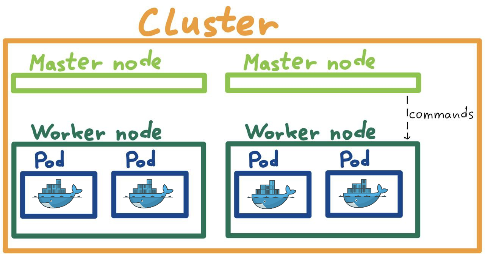

# Введение
## Что такое Kubernetes
Kubernetes (k8s) группирует контейнеры, составляющие приложение, в логические единицы для более простого управления и 
обнаружения. Изначально проект был написан Google под собственное использование, поэтому проект содержит в себе
большой опыт Google в области контейнеризации. Позже проект стал open source.

**K8s упрощает и автоматизирует процесс деплоя контейнеризированных приложений.** Если ваша система состоит из
контейнеризированных приложений и вы не хотите писать деплой на ansible/marathon/bash, то k8s ваш выбор.

Цели Kubernetes: 

- Автоматизация деплоя приложений
- Автоматизация масштабирования приложения
- Автоматизация управления приложением

## Компоненты k8s (в упрощенном виде)
Для достижения своих целей Kubernetes имеет следующая архитектуру (в упрощенном виде):

**Cluster** - основной компонент k8s. Вы создаете cluster, состоящий из **nodes**.  
**Nodes** - виртуальная или физическая машина, входящая в cluster. Бывают двух типов: **Master** и **Worker**.  
**Worker nodes** - узел, на котором запущены ваши контейнеры в подах (**Pod**).  
**Master nodes** - узел, который управляет рабочими узлами. Когда вы запускаете команды управления, они всегда идут на 
мастер ноду.  
**Pod** - объект k8s, представляющий группу из одного или нескольких контейнеров. Именно внутри пода и крутятся 
контейнеры.  

## Основные фичи k8s
1) **Публикация сервисов и балансировщики.**  
K8s позволяет гибко и быстро настраивать доступ к вашим контейнерам. Если контейнеров несколько, то можно 
настроить балансировщик. 
2) **Оркестрация хранилища.**  
K8s позволяет приаттачить любой локальный диск или диск из облака к контейнеру.
3) **Автоматическое обновление версии контейнера.**
4) **K8s автоматически перезапускает упавшие контейнеры.**
5) **Удобное хранение секретов и паролей**
6) **Поддержка со стороны всех Cloud провайдеров (AWS, Google, Yandex, etc)**

