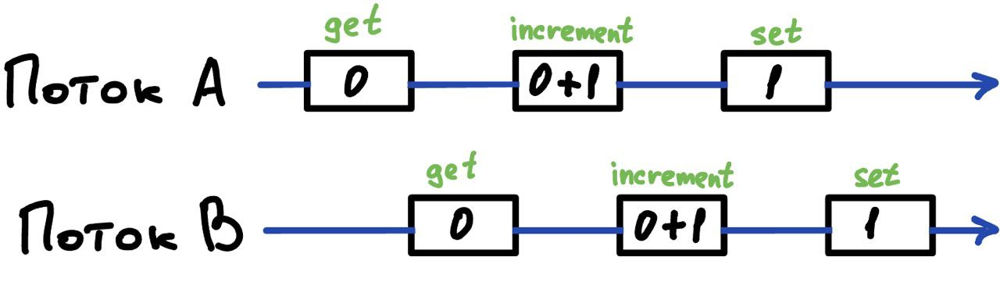

# Потокобезопасность
У каждого объекта есть _состояние_, это какие-то данные, которые хранятся в переменных. 
Если это состояние мутируемое (может быть изменено) и к нему обращаются из нескольких потоков, 
то такое состояние не _потокобезопасно_.

> :exclamation: **Всякий раз, когда более чем один поток обращается к переменной состояния, а другой из потоков в 
> нее пишет, все потоки должны координировать свой доступ к ней с помощью синхронизации.**

Если многочисленные потоки обращаются к одной мутируемой переменной без синхронизации, то программа неисправна.
Существует 3 способа ее исправить:
1) Не использовать переменную состояния совместно во всех потоках
2) Сделать переменную немутируемой
3) При каждом доступе к переменной использовать синхронизацию

> :exclamation: **Класс является потокобезопасным, если он ведет себя правильно во время доступа из многочисленных потоков, 
> независимо от того, как выполнение этих потоков перемежается между собой.**

### Пример
Есть некоторый класс, выполняющий разложение числа на его множители. Этот класс может вызываться во 
многопоточной среде.

```java
@ThreadSafe
public class NumFactor {
    public long[] service(long number){
        return factor(number);
    }
}
```

Такой класс является потокобезопасным, так как он не имеет внутреннего состояния: не содержит полей и 
не ссылается на поля из других классов. Состояния для конкретного вызова существует только в локальных 
переменных потока и доступны для изменения только ему.

> :exclamation: **Объекты без внутреннего состояния всегда являются потокобезопасными.**

## Атомарность
Предположим, что мы хотим добавить счетчик обращений в наш пример выше.

```java
@NotThreadSafe
public class NumFactor {
    private long counter = 0;
    
    public long[] service(long number){
        ++counter;
        return factor(number);
    }
}
```

Теперь класс `NumFactor` не является потокобезопасным, так как приращение счетчика не атомарно.  
При увеличении счетчика происходит 3 действия: достать текущее значение, прибавить единицу, положить его обратно.

Если два потока попробуют одновременно увеличить такой счетчик, то оба потока достанут значение 0, 
добавят к нему 1, и положат значение 1 обратно. Таким образом мы потеряем один вызов в счетчике.



Данная проблема называется состоянием гонки (_race condition_).

## Race condition
Очень частым типом состоянием гонки является подход "проверить и затем действовать". Большинство 
состояний гонки вызывают неожиданные исключения, перезаписанные данные, повреждения файла и др.

Мы часто сталкиваемся с состоянием гонки в реальной жизни.  

Допустим вы договорились встретиться с другом в 12 в кофейне в ТЦ. В условленное время вы пришли в кофейню, 
но друга там нет. Вы вспоминаете, что в ТЦ есть две кофейни и решили сходить проверить другую. Вы не знаете, 
пришел ли ваш друг или нет, возможно вы ходите кругами друг за другом и отправляетесь обратно. В худшем 
варианте развития событий вы, таким образом, будете ходить друг за другом целый день.

Проблема "прогуляться и посмотреть другую кофейню" заключается в том, что прогулка занимает время, за которое 
система может измениться.

Примером подобной проблемы в программирование является _ленивая инициализация_. 
Ее цель - отложить инициализацию "тяжелого" объекта до тех пор, пока он не понадобится и обеспечить, чтобы 
он инициализировался только один раз.

```java
@NotThreadSafe
public class LazyInitRace {
    private ExpensiveObject instance = null;
    
    public ExpensiveObject getInstance() {
        if (instance == null) {
            instance = new ExpensiveObject();
        }
        return instance;
    }
}
```

Предположим, что несколько потоков выполняют метод `getInstance` одновременно. Они оба увидят, 
что `instance == null` и оба начнут создавать тяжелый объект. Таким образом два вызова вернут два разных объекта,
еще и создадут его дважды, что противоречит задачи класса. 

## Atomic переменные
Оба наших примера выше содержат операции, которые должны быть атомарными.

> :exclamation: **Операции A и B являются атомарными, если с точки зрения потока, выполняющего
> операцию A, операция B была выполнена другим потоком либо целиком, либо не выполнена даже частично.**

Удобно думать об атомарной операции, как об операции, что выполняется за один тик процессора. 
Во время выполнения такой операции никакой другой поток не может помешать выполнению, так как тик - 
минимальная неделимая вычислительная операция процессора.

> :exclamation: **Операции "проверить и затем действовать" и "прочитать, изменить, записать" 
> всегда должны быть атомарными.**

Атомарность позволяет избежать проблемы со счетчиком в примере `NumFactor`.

```java
import java.util.concurrent.atomic.AtomicLong;

@ThreadSafe
public class NumFactor {
    private AtomicLong counter = new AtomicLong(0);

    public long[] service(long number) {
        counter.incrementAndGet();
        return factor(number);
    }
}
```

Пакет `java.util.concurrent.atomic` содержит атомарные переменные, они позволяют проводить над ними 
атомарные операции. В данном случае это помогло нам произвести действие "прочитать, изменить, записать" атомарно.