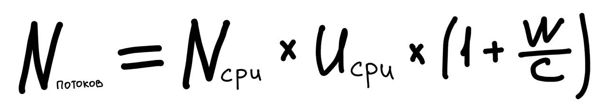

# Применение пулов потоков

## Проблемные задачи в пуле потоков
Пулы потоков лучше всего работают, когда задачи однородны и независимы. Предоставление зависимых задач может привести 
к взаимной блокировке, если пул ограничен. К счастью, запросы в серверных приложениях соответствуют этим ограничениям.

#### Взаимная блокировка с ресурсным голоданием
Если в пуле выполняются зависимые друг от друга задачи, то они могут быть заперты взаимной блокировкой. Например, все 
потоки выполняют задачи, которые заблокированы в ожидании других задач из рабочей очереди.

Взаимная блокировка с ресурсным голоданием (thread starvation deadlock) может возникать всякий раз, когда задача 
пула инициирует неограниченное по времени блокирующее ожидание действия другой задачи пула.

Самый простой способ избежать подобной проблемы - не использовать зависимые друг от друга задачи в пуле потоков. 
Если избавиться от этого невозможно, то можно увеличить размер пула потоков. Таким образом в увеличенный пул влезут 
задачи, выполнения которых ожидают заблокированные потоки.

Одна стоит помнить, что помимо явных лимитов на размер пула, существуют и неявные ограничения на другие ресурсы. Самый 
простой пример - количество соединений JDBC. Если приложению доступно 10 соединений, то делать пул из 11 
потоков бессмысленно.

#### Длительные задачи
Если размер пула слишком пал, а длительных задач слишком много, то может пострадать отзывчивость системы.

Один из вариантов решения проблемы - использование хронометрированных версий ожидания ресурсов, вместо неограниченных. 
Если время ожидания истекло, задачу можно пометить как безуспешную и отменить, либо поставить в конец очереди и 
попробовать ее выполнить снова.

## Определение размера пула потоков
Важно правильно определить оптимальный размер пула потоков. 

В слишком большом пуле потоки конфликтуют за ресурсы процессора и памяти. В слишком малом потоке страдает 
пропускная способность, хотя процессоры остаются невостребованы.

Чтобы правильно определить размер пула важно понимать ресурсные реалии и характер задач. Необходимо понимать 
количество процессоров, памяти, выполняют задачи вычисления или в основном ввод-вывод, требуют ли они дефицитных 
ресурсов. Если у вас имеются разные категории задач с очень разными формами поведения, то следуют рассмотреть 
возможность использования нескольких пулов. Свой для каждого типа задачи.

Для вычислительноемких задачи `Ncpu` процессорная система обычно достигает оптимальной работы с пулом `Ncpu + 1`. Даже 
вычислительноемкие задачи иногда берут паузы по какой-либо причине, поэтому лишний поток защищает от 
недоиспользования процессорных циклов.

Для задач, которые включают блокирующие операции (например ввод-вывод) требуется бОльший пул. Оптимальный размер пула 
в таком случае определяется по формуле:



где  
**Ncpu** - число процессоров  
**Ucpu** - целевая задействованность процессоров (0 < Ucpu < 1)  
**W/C** - отношения времени ожидания ко времени вычисления  

Данная формула является лишь основой для составления своей формулы для каждого конкретного случая. Скорее всего в вашем
случае будут и другие ограниченные ресурсы (память, сеть, подключения к бд, etc). К счастью, вычислять ограничения на
размер пула для этих типов ресурсов проще: разделите суммарное кол-во ресурса на кол-во ресурса необходимого 
одному потоку. Полученное число будет являться верхней границей размера пула потоков.
 
## Конфигурирование класса ThreadPoolExecutor
Класс ThreadPoolExecutor предоставляет базовую реализацию для пулов потоков, возвращаемых фабрикой Executors 
(методы newCachedThreadPool, newFixedThreadPool, etc). ThreadPoolExecutor предоставляет гибкую реализацию пула, которую
можно настроить под свои нужды.

#### Создание и удаление потоков
В ThreadPoolExecutor имеются следующие параметры для оптимальной настройки:
1) **Ядерный размер пула** - целевой размер. Реализация пытается поддерживать пул в этом размере, даже если нет 
задач на выполнение. Так же реализация не будет создавать новые потоки (количеством превышая ядерное число), пока 
рабочая очередь не заполнена.
2) **Максимальный размер пула** - верхняя граница числа потоков пула, которые могут быть активны одновременно.
3) **Период поддержания потока**. Поток, который простаивал дольше периода поддержания потока будет терминирован, если 
текущий размер пула превысит ядерный размер.

Регулируя ядерный размер пула и период поддержания потоков можно поощрять пул к высвобождению ресурсов. Однако стоит 
помнить, что убирая простаивающие потоки, вы позже получите доп нагрузку при создании новых потоков. Иногда 
целесообразнее хранить простаивающие потоки.

Фабрика newCachedThreadPool устанавливает максимальный размер пула равным `Integer.MAX_VALUE`, ядерный размер пула 
равным `0`, а период простаивания в одну минуту. Таким образом получается эффект бесконечно расширяемого пула потоков, 
который будет сокращаться при уменьшении спроса на потоки. 

#### Управление рабочей очередью задач
Исполнитель ThreadPoolExecutor позволяет предоставить очередь BlockingQueue для хранения задач, ожидающих выполнения. 
Существует 3 основных подхода к организации рабочей очереди: 
- неограниченная очередь
- ограниченная очередь
- синхронная эстафетная передача

По умолчанию в fixedThreadPool и singleThreadPool используется неограниченная очередь LinkedBlockingQueue. 

Более стабильной стратегией управления является использование ограниченной очереди (ArrayBlockingQueue, 
LinkedBlockingQueue, PriorityBlockingQueue). Такой подход помогает предотвратить исчерпание ресурсов, но встает вопрос, 
что делать с новыми задачами, если места в очереди нет.

Для очень больших или неограниченных по размеру пулу кодов можно использовать синхронную эстафетную передачу. В этом 
подходе используется SynchronousQueue, которая на самом деле не очередь, а механизм передачи данных между потоками. 
Чтобы положить какой-то элемент в SynchronousQueue, нужно чтобы в пуле потоков был свободный поток, готовый принимать 
данные из SynchronousQueue. Если свободных потоков нет, но можно создать еще один, то пул создаст еще один поток. Иначе 
задача отклоняется. Такой подход может быть полезен, если пул потоков практически неограничен, либо можно безболезненно
отклонять задачи.

Стоит помнить про PriorityBlockingQueue, если задачи в очереди необходимо как-то сортировать. Задачи в такой очереди 
сортируются либо если объект поддерживает интерфейс Comparable, либо если предоставить очереди объект Comparator.

Фабрика newCachedThreadPool является хорошим выбором для пула потоков, так как обеспечивает более высокую 
производительность, чем фиксированный пул. Фиксированный пул уместен для тонкого управления ресурсами, которое способно 
предотвратить перегрузку системы. Однако стоит заранее продумать политику отмены новых задач.

Так же стоит помнить, что ограничение пула потоков или рабочей очереди подходит только в том случае, если задач 
независимы. Иначе можно получить взаимную блокировку с ресурсным голоданием.

#### Политика насыщения
Политика насыщения срабатывает, когда ограниченная очередь заполнена. Для ThreadPoolExecutor политика насыщения может 
быть изменена путем вызова `setRejectedExecutionHandler`. Есть несколько стандартных реализаций политик насыщения:
AbortPolicy, CallerRunsPolicy, DiscardPolicy, DiscardOldestPolicy.

По умолчанию используется AbortPolicy, при которой метод execute выдает непроверяемое исключение 
RejectedExecutionException, если рабочая очередь заполнена. Вызывающий элемент в случае необходимости может отловить 
ошибку.

Политика DiscardPolicy молча отбрасывает только что представленную задачу, если рабочая очередь заполнена.

Политика DiscardOldestPolicy отбрасывает самую старую задачу в рабочей очереди. В случае FIFO коллекции, это задача, 
которая должна была выполняться следующей. После отбрасывания самой старой задачи, принимается новая задача. Не стоит
использовать эту политику вместе с приоритетными коллекциями, поскольку в таком случае отменится задача с самым 
высоким приоритетом.

Политика CallerRunsPolicy в случае заполнения рабочей очереди выполняет задачу в потоке, который предоставил задачу. 
Таким образом, предоставляющий задачи поток на некоторое время не смог предоставлять новые задачи, что разгружает 
рабочую очередь пула потоков.

Политики насыщения, которая блокировала бы метод execute, отсутствует. Однако похожее поведение может быть 
достигнуто при помощи семафора. Границу семафора следует устанавливать как сумму размера пула и размера рабочей очереди.

#### Фабрика потоков
Пул потоков создает новые потоки при помощи фабрики. Фабрика по умолчанию создает поток, не являющийся демоном, без 
специальной конфигурации.

Существует ряд причин для использования настраиваемой фабрики потоков. Возможно необходимо указать обработчика 
UncaughtExceptionHandler, добавить логирование отладочной информации, etc.

Пример кастомной фабрики потоков:

```java
public class MyThreadFactory implements ThreadFactory {
    private final String poolName;
    
    public MyThreadFactory(String poolName) {
        this.poolName = poolName;
    }
    
    public Thread newThread(Runnable runnable) {
        return new MyAppThread(runnable, poolName);
    }
}
```

#### Настройка ThreadPoolExecutor после конструирования
Параметры пула потоков могут быть изменены после конструирования посредством методов доступа (setters).

Однако есть способ, который позволяет запрещать конфигурацию после конструирования. Для этого необходимо использовать
метод `Executors.unconfigurableExecutorService` и обертывает ее, предоставляя только методы ExecutorService, в 
результате чего конфигурация невозможна.

Именно в этом и кроется отличие newSingleThreadExecutor, поскольку этот метод возвращает пул потоков, 
обернутый таким образом. Таким образом, однопоточность данного пула защищается от случайного изменения в 
конфигурации пула.

## Расширение класса ThreadPoolExecutor
Класс ThreadPoolExecutor предоставляет расширение перехватчиками beforeExecute, afterExecute, terminated.

Перехватчики beforeExecute, afterExecute вызываются в потоке выполняющем задачу. Перехватчик afterExecute вызывается 
независимо от того, как задача завершается: с исключением или без (но если задача завершается с ошибкой Error, то
перехватчик не вызывается). Если beforeExecute выдается RuntimeException, то задача не выполняется, а перехватчик 
afterExecute не вызывается.

Перехватчик terminated вызывается, когда пул потоков завершает процесс выключения.

## Параллелизация циклов
Цикла, тела которых содержат нетривиальные вычисления или выполняют блокирующий ввод-вывод, часто являются хорошими 
кандидатами для параллелизации, если их итерации независимы.

Можно использовать Executor для преобразования последовательного цикла в параллельный:
```java
void processSequentially(List<Element> elements) {
    for (Element e: elements) {
        process(e);
    }
}

void processParallel(Executor exec, List<Element> elements) {
    for (final Element e: elements) {
        exec.execute(() -> { process(e); })
    }
}
```

Так же можно использовать метод invokeAll и таким образом получать результаты по мере их готовности.

# Итоги
- Executor - мощная и гибкая струткура для конкурентного выполнения задач. Он предоставляет различные конфигурации и 
политики относительно задач и потоков. 
- Однако существуют комбинации параметров, которые плохо работают вместе: некоторые типы задач требуют специфичных 
политик, а некоторые комбинации параметров могут привести к непредвиденным последствиям.