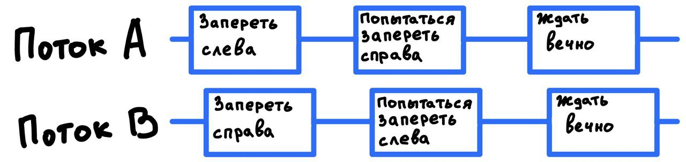

# Предотвращение сбоев жизнеспособности
## Взаимная блокировка (deadlock)
Взаимная блокировка возможна при следующем случае:
1) Поток А владеет бессрочно замком А1
2) Поток В владеет бессрочно замком В1
3) Поток А пытается приобрести замок В1, получает блокировку
4) Поток В пытается приобрести замок А1, получает блокировку

Таким образом, оба потока будут вечно ждать друг друга, поскольку ни один поток не освободит замок, необходимый 
другому потоку и оба потока будут вечно заблокированы. JVM никак не решает данную ситуацию, заблокированные потоки 
останутся таковыми навсегда. Работоспособность приложения может восстановить только перезапуск приложения. 

#### Взаимные блокировки из-за порядка блокировки
Рассмотрим пример:
```java
public class LeftRightDeadLock {
    private final Object leftObject;
    private final Object rightObject;
    
    public void leftRight() {
        synchronized (leftObject) {
            synchronized (rightObject) {
                doSomething();
            }
        }
    }
    
    public void rightLeft() {
        synchronized (rightObject) {
            synchronized (leftObject) {
                doSomething();
            }
        }
    }
}
```
Оба метода приобретают левый и правый замки, в случае неудачной временной координации два потока могут 
заблокироваться следующим образом:


Взаимная блокировка возникла, потому что два потока приобретали одинаковые замки в _разном порядке_. Если обеспечить, 
чтобы все потоки приобретали одинаковые замки в одинаковом порядке, то такую проблему можно избежать.

> :exclamation: **Чтобы избавиться от взаимной блокировки, возникающей из-за порядка блокировки, необходимо чтобы 
> все потоки приобретали замки в фиксированном глобальном порядке.**

#### Взаимные блокировки из-за динамического порядка следования замков
В некоторых случаях мы не владеем порядком блокировки, в таких случаях возникает динамический порядок 
следования замков. Рассмотрим пример:
```java
public void transferMoney(Account fromAccount, Account toAccount) {
    synchronized(fromAccount) {
        synchronized(toAccount) {
            fromAccount.debit(300);
            toAccount.credit(300);
        }
    }
}
```
Может показаться, что все потоки приобретают замки в одном и том же порядке. На самом деле порядок следования замков 
динамичный и зависит от передаваемых аргументов. Блокировка может возникнуть, если два потока одновременно вызывают 
метод, один переводит деньги `X -> Y`, а другой переводит деньги `Y -> X`. При неудачной координации поток А 
приобретает замок на аккаунт Х и будет ожидать замок на аккаунт Y, в то время как поток В приобретает замок 
на аккаунт Y и будет ожидать замок на аккаунт X.

От взаимных блокировок подобного рода можно избавиться, если закрепить порядок блокировки для объектов. Самый простой 
способ, использовать некоторый идентификатор объекта. В нашем случае подошел бы `account.id`. Порядок приобретения 
замков тогда можно было бы определить как от большего ключа к меньшему.

Если у объекта нет идентификатора, можно использовать `System.identityHashCode`. По численному значения хеша 
можно определить порядок приобретения блокировок. Важно учесть случай, когда объекты имеют одинаковый хеш код, в 
таких случаях можно сначала приобрести замок на некоторый сторонний объект. Пример данного подхода:
```java
private static final Object tieLock;

public void transferMoney(Account fromAccount, Account toAccount) {
    int fromHash = System.identityHashCode(fromAccoutn);
    int toHash = System.identityHashCode(toAccoutn);
    
    if (fromHash < toHash) {
        synchronized (fromAccount) {
            synchronized(toAccount) {
                // transfer money
            }
        }
    } else if (toHash < fromHash) {
        synchronized(toAccount) {
            synchronized(fromAccount) {
                // transfer money
            }
        }
    } else {
        synchronized(tieLock) {
            synchronized (fromAccount) {
                synchronized(toAccount) {
                    // transfer money
                }
            }
        }
    }
}
```

#### Взаимные блокировки между взаимодействующими методами
Вложенное замковое приобретение не всегда так очевидно, как в предыдущих примерах, два замка не обязательно будут 
приобретены в рамках одного метода или даже в рамках одного объекта. Рассмотрим пример:
```java
class Taxi {
    private Point location, destination;
    private final Dispatcher dispatcher;
    
    public synchronized Point getLocation() {
        return location;
    }
    
    public synchronized void setLocation(Point location) {
        this.location = location;
        if (location.equals(destination)) {
            dispatcher.notifyAvailable(this);
        }
    }
}

class Dispatcher {
    private final Set<Taxi> taxis;
    private final Set<Taxi> availableTaxis;
    
    public synchronized void notifyAvailable(Taxi taxi) {
        availableTaxis.add(taxi);
    }
    
    public synchronized Image getImage() {
        Image image = new Image();
        for (Taxi t: taxis) {
            image.drawMarker(t.getLocation());
        }
        return image;
    }
}
```

Хотя ни один метод не приобретает два замка явным образом, методы setLocation и getImage могут приобрести два замка. 
Поскольку оба метода синхронизированы, поток вызывающий метод setLocation приобретает замок Taxi и затем 
замок Dispatcher. Схожим образом метод getImage приобретает замок Dispatcher, а затем каждый замок taxi. Так же, как в 
предыдущих случаях, два потока рискуют быть заперты взаимной блокировкой.

Обнаружить возможность такой взаимной блокировки сложнее. Предупреждающим признаком является то, что _чужой_ метод 
вызывается, пока замок удерживается.

> :exclamation: **Активировать чужой метод с удержанием замка - плохая затея. Чужой метод может приобретать другие 
> замки (рискуя быть запертым взаимной блокировкой) или выполняться неожиданно долго, удерживая при этом замок.** 

#### Открытые вызовы
Вызов чужого метода с удержанием замка трудно анализируется на предмет взаимных блокировок, а значит, 
является рискованным.

Вызов метода без удерживаемых замков называется открытым вызовом (open call). Классы, опирающиеся на открытые вызовы
являются более благополучными и композиционно пригодными к конкурентному выполнению. Нужно стремиться к такому 
проектированию системы, которое использовало бы только открытые вызовы.

Пример выше может быть переделать с использованием открытых методов:
```java
class Taxi {
    // ...

    public void setLocation(Point location) {
        boolean reachedDestination;
        synchronized (this) {
            this.destination = destination;
            reachedDestination = location.equals(destination);
        }

        if (reachedDestination) {
            dispatcher.notifyAvailable(this);
        }
    }
}
```

В нашем примере потеря атомарности была не критична. Нет оснований, чтобы обновление положения такси и уведомления 
диспетчера было атомарным. 

Иногда потеря атомарности критична. В таких случаях используют техническое решение, при котором **только один** поток может 
выполнять код после открытого вызова. Решение состоит в том, чтобы внутренним состоянием сервиса обозначить, что сервис
недоступен для выполнения другим потокам.

#### Ресурсные взаимные блокировки
Ресурсные взаимные блокировки возможны при малом пуле ресурсов. Возможна эта блокировка в следующем случае:
1) Есть пул из двух соединений к двум разным БД.
2) Поток А удерживает соединение D1 из пула соединений.
3) Поток B удерживает соединение D2 из пула соединений.
4) Потоку А необходимо подключение D2 из пула соединений.
5) Потоку B необходимо подключение D1 из пула соединений.

В таком случае потоки А и B так же будут взаимно заблокированы по причине нехватки ресурсов (соединений к БД). При 
увеличении пула ресурсов такие проблемы, как правило, решаются.

Так же существует **взаимная блокировка с ресурсным голоданием**. Простейший пример возникновение такой блокировки:
1) Есть пул потоков из 1 потока.
2) В этом пуле выполняется зависимая задача, которая ожидает результат выполнения следующей задачи из рабочей очереди.

В таком случае задача будет ожидать вечно, так как свободных потоков для выполнения следующей задачи нет. 

Зависимые задачи в ограниченном пуле являются первичным источником взаимной блокировки с ресурсным голоданием.

## Предотвращение и диагностирование взаимной блокировки