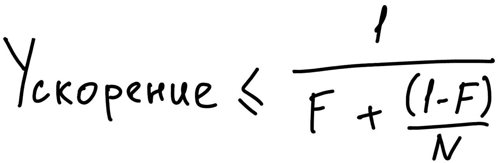

# Производительность и масштабирование
## Вводные слова про производительность
Стоит помнить, что введение многопоточности содержит свои издержки (координация между потоками, переключение контекста, 
и тд). При эффективном использовании потоков эти издержки компенсируются бОльшей пропускной способностью.

Используя многопоточность, мы хотим добиться единственной цели: позволить нашей программе эксплуатировать больше 
ресурсов (ядра процессора, подключения к бд, и тд).

#### Производительность и масштабируемость
Производительность -[как быстро]- выполнение _той же_ работы с _меньшими_ ресурсами.  
Масштабируемость -[как много]- выполнение _бОльшей_ работы с _бОльшим_ количеством ресурсов.

По этой причине, проектировка многопоточных приложений для масштабируемости сильно отличается от проектировки 
производительных приложений. Зачастую для масштабируемости приходится принимать решения, которые вредят 
производительности.

Всем известная трехуровневая архитектура (бд, бизнес уровень, представление) в угоду масштабируемости жертвует 
производительностью. Монолитное приложение почти наверняка обеспечит более высокую производительность для первой и 
единственной единицы работы. 

Однако рано или поздно монолит достигнет границы своей обрабатывающей мощности. Тут возникает проблема: увеличить 
мощность монолита может быть не просто. Добавление новых ядер процессору может не помочь. В то время как трехуровневая 
архитектура является более масштабируемой. Зачастую достаточно просто добавить больше доступных ресурсов приложению.

Для серверных приложений масштабируемость важнее производительности. Сервер может пожертвовать скоростью обработки 
одного запроса, но для сервера критично иметь большую пропускную способность.

#### Оценивание компромиссов производительности и масштабируемости
При написании кода мы зачастую не владеем полной информации о системе. 

Например, при реализации сортировки мы можем не знать, какие массивы данных нам предстоит сортировать, хотя эти 
знания помогут нам выбрать правильный алгоритм. По этой причине мы часто занимаемся преждевременной оптимизацией.

> :exclamation: **Избегайте преждевременной оптимизации. Сначала выполните задачу верно, а потом занимайтесь 
> оптимизацией (если это вообще будет необходимо).**

Стремление к излишней производительности системы является одним из главных источников ошибок конкурентности. Зачастую 
интуиция обманывает разработчиков, они неверно понимают, где находится слабое звено производительности или какой подход
будет быстрее, а какой медленнее того, что есть сейчас. Поэтому необходимы конкретные требования к производительности
(что и до какой степени ускорять). Так же стоит использовать специальные библиотеки для измерения производительности.

## Закон Амдала
Закона Амдала описывает, насколько программа может быть ускорена добавлением новых ресурсов. Для этого необходимо
знать соотношение параллелизируемых и последовательных компонентов. 

Закон Амдала выглядит следующим образом:

F - доля последовательных вычислений.  
N - кол-во процессоров.

Стоит понимать, что доля последовательных вычислений не может быть равна нулю никогда. В каждом приложении всегда 
будет некоторая доля последовательности.

Представим приложение, в котором N потоков выполняют метод `doWork`, доставая некоторые данные из рабочей очереди. 
На первый взгляд кажется, что приложение полностью параллелизуемо, данные обрабатываются в разных потоках, потоки не 
зависят друг от друга. Хоть добавь 100 ядер процессору и разбивай на 100 потоков, масштабируемость идеальная.

Однако в данном примере есть одно последовательное действие, которое мешает полной масштабируемости. Очередь, из 
которой потоки берут данные для обработки, общая. А значит когда какой-то поток читает (и удаляет) оттуда 
данные, очередь блокируется и только один поток за раз может что-то оттуда прочитать. 

> :exclamation: **Все конкурентные приложения имеют некие источники последовательных вычислений.**

## Стоимость многопоточности
Многопоточные программы предполагают дополнительные издержки на создание, поддержание и совместную работу потоков. 
Преимущества параллелизации должны перевешивать затраты на содержание. Для этого необходимо знать, какие есть затраты у 
многопоточности.

#### Переключение контекста
Если потоков существует больше, чем ядер в процессоре, то ОС будет вытеснять один поток, чтоб другой тоже мог 
выполняться некоторое время. Каждый поток обрабатывает определенное число тиков процессора, перед постановкой на паузу.

В результате такой работы потоки переключают контекст, это требует сохранение контекста текущего потока и 
загрузку контекста следующего потока. Такие переключения ресурсно не бесплатны.

Когда поток блокируется (например из-за замка), JVM приостанавливает поток, что позволяет ОС сменить контекст и дать 
время работы следующему потоку. Если потоки часто блокируются, это увеличивает издержки на переключение контекста.

#### Синхронизация памяти
Гарантии видимости, предоставляемые механизмами `synchronized` или `volatile` могут повлечь за собой использование 
барьеров памяти, которые могут сбрасывать или обнулять кэши и буферы. Барьеры памяти косвенно влияют на 
производительность, поскольку мешают оптимизации компиляторов.

При оценивании влияния синхронизации стоит различать оспариваемую синхронизацию от неоспариваемой. Оспариваемую 
синхронизацию обязательно используют два или более потоков. Таким образом хотя бы один поток будет ждать возможности 
выполнения синхронизированного блока. Механизм synchronized оптимизирован для неоспариваемого случая (метод volatile 
не может оспариваться).

Так же стоит помнить, что синхронизация между потоками использует одну и ту же шину используемой памяти. Если потоки
постоянно конфликтуют за замки, это засоряет и ухудшает пропускную способность шины.

Современные JVM, видя неоспаривемую синхронизацию, могут исключать замковое приобретения для оптимизации.

Более сильные JVM могут использовать анализ ускользания. Если ссылка на замок не появляется в куче, значит этот замок 
является локальным объектом некоторого потока. В таком случае можно исключить замковое приобретение.

Так же современные JVM выполняют укрупнение замков, объединяя соседние синхронизированные блоки. Таким образом 
оптимизируется издержки, связанные с замковым приобретением.

#### Блокирование
Когда замок оспаривается, проигравший поток блокируется. JVM реализует блокирование либо путем ожидания в холостом 
цикле (в цикле попытка приобрести замок), либо путем приостановки блокированного потока через ОС. 

Что из этого эффективнее зависит от конкретного случая. Холостой цикл эффективнее для коротких ожиданий, приостановка 
для длинных. Некоторые JVM выбирает между этими двумя вариантами адаптивно, на основе данных прошлых времен ожидания.
Большинство JVM просто выбирает приостановку потока.

## Сокращение конфликтов блокировки
Последовательные вычисления снижают масштабируемость, а переключение контекста снижает производительность. Конфликт 
блокировки вызывает и то, и другое, поэтому важно сокращать количество таких конфликтов. 

Существует 3 способа сокращения конфликтов блокировки:
1) Сократить время, в течение которого замок удерживается.
2) Сократить частоту, с которой замки запрашиваются.
3) Заменить исключающие блокировки механизмами координации.

#### Сокращение времени удержания замка
Самый верный способ избежать конфликтов блокировки - владеть замками максимально коротко. Для этого стоит максимально 
уменьшать синхронизированные блоки. Необходимо исключать дорогостоящие операции из синхронизированных блоков.

#### Сокращение частоты, с которой замки запрашиваются
Для этого используют замковое разделение (lock splitting) или чередование блокировок (lock striping). Эти подходы 
подразумевают использование отдельных замков для защиты разных независимых переменных.

_Замковое разделение_

Если замок защищает более чем одну _независимую_ переменную, то стоит расщепить такой замок. Каждый замок должен 
отвечать за одну независимую переменную.

_Чередование блокировок_  

Замковое разделение иногда может быть расширено до секционной замковой защиты на некоторой коллекции объектов.
При таком подходе один замок защищает некоторую часть коллекции.

Реализация хеш-массива ConcurrentHashMap использует массив из 16 замков, каждый защищает 1/16 часть хеш-корзин. Корзина
N защищена `N mod 16` замком. Таким образом шанс конфликта блокировки уменьшает приблизительно в 16 раз (на самом деле 
чуть меньше). 

Одним из недостатков такого подхода является сложность и высокая стоимость. Так же, иногда нужно получить доступ ко 
всей коллекции, что в данном подходе влечет за собой замковое приобретение 16 замков. 

#### Недопущение горячих полей
Если бы мы реализовали хеш массив, у нас был бы выбор, как реализовать метод size. Самый простой способ - подсчет 
кол-ва элементов при каждом вызове. Подход получше - обновлять отдельный счетчик по мере добавления/удаления элементов.

Содержание отдельного счетчика отлично работает в однопоточных системах. В многопоточных системах это будет узким местом.
Даже если использовать чередование замков, каждому потоку будет необходимо обратиться к единственному счетчику, что 
является местом блокировки. 

Такой счетчик называется горячей точкой (hot field), потому что каждая мутационная операция должна иметь к нему доступ.

В ConcurrentHashMap проблему решили просто: содержание отдельного массива count, который хранит размерность каждой 
полосы корзин (и имеет с ней один замок).

#### Альтернативы исключающим блокировкам
Еще одно техническое решение предполагает отказ от использования исключающих блокировок. Вместо них можно использовать
конкурентные коллекции, замки чтения-записи, немутируемые объекты и атомарные переменные.

## Пример: сокращение издержек на переключение контекста
Переключение контекста происходит, когда JVM отключает заблокированные потоки и ОС меняет контекст на следующий 
ожидающий поток. Одним из источников блокирования в серверных приложениях является логирование. Проанализируем разные
подходы к логированию.

Самая простая реализация - обычная обертка на println. Если что-то надо написать в логи, это делается здесь и сейчас. 
Более продвинута реализация выделяет каждую запись в логи в отдельный поток. 

Второй подход может сократить среднее время обработки одного запроса. Потоки логирующие свои действия больше не 
блокируются на время вывода. Так же мы избавились от неожиданных исключениях вывода. 

По сути мы просто перенесли вывод в другой поток, где стоимость вывода не заметна пользователю. Но если перенести 
_весь_ вывод в логи в единственный поток, мы так же избавимся от конфликта за стандартный выходной поток и таким образом
исключаем источник блокирования. 

# Итоги
- При обсуждении производительности многопоточных программ нас обычно больше волнует пропускная способность 
(масштабируемость), чем быстрое время обработки.
- Закон Амдала гласит, что масштабируемость приложения определяется долей кода, которая выполняется последовательно.
- Масштабируемость можно улучшить, тратя меньше времени на удержание замков. В этом могут помочь уменьшение 
синхронизированных блоков, сокращение продолжительности синхронизации либо замена исключающей блокировки неблокирующими
альтернативами.