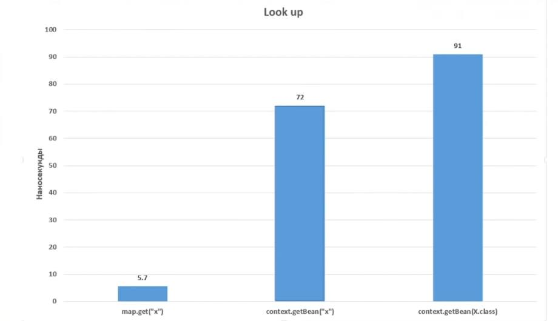
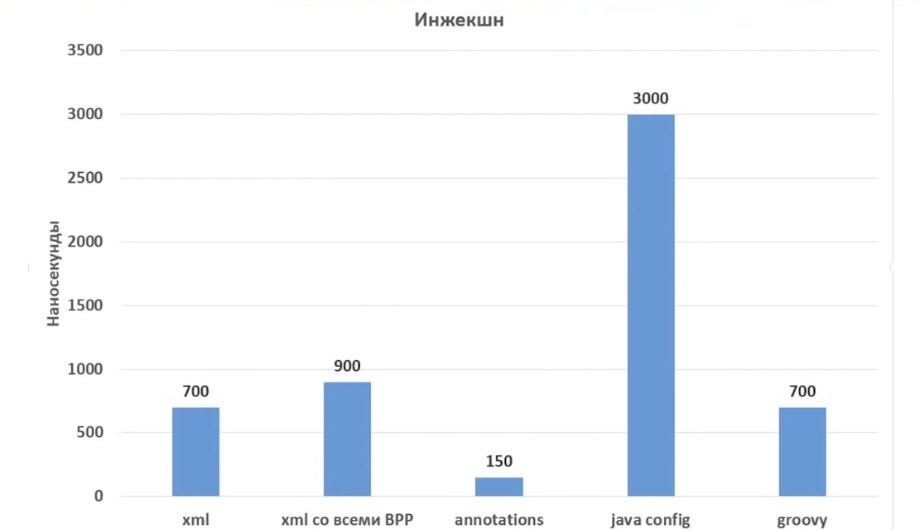
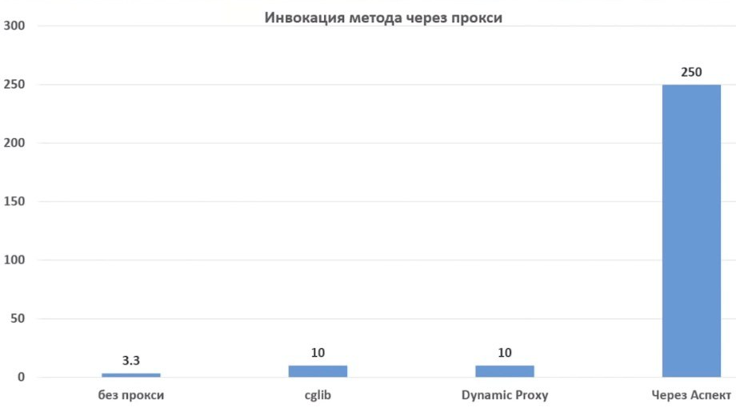

## Context

Как все работает:  
1) Поднимается контекст  
2) BeanDefinitionReader  
он читает определение бинов из Xml контекста и составляет мапу `bean's id -> Bean declaration`.  
Bean declaration хранит то, что мы и описали в xml (clss, property, etc)
3) BeanFactory  
Сначала вытаскивает из `Bean declaration` мапы достает BeanPostProcessor, создает их и кладет в сторонку.  
Создает бины исходя из мапы `BeanDefinitionReader`.  
К каждому бину применяются ВСЕ созданные BeanPostProcessor.  
Вызывается init метод бина.  
К каждому бину применяются ВСЕ созданные BeanPostProcessor.  
Готовый бин кладется в контейнер.  

Важно, что синглтоны создаются сразу, а прототайпы по требованию (прототайпы в контейнер не складываются).

#### Трехфазовый конструктор
Идея в том, чтоб настроить Bean 

1) Java construct. 
2) @PostConstruct / init method (BeanPostProcessor). Для обращения к механизмам Spring.
3) ApplicationContextListener. Может работать на этапах, когда контекст уже создан.

#### Зачем нужен init метод
Для модели двухфазного контроллера (controller -> init method).  
Если мы обратимся к спринговым компонентам в контроллере, то получим NPE. `BeanInjection` происходит после создания 
работы контроллера. А в init method все зависимости спринга будут на месте.

#### Зачем BeanPostProcessor нужно before и after initialization
Если мы захотим обернуть наш объект в прокси, то делать это нужно на этапе post init.  
Если сделать это на этапе before init, то в init метод вернется прокси, что может негативно сказаться на самом методе.

#### ApplicationContextListener
Данный интерфейс позволяет слушать ApplicationContext и как-то реагировать на его lifecycle events.  
Его events в натуральном порядке:
1) ContextStartedEvent
2) ContextRefreshedEvent
3) ContextStoppedEvent
4) ContextClosedEvent

Начиная со Spring 4.2 можно сделать вот так:
```java
@EventListener
public void handleContextRefreshEvent(ContextStartedEvent ctxStartEvt) {
    System.out.println("Context Start Event received.");
}
```

#### BeanFactoryPostProcessor
Позволяет повлиять на BeanFactory после его инициализации.   
Например можно поправить определенный BeanDefinition. 

Схема работы такая:
1) BeanDefinitionReader читает XML -> генерит BeanDefinition
2) BeanFactoryPostProcessor читает BeanDefinition -> как-то их изменяет **МЫ ТУТ**
3) BeanFactory читает BeanDefinition -> кладет бины в IoC container

#### История появлений DefinitionScanner
#### Spring 1
XML bean scanner. Читает определения бинов из XML конфига
#### Spring 2
ClassPathBeanDefinitionScanner. Создает BeanDefinition из всех классов аннотированных @Component и другими.
#### Spring 3
Java Config. Java конфиги обрабатывает класс ConfigurationClassPostProcessor, он создает BeanDefinition 
из методов Java config.  
Появилась возможность дебажить и тонко настраивать бины.
#### Spring
Groovy config. Определение бинов в groovy языке.

#### Обновление Prototype в Singletone
1) Не очень хорошее решение  
В Bean Scope поставить `proxyMode = TargetClass`.  
! Новый бин создается при каждом обращении к нему (вызов метода, переменной, етс)
2) Сделать Singleton абстрактным с фабричным методом получения Prototype.  

```java
class abstract Singleton {
    public abstract Prototype getPrototype();
}

@Config
class JavaConfig {
    @Bean
    @Scope("prototype")
    public Prototype prototype() {
        return prototype;
    }
    
    @Bean
    public Singleton singleton() {
        return new Singleton() {
            @Override
            public Prototype getPrototype() {
                return prototype();
            }
        }
    }
}
```

#### Создание кастмного Scope. 
Логика может быть любой кастомной:

1) Создать класс, имплементировать interface Scope и реализовать как минимум метод get.
2) Создать BeanFactoryPostProcessor и там в beanFactory.registerScope.

#### Быстродействие Spring



