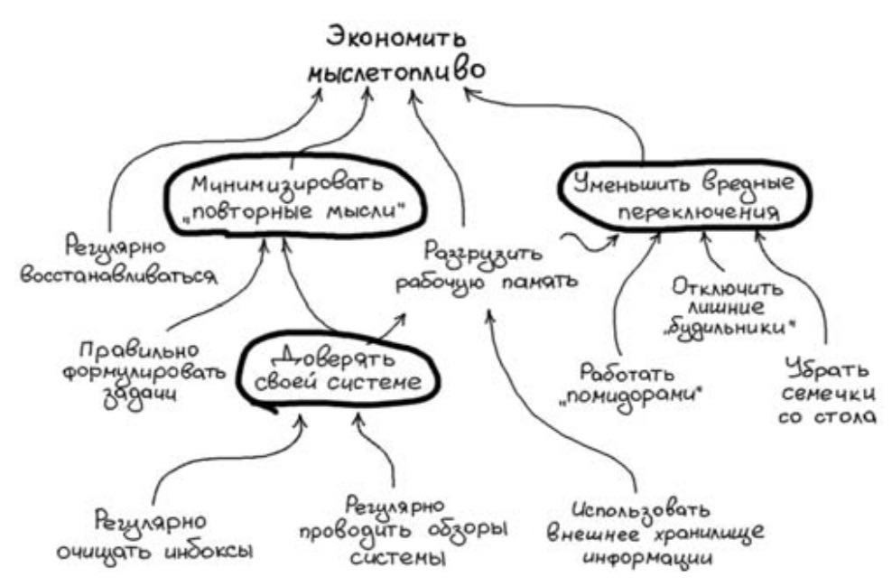

# Практики экономии мыслетоплива
Основные практики представлены ниже:

## Разгружать рабочую память
Рабочая память имеет свойство потихоньку засоряться, если мы не будем за ней следить. Заполненная рабочая
память потребляет много мыслетоплива, а также вызывает тревожность. Необходимо время от времени разгружать рабочую 
память.

Для этого подойдут медитации или метод вечернего гвоздодера. При медитации попытайтесь сконцентрироваться на дыхании 
или на одной точке в пространстве, выписывайте все приходящее мысли и старайтесь их отпускать. 

Метод вечернего гвоздодера заключается в пересказе (в обратном хронологическом порядке) всего своего дня. Все забытые 
и/или важные вещи необходимо записать.

## Регулярно очищать инбоксы
Постепенно, список записанных мыслей будет увеличиваться в размерах. Весь этот список необходимо регулярно 
"переваривать". Для этого необходимо подумать над каждым пунктом списка и отнести его к одной из следующих категорий:
1) Задачи
2) Проекты
3) Информация
4) Встречи

Таким образом, инбокс очищается и все мысли, при необходимости, оказываются в ToDo списке или календаре.

## Правильно формулировать задачи
Для того, чтобы список задач приносил пользу, необходимо чтобы каждая задача удовлетворяла требованиям:
1) Формулировка задачи должна звучать как ответ на вопрос "Что нужно сделать"
2) Формулировка начинается с глагола неопределенной формы
3) Задачу можно выполнить, по минимуму используя мышление
4) Задача предоставляет собой промежуточное действие по достижению конечной цели

В идеале, можно добавить критерий
5) Задачу можно выполнить за полчаса
Но это временное ограничение должно быть индивидуальным.

Есть определенные шаблоны, которые могут использованы при формулировки задач:

| Как хочется вписать | Как лучше сформулировать                                                                      |
|---------------------|-----------------------------------------------------------------------------------------------|
| Встретиться ...     | Предложить встретиться ... в ...                                                              |
| Узнать ...          | Уточнить, как именно это что-то узнать "Написать ... письмо с вопросом ..."                   |
| Подумать ...        | Сформулируйте первый вопрос, стоящий перед вами. Подумать == дать ответ на конкретный вопрос. |

## Правильно работать с проектами
Основной подход к работе с проектами выглядит следующим образом:
1) Подумать над проектом и вычислить ближайшую задачу
2) Записать задачу в список задач
3) Выполнить задачу
4) Вернуться к п.1

Если общий план проекта нам ясен - это хорошо, таким образом у нас будет более полная картина этого проекта для 
пункта 1. Но если плана нет, то в этом нет ничего критичного. Для списка задач нам нужны 1-2 задачи на ближайшие дни.
Когда обезьяна выполнит эти задачи, разумная часть нас подумает и сформулирует следующие действия.

## Использовать внешние хранилища
Мы должны стремиться к такому использованию внешнего хранилища, когда это хранилище является продолжением и 
расширением нашего мозга, а не является его резервной копией. 

Для этого необходимо:
1) При необходимости что-то узнать, обращаться сначала к хранилищу, а не к памяти.
2) Регулярно выгружать из нашей рабочей памяти идеи и мысли в наше хранилище.

Главное в хранилище - **насколько регулярно вы его просматриваете**.

Внеешнее хранилище должно включать в себя:
1) Список задач
2) Список проектов
3) Календарь
4) Систему хранения справочной информации

Не пытайтесь найти идеальный и единственный инструмент, который станет вам внешним хранилищем. Скорее всего это будет 
несколько неудобных программ, которые вам придется использовать. С получением опыта ведения такого хранилища вы будете
получать опыт, который подскажет вам, какое приложение попробовать в качестве хранилища следующим. Не бойтесь менять
такие приложения.

## Регулярно проводите обзор системы