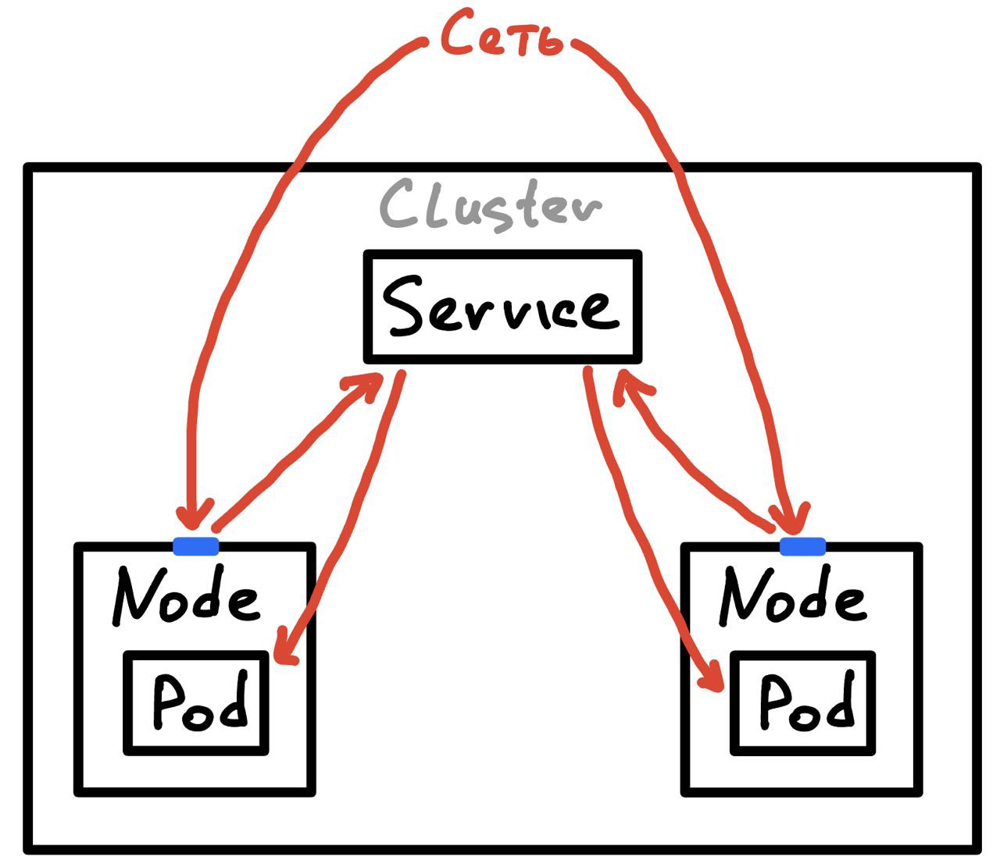
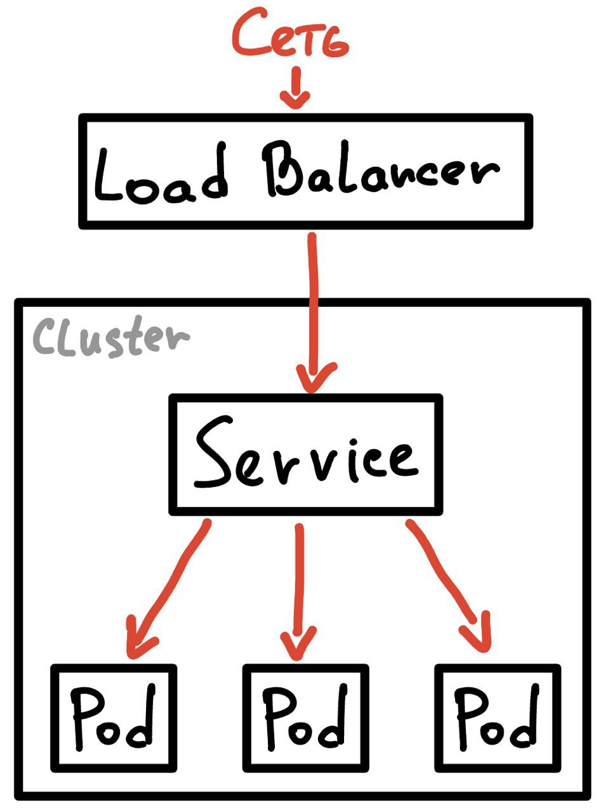

# Service
Service - объект k8s который позволяет открыть сетевой доступ извне для подов.

Под в k8s создается и уничтожается в рамках деплоя, чтобы удовлетворять указанным потребностям масштабирования.
Из-за этого давать сетевой доступ извне напрямую в поды нельзя. По этой причине был введен Service, целью которого
и является предоставление сетевого доступа к постонно меняющемуся множеству подов. Сервис открывает доступ к подам
на основе их **лейблов**. 

По сути сервис представляет собой абстракцию, содержащую в себе множество подов и политику сетевого доступа до 
этих подов.

Существует 4 типа Service:
1) **ClusterIP** - задает IP сервису только внутри кластера. Используется по умолчанию.  

2) **NodePort** - открывает порт на всех нодах, где крутятся поды сервиса. 
На этом порту становится доступен сервис. Пользователь стучится в ноду, из ноды попадает в сервис, из сервиса в под.  

3) **LoadBalancer** - Создается балансировщик (вне кластера), который ведет к сервису в кластере. Доступно 
для Cloud Clusters (AWS, Google, Azure, etc).  

4) **ExternalName** - Сервис, который на уровне DNS будет редиректить (например на другой сервис) запрос извне.  

## Ручная работа в терминале
Предположим, что у нас уже есть deploy, который запустил некоторое число pods. Создадим service для этого deploy с 
типом NodePort:
```console
user@user-PC:~$ kubectl expose deploy max-deploy --type=NodePort --port 8080
service/max-deploy exposed
```

Посмотрим созданный NodePort:
```console
user@user-PC:~$ kubectl get services # вместо services можно написать просто svc
NAME         TYPE        CLUSTER-IP     EXTERNAL-IP   PORT(S)        AGE
kubernetes   ClusterIP   10.96.0.1      <none>        443/TCP        30d
max-deploy   NodePort    10.99.87.168   <none>        8080:30246/TCP   43s
```
kubernetes это сервис по умолчанию, который всегда стартует. Наш сервис max-deploy открыл порт 30246 на всех 
нодах, где есть необходимые поды. Осталось узнать IP подов. Я использую локальный minikube, поэтому мне нужно узнать 
InternalIP:

```console
user@user-PC:~$ kubectl describe nodes | grep InternalIP
  InternalIP:  192.168.49.2
```

Теперь если мы перейдем в браузере по `192.168.49.2:30246`, то мы увидим страницу Apache Tomcat. Теперь можно 
удалить наш сервис:

```console
user@user-PC:~$ kubectl delete svc max-deploy
service "max-deploy" deleted
```

## Использование манифестов
Пример манифеста можно посмотреть [здесь](./manifests/service_manifest.yml)

Запустить манифест можно командой:
```console
user@user-PC:~$ kubectl apply -f ./service-manifest.yaml 
deployment.apps/my-web-deploy created
service/my-single-pod-service created
```