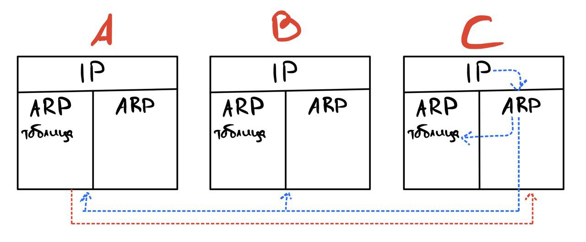

# Протокол ARP
## Проблема 
Нужно найти MAC адрес по его IP.
## Решение
ARP протокол хранит таблицу соответствий IP - MAC.  
1) Для начала отправитель смотрит, есть ли искомый IP в его таблице. 
2) Если в таблице данных нет, то ARP протокол запускает широковещательный запрос по сети. 
3) Каждый узел сверяет искомый IP со своим, и в случае соответствия отправляет обратный 
запрос отправителю.
4) Отправитель, получим MAC адрес записывает его в свою ARP таблицу и хранит ее там пару минут.
## Пример 
Допустим есть небольшая сеть:
  
И узел C хочет отправить запрос узлу А.

Ход действий:
1) Узел C смотрит свою ARP таблицу, допустим IP узла С он там не находит.
2) Узел С при помощи ARP запускает широковещательный запрос по сети.
3) Узел А получает этот запрос и отвечает узлу С.
4) Узел C отправляет запрос и сохраняет MAC адрес узла А в ARP таблицу.