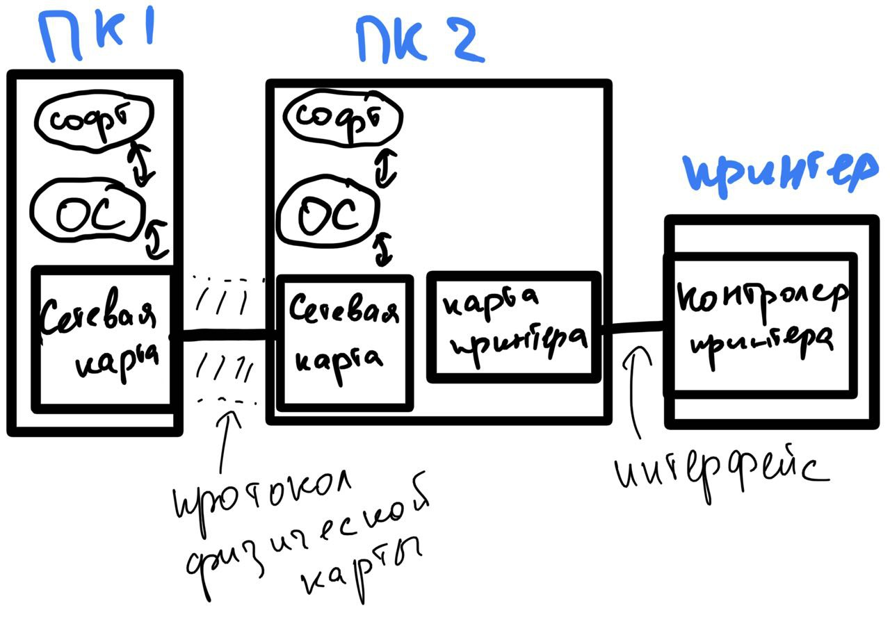
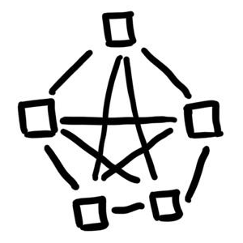
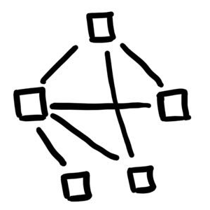
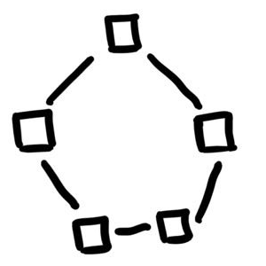
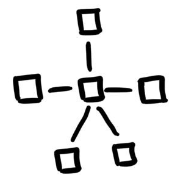
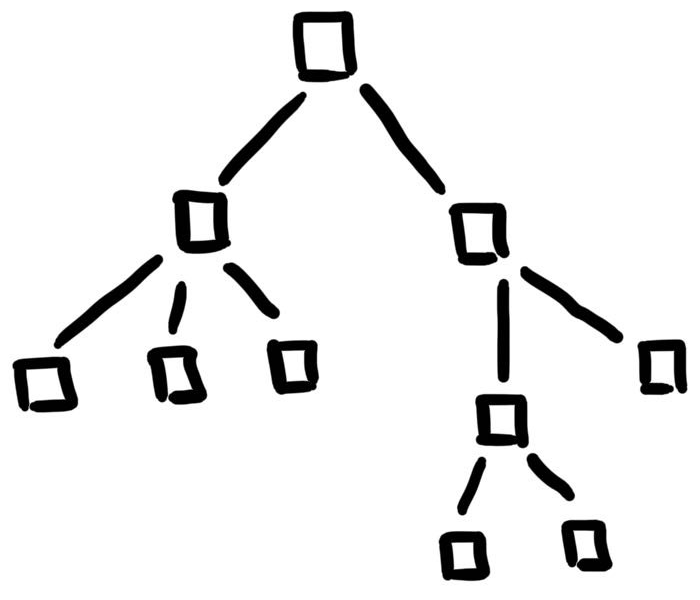
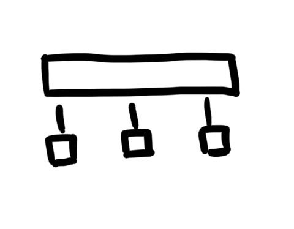

# Основы сетей

## Внешние интерфейсы
Внешние интерфейсы необходимы для связи устройств в сети. Есть два типа внешних сетей:  
1) Физический интерфейс - необходим для физической связи устройств проводом, чтобы информацию возможно было передавать.
2) Логический интерфейс - необходим для организации передачи данных, этот интерфейс указывает что и как будет передаваться по сети.

Для ПК  
Физический интерфейс - сетевая карта  
Логический интерфейс - драйвер сетевой карты

Для переферийных устройств (например принтер)  
Физический интерфейс - контролер принтера  
Логический интерфейс - драйвер контролера принтера

## Типы приложений использующих сеть
Все приложения, которые используют сеть, можно разделить на 3 группы:
1) Локальные - выполняются без выхода в сеть
2) Централизованные сетевые - выполняется локально, но для некоторых операций обращаются к сетевым службам
3) Распределенные - приложение выполняется распределенно на нескольких ПК в сети

## Классификация сетей по передачи данных
В сети информация всегда передается в обе стороны. Даже если кажется, что сигнал уходит от ПК1 к ПК2, то ПК2 все
равно передает квитанцию о получении данных. Исходя из этого физические сети делятся на три типа:
- Дуплексные - возможен обмен данных в двух направлениях в один момент времени
- Полудуплекс - обмен в двух направлениях только по очереди
- Симплекс - обмен только в одну сторону

## Топологии сетей
Топологией называют способ организации клиентов в рамках сети. Стоит понимать, что серебряной пули тут не существует. 
Каждый тип хорош в одних случаях и плох в других.

**Полносвязная**  
Дорого, но в реализации и надежно  

**Ячеистая**  
Полносвязная без некоторых связей. 
Подешевле, но надо продумать, какие связи убрать и надежность уже меньше  

**Кольцевая**
Дешево, легко в реализации, но ненадежно  

**Звезда**  
Дешево, легко в реализации, но ненадежно (центральный узел жизненно необходим для сети)  

**Дерево**  
Звезда с несколькими центрами  

**Общая шина**  
Информация передается по общей шине, дешево, легко, но ненадежно  

## Способы соединения двух пользователей
Проблема соединения двух пользователей называется **коммутацией**.  
Коммутация может быть двух типов:
- Коммутация каналов
- Коммутация пакетов

#### Коммутация каналов
Коммутация каналов при соединении двух пользователей бронирует за ними канал связи и никто
больше не может им пользоваться. Такое использование в компьютерных сетях иррационально из-за
пакетного поведения трафика в сети.  
Тем не менее коммутация каналов остается самым надежным, быстрым и предсказуемым способом коммутации.

#### Коммутация пакетов
Коммутация пакетов предполагает, что по каналу связи передаются пакеты данных, а каналом могут пользоваться несколько
пользователей одновременно.  
Сейчас повсеместно используется пакетная коммутация. Такое способ иррациональный, дешевый и подходит
критериям компьютерным сетям.