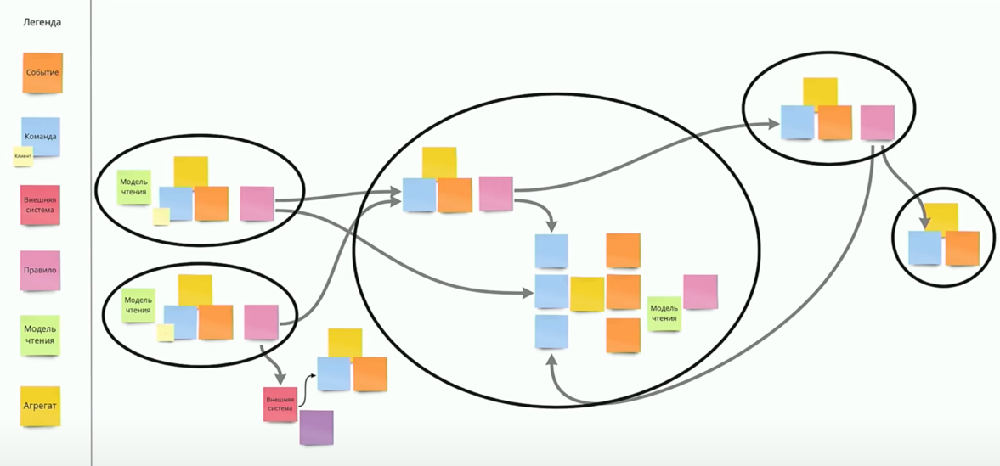

- [Ограниченный контекст](#ограниченный-контекст)
- [Event Storming](#event-storming)
- [Единый язык](#единый-язык)
- [Фокус на доменной модели](#фокус-на-доменной-модели)
- [Агрегаты](#агрегаты)
- [Плюсы и минусы DDD](#плюсы-и-минусы-ddd)
- [Источники](#источники)

# Domain Driven Design (DDD)
Состоит из 3х принципов: 
- Ограниченные контексты (bounded context)
- Единый язык (ubiquitous language)
- Фокус на доменной модели

# Ограниченный контекст
DDD вводит понятие **problem space**. Problem space это задача, которую решает бизнес. Например, есть магазин, его problem 
space это продажа товаров. В рамках problem space выделяют **subdomain**, это какие-то более мелкие бизнес процессы. 
Например, в магазине subdomain могут быть: продажа товаров и услуг, поддержка, доставка и тд.

Для каждого subdomain на уровне кода создается **ограниченный контекст**. Ограниченный контекст это логическое 
разделение используемых моделей. Например, в рамках сабдомена продажи в ограниченном контексте находятся понятия: 
клиент, товар, территория продажи, продавец. В рамках сабдомена поддержки находятся понятия: клиент, товар, дефект.

Обратите внимание, что понятия в разных ограниченных контекстах могут пересекаться, это нормально и иначе, как правило, 
не бывает. DDD говорит, что в таких случаях сущности надо копировать и держать в двух местах. Фактически это будут две
таблицы или даже две разные базы. На самом деле это имеет смысл, потому что оба сабдомена рассматривают эти понятия 
иначе и могут добавлять к понятию специфические аттрибуты. Например, сабдомен поддержки может ввести аттрибут "уровень
поддержки" (золотой/серебряный/бронзовый), который не интересен домену продаж. Тем не менее у каждого аттрибута должен
быть мастер сабдомен. Изменять атрибут разрешается только в рамках его мастер сабдомена. Это необходимо, потому что 
если аттрибут будут пытаться одновременно изменить в нескольких доменах, то будет необходимо как-то мержить эти изменения.

Все домены делятся на 3 вида:
1) Core - то, что жизненно необходимо бизнесу, представляет его конкурентное преимущество. Данный домен должен иметь 
наивысший приоритет, внутреннюю разработку и лучших разработчиков. 
2) Supporting - необходим для бизнеса, но не является основным. Может быть это бывший core, но с приходом большого 
количества конкурентов стал supporting. Например, для авито supporting домен это сама доска объявлений. А core домен 
это сбор данных и аналитика. Желательно использовать внутреннюю разработку, но можно использовать донастроеное 
коробочное решение и уже не первоклассных разработчиков.
3) Generic - не содержит ничего особенного важного для организации, но все равно по какой-то причине необходим. Можно 
отдать на оутсорс или джунам для развития.


# Event Storming
Для определения ограниченного контекста может применяться подход event storming. Обычно это делают на физической доске 
или доске миро и крепят определенные стикеры в таком порядке:

1) События (оранжевый стикер) - какое-либо событие в системе: товар положили в корзину, оплата заказа, поступление товара 
в ПВЗ и тд. Такими событиями полностью покрывается какая-то часть бизнеса
2) Для каждого события записываются команды для выполнения (синий стикер) - событие может генерировать 1:N команд. 
Например, добавление товара в корзину может вызывать команды: проверка остатка товара, добавление товара в корзину, 
отправка события в аналитику и тд.
3) Для каждого события с командами дописывается бизнес правило (фиолетовый стикер) - описание того, как этот процесс 
работает в реальном бизнесе. Это потом ляжет в основу кода.
4) Добавляются агрегаты (желтый стикер) - возле команд и событий указываются агрегаты, с которым работают данные 
стикеры.

После всех этих действий на доске будут видны места, где можно провести ограниченный контекст (объединение агрегатов). 
Так же по таким границам можно делить микросервисы (собственно ограниченный контекст как один из примеров границ
микросервисов). 



# Единый язык
Единый язык на самом деле является частью ограниченного контекста. Единый язык необходим, чтобы разработчик и бизнес 
эксперт говорили на одном языке. Кодовая база должна отражать все сущности бизнеса: если в рамках бизнес процессов есть
покупать (customer), то такая сущность обязательно должна быть в базе, то же самое с различными документами и отчетами.
Сервисы должны по возможности повторять названия бизнес процессов. Таким образом код, написанный по DDD, является
самодокументированным. Достаточно почитать хороший код, чтобы понять, как работает бизнес. Разработчик тут является 
медиатором между доменной логикой в коде (domain model) и бизнес экспертами. Такой подход требует постоянного рефакторинга и 
синхронизации с бизнес экспертами, чтобы все были на одной волне. 

Конечная точка единого языка - DSL (domain specific language). Когда мы пишем код, даже следуя единому языку, у нас 
получается что-то типа `public class Customer {...}`. Ключевые слова языка Java только мешают единому пониманию кодовой
базы со стороны бизнес экспертов. Если развивать единый язык дальше, то разрабатывается собственный язык, чтобы 
сущность в коде можно было описать просто как `Customer {...}`, так же по аналогии с другими сущностями и бизнес 
процессами. Однако это очень дорого и почти никто не идет на такой шаг. 

# Фокус на доменной модели
Зачастую при разработке новых приложений применяется inside-out development. Это когда мы сначала проектируем базу 
данных и таблицы в ней. Потом на основе этого делаем слой data access, затем слой business logic, слой API и тд. 
DDD говорит, что так делать не надо и предлагает подход middle-out development. При таком подходе сначала 
разрабатывается доменная логика, а все остальные слои строятся поверх. Идея в том, что core domain 
model меняться будет крайне редко, если бизнес продает корм для собак, вряд ли через пару лет он будет производить 
автомобили. А вот все последующие слои будут меняться чаще. Даже изменение базы данных или других основных технологий 
более реалистично, чем изменение core domain model.

Так же нужно следить, чтобы доменная логика не размазывалась по всем слоям приложения. Потом с этой логикой становится 
очень сложно работать. Будет практически невозможно знать про все нюансы доменной логики и малейшие изменения могут 
стать проблемой.

Коробочные решения - яркий пример отсутствия фокуса на доменной модели. Если их применять в core domain model, то 
продукту будет сложно получить конкурентные преимущества. Дело в том, что коробочное решение почти наверняка не будет 
иметь то, что необходимо именно вашему бизнесу, зато будет иметь большое количество того, что не нужно вашему бизнесу.
Например, у вас в домене есть сущность розничный покупать, а в коробочном решении такого понятия нет, но есть 
ключевой бизнес партнер. Вам придется использовать эту сущность, за неимением альтернатив. Если несколько раз принять
такие решения, доменная логика станет сложной и запутанной. Вносить в нее изменения будет сложно. Использовать коробочные
решения можно в generic доменных областях. Например, для интернет-магазина это ведение бух учета сотрудника. 
Разрабатывать собственное решение тут будет странно, поэтому можно просто использовать 1С. 

Существует два типа доменной модели: **богатая и анемичная**. Богатая доменная модель содержит вместе данные и логику 
работы с этими данными (другими словами имеет сильную инкапсуляцию). Анемичная доменная модель содержит отдельно данные,
отдельно логику по работе (entity, services, sql хранимки и тд). По DDD нужно стремиться к богатой модели.

Пример анемичной доменной модели - всем известный паттерн, когда у нас есть entity Person и сервис для работы с ним
PersonService. Минус такого подхода в том, что сущность Person никак не ограничивает изменение данных:
```java
class Person {
    private String name;
    private String email;
    private boolean isEmployee;
    
    // getters and setters
}
```
Мы можем свободно менять любое из полей класса, хотя эти поля могут быть связаны каким-нибудь инвариантом, например
человек считается сотрудником, если у него email корпоративного домена. В случае с анемичной моделью мы можем поменять
свойство isEmployee, оставив при этом старый email и наоборот. Инвариант в таком случае нарушится, что влечет за собой 
возникновение ошибок. Анемичная модель в целом создает лишнюю когнитивную нагрузку, потому что хороший разработчик 
будет постоянно думать: какие операции с моделью являются валидными, а какие нет.

По DDD **анемичную модель надо рефакторить**, чтобы привести ее к богатой модели. Рефакторинг состоит из двух шагов:
ввести строгую типизацию, уменьшить количество методов, которые могут изменять состояние модели. Под введением строгой
типизации предлагается введение объектов там, где это возможно: email хранить не в строке, а в специальном объекте 
Email, status не в строке, а в отдельном объекте и так далее. Все эти новые введеные объекты называются ValueObjects. 
По возможности управление инвариантами модели следует вынести туда. Под уменьшением количества методов подразумевается
удаление лишних сеттеров и доступов к внутренним свойствам класса. Допустим у нас есть класс Customer у которого есть
массив заказов. У массива заказов есть сеттеры и геттеры. DDD говорит, что сеттеры и геттеры необходимо убрать и ввести
специальные методы для добавления/удаления/изменения заказа. Таким образом изменение списка заказов будет происходить в 
одном месте и будет проще следить за соблюдением инварианта. В противном случае за соблюдением инвариантов придется 
следить везде, где изменяется список заказов, есть большой шанс забыть хотя бы в одном месте соблюдение инварианта. 
**Всю логику из сервисов необходимо стараться перемещать в сущности, а из сущностей в value objects.**

Таким образом анемичная модель Customer:
```java
public class Customer {
    private String name; // getters, setters
    private String email; // getters, setters
    private String status; // getters, setters
    private List<Order> orders; // getters, setters
    private double currentDiscount; // getters, setters
}

public class CustomerService {
    public void addOrder(Customer customer, Product product, int quantity) {
        customer.getOrders().add(new Order(product, quantity));
        if (customer.getOrders().size() > 10) {
            customer.setStatus("Advanced");
        }
    }
}
```
После рефакторинга превратится в такую богатую модель:
```java
public class Customer {
    private String name; // getter
    private Email email; // getter
    private Status status; // getter
    private List<Order> orders; // no getter and no setter
    
    public Discount getDiscount() {
        return status.getDiscount();
    }
    
    public ImmutableList<Order> getOrders() {
        return ImmutableList.of(orders);
    }
    
    public void addOrder(Product product, int quantity) {
        orders.add(new Order(product, quantity));
        if (orders.size() > 10) {
            status = Status.ADVANCED;
        }
    }
    
}
```
Таким образом модель стала богатая и по-максимуму сама следит за выполнением своих инвариантов. В идеале для какого-либо 
изменения класса необходимо вызвать всего один метод этого класса. 

**Доменная модель должна быть ответственна только за моделирование бизнес домена**. Она ничего не должна знать и 
изолирована от влияния БД, внешние сервисы, API и тд. Доменная модель сложна сама по себе, не нужно усложнять ее 
лишними связями. Внешние сервисы общаются с вашей доменной моделью при помощи сервисов.

# DDD триллема
Триллема состоит в том, что из трех свойств изоляция доменой модели, инкапсуляция (богатство) доменой модели и скорость 
работы можно выбрать только два.

Представим такой пример: нам надо сделать метод контролера, который бы изменял email пользователя. Но email должен быть
уникальным. Существует три способа решения данной проблемы.

Изоляция + скорость. Инкапсуляция страдает, поскольку за инвариантом уникальности сущности теперь следит контролер.  
```java
public class CustomerController {
    public void updateEmail(String customerId, Email email) {
        Customer emailCustomer = customerRepository.getByEmail(email);
        
        if (emailCustomer != null && emailCustomer.getCustomerId() != customerId) {
            throw new RuntimeException("Email already set for another customer");
        }
        
        Customer customer = customerRepository.getById(customerId);
        customer.changeEmail(email);
        customerRepository.save(customer);
    }
}
```

Инкапсуляция + скорость.  Изоляция страдает, поскольку в сущности теперь есть ссылка на репозиторий (а значит на БД).
```java
public class CustomerController {
    public void updateEmail(String customerId, Email email) {
        Customer customer = customerRepository.getById(customerId);
        customer.changeEmail(email, customerRepository); // проверки уникальности внутри Customer
        customerRepository.save(customer);
    }
}
```

Изоляция + инкапсуляция. Теряется скорость работы.
```java
public class CustomerController {
    public void updateEmail(String customerId, Email email) {
        List<Customer> emailCustomers = customerRepository.getAllByEmail(email);
        Customer customer = customerRepository.getById(customerId);
        customer.changeEmail(emailCustomers, email); // проверки уникальности внутри Customer
        customerRepository.save(customer);
    }
}
```

# Агрегаты
Агрегаты - одно из ключевых понятий DDD. Агрегат - кластер сущностей и value objects которые представляют собой единое
целое. Представляет собой границу транзакций. Все сущности доступны только через корень агрегата. Customer, 
рассмотренный нами выше, представляет собой агрегат. Он аккумулирует в себе сущности Customer и Order, а так же value 
objects email и status. Другие элементы домена не могут напрямую общаться с внутренностями агрегата, только через него 
(его методы). Мы не может выполнить отдельный запрос в репозиторий и получить адрес клиента по id или сумму его 
третьего заказа. Нам необходимо запросить весь агрегат.

# Плюсы и минусы DDD
Плюсы
- Легко поддерживать и расширять

Минусы
- Сложный старт, понадобится больше времени для запуска продукта
- Высокий порог входа
- Есть много нюансов реализации 
- Оверхед для простой бизнес логики
- Слишком много абстракций
- Некоторый функционал сложно отнести к определенному слою (например логирование, безопаность и тд)

# Источники
1) Владимир Хориков — Domain-driven design: Cамое важное. https://www.youtube.com/watch?v=JOy_SNK3qj4
2) Агрегаты - DoDo Engineering. https://habr.com/ru/companies/dododev/articles/532628/
3) Дмитрий Науменко - DDD. Просто о сложном. https://www.youtube.com/watch?v=rjtbCyacJas