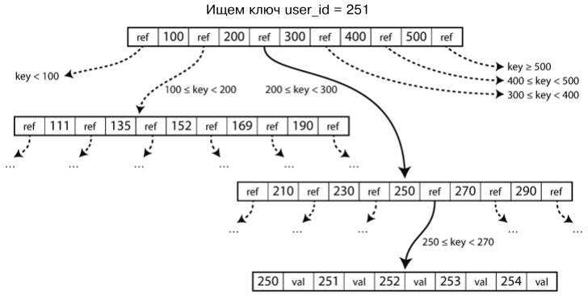
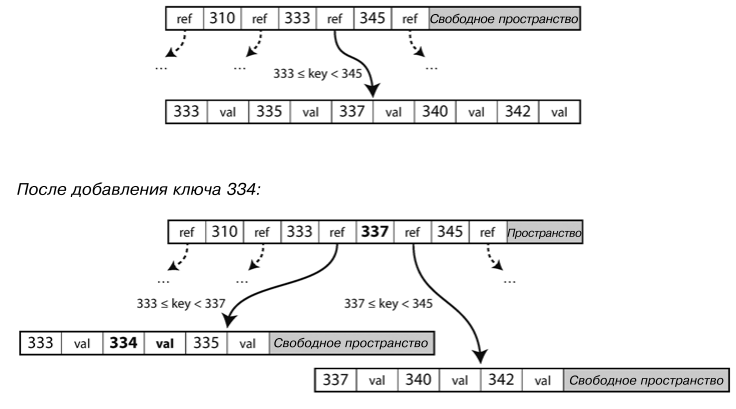

[Назад](./README.md)

# Подсистемы хранения и извлечения данных

В данной главе мы рассмотрим, как базы данных работают под капотом. Вам, как разработчику это может быть интересно
(и полезно) с практической стороны вопроса. Если вы будете знать нюансы внутренней работы БД, то сможете выбрать
самую оптимальную для вашего конкретного случая. Мы рассмотрим две основные системы хранения данных: журналированные
(log-structured storage engine) и постраничные (page-oriented storage engine), например B-деревья.

## Базовые структуры данных БД
Для начала представим самую простую в мире БД, состоящую из двух комманд:

```bash
#!/bin/bash

db_set() {
  echo "$1,$2" >> database
}

db_get() {
  grep "^$1," database | sed -e "s/^$1,//" | tail -n 1
}
```

Это реализация хранилища "ключ-значение". Значение может быть чем угодно - файлом, строкой, JSONом. Команда 
`db_set key value` необходима для сохранения key и value в 
базе данных. Затем нужно вызвать `db_get key` для поиска последнего значения, записанного для данного ключа. И это 
работает! Каждый вызов `db_set` приводит к дописыванию данных в конец файла, а для поиска данных берется самая 
последняя запись с данным ключом. 

Журналированный движок БД используются очень похожий на наш `db_set` механизм. Упрощенно, они просто добавляют в конец 
файла новые значения, а потом читают самое последнее значение. Такой подход дает довольно большую производительность, 
поскольку дописывание в конец файла - быстрая операция.

С другой стороны, производительность нашей функции `db_get` - ужасна в случае большого количества записей в БД. Каждый 
раз мы просматриваем всю базу от начала до конца, чтобы получить значение. Для эффективного поиска ключа в БД необходима
другая структура - _индекс_. Общая идея индекса заключается в дополнительном хранении определенных метаданных, служащих
для быстрого поиска необходимого ключа. Может понадобиться несколько индексов, если поиск может вестись по нескольким 
полям. 

Любые индексы обычно замедляют запись, так как индекс тоже приходится обновлять всякий раз при записи на диск. Это 
важный компромисс между скоростью поиска и записи. По этой причине БД не индексируют все поля по умолчанию, а оставляют
решение по индексации полей разработчику.

#### Хеш индексы
Представим простейшее хранилище в БД, оно хранит данные путем добавления этих данных в конец файла. Тогда простейшая
стратегия индексации для такой БД - держать в оперативной памяти хеш таблицу, где каждому ключу поставлено в 
соответствие смещение (в байтах) необходимое для прочтение значения этого ключа. Такая таблица поможет почти мгновенно
найти и прочитать необходимое значение по ключу. Однако, всякий раз при добавлении в файл новых данных нужно обновить 
нашу хеш таблицу.

Представленный подход может показаться некоторым упрощением, но вполне жизнеспособен. Фактически именно так работает 
Bitcask (подсистема хранения в Riak). 

До этого момента мы дописывали все данные в конец файла. Что делать, если исчерпается память на диске? Хорошим решением
будет разбить журнал (файл с данными) на _сегменты_ определенного размера, закрывая сегмент при достижении определенного
размера. Затем можно выполнить _уплотнение_ этих сегментов. Уплотнение обозначает отбрасывание дублированных значений и
сохранение только последней версии значения для каждого ключа. Если данные часто перезаписываются и уплотненный
сегмент получится сильно меньше изначального размера, такие сегменты можно _совмещать_. Слияние и уплотнение сегментов 
можно выполнять в фоновом потоке, не блокируя новые запись и чтения используя старые файлы сегментов. 

Каждому такому сегменту надо составлять свою хеш таблицу. Чтобы найти значение по ключу надо сначала прочитать хеш 
таблицу последнего сегмента. Если ключа там нет, то переходить к более старому по цепочке. 

На первый взгляд кажется, что добавление в конец файла - неэкономно. Более логичным кажется менять значения в файле.
Но вариант с журналами, дописывающими данные в конец имеют преимущества:
1) _Скорость_ - добавление данных в конец файла выполняется быстро и для HDD и, до некоторой степени, в SSD.
2) _Стабильность_ - сильно упрощается работа в конкурентной среде и в случае сбоев. Не нужно заботиться о сбоях во время
перезаписи значений, когда значение перезаписалось не полностью.
3) _Простота_ - слияние старых сегментов позволяет добиться той же плотности данных, как и в случае с перезаписью данных.

Однако не все так радужно и есть свои ограничения:
1) _Память_ - хеш таблица расположена в оперативной памяти, так что если у вас много ключей - у вас проблемы.
2) _Диапазон значений_ - запросы по диапазону значений неэффективны. Невозможно легко просмотреть все записи между
data0000 и data9999, необходимо искать каждый ключ отдельно.

#### SS таблицы и LSM деревья
Поменяем формат наших сегментов. Сделаем так, чтобы последовательность пар "ключ-значение" были отсортированы по ключу.
Назовем такой формат отсортированной строковой таблицей (sorted string table, SS Table) - сокращенно **SS-таблица**. Так 
же сделаем, чтобы ключ встречался лишь один раз в каждом сегменте (процесс уплотнения может нам это гарантировать). 

У такой SS таблицы есть несколько преимуществ:
1) Объединение сегментов выполняется просто и эффективно. Благодаря тому, что ключи отсортированы, можно использовать
сортировку слиянием. 
2) Чтобы найти в файле определенный ключ больше не нужно хранить индексы всех ключей в оперативной памяти. Достаточно
держать разреженную хеш таблицу, в которой будут некоторые индексы ключей. Оставшиеся можно будет найти рядом с 
известными благодаря сортировке ключей. Достаточно будет одного ключа на несколько килобайт файла.

Чтобы поддерживать сортировку в подсистеме хранения, нам понадобится структура под названием **LSM дерево** 
(Log-Structured Merge-Tree). Ее принцип работы таков:
1) При поступлении записи добавляем ее в расположенную в оперативной памяти древовидную структуру данных (например 
красно-черное дерево). Это дерево будет называться MemTable (от слова Memory Table).
2) Когда размер MemTable перевалит заданный порог (обычно несколько мегабайт), запишем ее содержимое на диск в виде
файла SS-таблицы. Эта операция выполнится быстро, поскольку дерево поддерживает данные отсортированными. Новый SS файл
является последним сегментом таблицы. Во время записи создается новый экземпляр MemTable, принимающий операции записи.
3) Для запроса на чтение сначала ищем ключ в MemTable, затем в последнем сегменте на диске, затем в предпоследнем и т.д.
4) Время от времени запускаем в фоне процесс слияния и уплотнения сегментов. 

Представленная выше схема работает отлично. У нее есть только одна проблема: если происходит фатальный сбой БД, то
данные из MemTable не успевает попасть на диск. Для решения этой проблемы на диске держат отдельный журнал, в конец 
которого немедленно записываются данные, предназначенные для MemTable. В случае сбоя MemTable восстанавливается из 
этого журнала. Зато благодаря отсортированным ключам решается проблема запросов по диапазону. 

Фактически эта система (SS таблица + LSM дерево) хранения используется в LevelDB, RocksDB, Cassandra и HBase. Конечно 
ее несколько улучшают (создают дополнительные индексы для удаленных данных, используют разные приемы уплотнения), но 
базово она работает так, как описано выше. 

#### B деревья
Журналированные индексы, описанные выше, только набирают популярность. Наиболее широко используемая является 
индексная структура **B-дерево**. 

B-деревья тоже хранят пары "ключ-значения" в отсортированном по ключу виде, что позволяет эффективно выполнять поиск по
данным и запросы с диапазонам. В отличие от журналированных индексов B-деревья разбивают БД на _блоки_ или _страницы_ 
фиксированного размера (обычно 4кб) и читают/записывают по одной странице за раз. Все страницы имеют свой 
адрес/местоположение. Благодаря этому одни страницы могут ссылаться на другие. Этими ссылками пользуются для создания
дерева страниц:



Одна из страниц назначается корнем B-дерева, с нее начинается любой поиск ключа в индексе. Каждая страница содержит 
ссылки на некоторый диапазон ключей. В итоге если переходить по ссылкам можно попасть на конечную страницу, содержащую 
необходим ключ и его значение. 

При необходимости обновить значение для существующего ключа нужно найти содержащую этот ключ страницу и изменить 
там значение. Все ссылки на измененную страницу останутся рабочими. Если необходимо внести новую пару ключ-значение, надо
найти необходимую страницу и добавить эту пару туда. Если на странице недостаточно места, то она разбивается на две 
полупустые страницы, а родительская страница обновляется, чтобы учесть это разбиение (рисунок см ниже). Представленный
алгоритм гарантирует, что дерево останется _сбалансированным_. Однако это опасная операция, в случае сбоя мы можем
получить поврежденные данные и бесхозную страницу (orphan page). Для решения этой проблемы используют _журнал 
предупреждающей записи_, он представляет собой файл, в который записываются все операции с деревом (еще до выполнения). 
После сбоя этот журнал используется для восстановления данных.



Эффект, когда одна запись в БД приводит к множественной записи на диск называется _усилением записи_ 
(write amplification).

#### Сравнения B и LSM деревьев
Нельзя с точностью сказать, какой подход в целом быстрее или медленнее при записи или чтении. Для каждого конкретного
случая нужно проводить нагрузочное тестирование.

Достоинства LSM деревьев:
1) Как правило, LSM деревья быстрее при записи. Это из-за того, что у них слабее усиление записи. LSM деревья
не имеют журнала предупреждающей записи, разделения страниц, etc. SS таблицы делают лишние операции только при уплотнении
сегментов. Не стоит забывать про это, используя SSD. Такие диски имеют ресурс по перезаписи на диск и могут быстрее
выйти из строя при использовании B деревьев.
2) Как правило, LSM деревья способны обеспечить большую пропускную способность, чем B деревья. Происходит это из-за 
более слабого усиления записи и благодаря последовательной записи в SS таблицы. Эта разница особенно заметна на 
жестких магнитных дисках, поскольку последовательная запись там работает намного быстрее, чем произвольная.
3) LSM деревья занимают меньше. B-деревья оставляют некоторое пространство на диске незадействованным из-за 
фрагментации данных (страница всегда имеет определенный размер).

Достоинства B деревьев:
1) LSM деревья могут неожиданно просесть в производительности во время уплотнения данных. Проблема в ограничении на 
чтение с диска. B-деревья более предсказуемы.
2) Чем больше становится БД, тем более трудоемким становится уплотнение и потребляет больше ресурсов полосы пропускания
данных жесткого диска. Эта же полоса пропускания диска делится с операцией на чтение. Таким образом, B-деревья 
лучше подходят для больших объемов данных.
3) Каждый ключ в B-деревьях встречается в индексе только в одном месте. В LSM деревьях один ключ может встречаться
в нескольких сегментах. Таким образом B-деревья более привлекательны в случаях, когда нужно обеспечить выраженную
транзакционность.
4) B-деревья укоренились в архитектуре БД и обеспечивают неизменно хорошую производительность для многих видов нагрузки.

## Аналитические базы данных
Изначально БД проектировались для коммерческих целей. Для этих целей бд обычно находит пару строк в таблице, изменяет 
их и записывает обратно. Сейчас основной паттерн работы с данными остался прежним. Такой паттерн называется 
"обработка транзакций в реальном времени" (online transaction processing, **OLTP**).

Однако БД все шире используются для аналитической обработки данных. В этом случае бизнес аналитики выполняют
очень большие и трудоемкие запросы на всю базу, но запросы такие поступают не столь часто. Так же важна скорость
чтения, а не скорость вставки. Результаты своих запросов бизнес аналитики используют в отчетах для руководства
компании. Этот паттерн называется "аналитическая обработка данных в реальном времени" (online analytical 
processing, **OLAP**).

Различия OLTP и OLAP:
