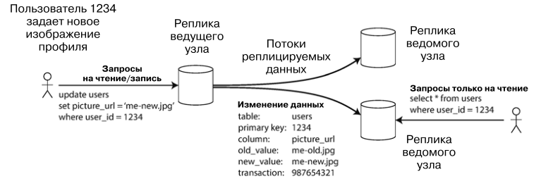
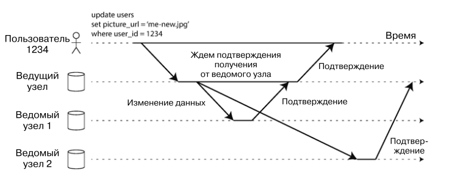

# Репликация
Репликация - хранение копии одних и тех же данных на нескольких машинах. Существует несколько причин для репликации:
1) Ради хранения данных географически ближе к пользователю
2) Чтобы система могла работать при отказе некоторых систем
3) Для увеличения количества машин, способных принимать запросы на чтение

Основная сложность репликации в том, чтобы поддерживать репликации актуальными. Существуют при популярных алгоритма 
решения этой задачи: репликация _с одним ведущим узлом_ (single-leader), _с несколькими ведущими_ (multi-leader) и 
_без ведущего узла_ (leaderless). 

## Ведущие и ведомые узлы
Каждая операция записи в базу должна учитываться всеми репликами. Наиболее распространенное решение - репликация с
ведущим узлом (_leader-based replication_). Ее алгоритм:

1) Одна из реплик становится _ведущей_ (leader). Запись происходит только в ведущую реплику.
2) Другие реплики называются _ведомыми_ (followers). Ведущая реплика отправляет им все свои изменения и ведомые все 
повторяют.
3) Для чтения можно обратиться к ведущему или ведомому узлу.

Такой режим работы встроен во множество реляционных БД (PostgreSQL, MySQL, Oracle, SQL Server) и некоторые 
нереляционные БД (MongoDB, Espresso). Такой механизм так же используется в брокерах сообщений (Kafka, RabbitMQ)

#### Синхронность репликаций
Ведомая репликация называется синхронной, если ведущий узел ждет, пока репликация не повторит те же шаги. Если ожидания 
не происходит, ведомая репликация не синхронна.

Узел 1 в примере синхронный, узел 2 нет.  

Преимущество синхронности - всегда есть реплика, в точности повторяющая лидера. Теоретически такая реплика может 
подменить лидера в случае сбоя последнего. Недостаток - если ведомый узел не отвечает, приостанавливается работы 
системы, запись не сможет отработать.

Многие системы хранения данных позволяют выбрать полусинхронный вариант: когда ведомая синхронная реплика не отвечает,
на ее место выбирается одна из рабочих реплик (в случае необходимости в реплику дописываются данные с лидера).

#### Создание новых ведомых узлов
Алгоритм создания ведомого узла:
1) Время от времени делать снимок БД ведущего узла
2) Скопировать снимок состояния на ведомый узел и накатить этот снимок
3) Ведомый узел подключается к ведущему и запрашивает изменения, произошедшие с момента создания снимка
4) Снимок наверстал упущенное и готов к использованию

#### Перебои в обслуживании узлов
В случае перебоя в работе ведомого узла его можно восстановить. Для этого ведомый узел запрашивает у ведущего
все изменения за то время, пока он был недоступен.

В случае перебоя в работе ведущего узла у нас есть 3 задачи:

- один из ведомых узлов сделать ведущим
- настроить клиенты на отправку запросов новому ведущему
- другие ведомые должны получать обновления от нового ведущего

Все вышеперечисленное называется восстановление после отказа (failover). Алгоритм восстановления следующий:
1) Правильно определить перебой в узле. Обычно для этого используются healthcheck.
2) Выбрать новый ведущий узел. Используется процесс выборов или задействуется узел-контроллер (node controller). 
Оптимальным кандидатом является реплика с наиболее свежими изменениями данных.
3) Настроить систему на использование нового ведущего узла. Необходимо решить задачу 2 и 3. На случай, если старый 
ведущий узел проснется, его надо сделать ведомым.

Естественно, во время восстановления может произойти куча нестандартных проблем, для которых не существует 
легких решений. Поэтому многие придерживаются ручного восстановления, чтобы оперативнее и точнее решать возникающие 
проблемы. 

#### Журналы репликации
1) **Операторная репликация**  

Простейший случай - ведущий узел записывает все входящие операции (для БД это INSERT, UPDATE, etc) и этот журнал далее
передается ведомым узлам. У этого есть свои минусы:

- Все недетерминированные операции (например NOW()) выполняются по-разному на каждой реплике
- При параллельном выполнении запросов могут быть различные поведения на разных репликах
- Триггеры, хранимые процедуры и пользовательские функции могут приводить к различным действиям на разных репликах

Операторная репликация использовалась в MySQL до версии 5.1

2) **Перенос журнала упреждающей записи (WAL)**

Такой журнал позволяет только дописывать в конец и хранит результаты всех операций. Ведомые узлы, прочитав журнал, 
создают такие же копии данных у себя. Из минусов: такой журнал описывает данные на низком уровне, поэтому зависит от 
системы хранения. Если версия БД разная на двух узлах, такой журнал может не сработать.

Журнал WAL используется в PostgreSQL и Oracle.

3) **Логическая (построчная) журнальная репликация**  

Логический журнал представляет собой последовательность готовых строк, добавляемых в хранилище:

- При вставке строки журнал включает новые значения всех столбцов
- При удалении строки журнал хранит информацию, достаточную для однозначной идентификации удаляемой строки
- При обновлении строки журнал хранит информацию, достаточную для однозначной идентификации обновляемой строки + 
новые значения всех обновляемых столбцов

Используется в бинарном журнале MySQL.

4) **Триггерная репликация**  

При помощи триггеров можно заносить все изменения в отдельную таблицу, откуда будет читать изменения внешний процесс
и синхронизировать реплики. Такой внешний процесс можно гибко настроить, но как правило такой подход больше подвержен
ошибкам.

Используется в Databus (Oracle) и Bucardo (PostgreSQL).

## Проблемы задержки репликации
С введением реплик есть соблазн создать большое количество ведомых узлов и распределить по ним чтение. Это снизит 
нагрузку с ведущего узла и позволить увеличить масштабируемость на чтение. Такой подход называется _масштабируемая
по чтению архитектура_ (read-scaling architecture). Однако этот подход работает только при асинхронной записи. При 
синхронной выведение из строя одного узла может заблокировать запись. Соответственно, чем больше узлов, тем больше 
шанс аварии.

К сожалению, асинхронные ведомые узлы могут иметь устаревшую информацию. Это приводит к несогласованности хранилища. 
Как правило, такая несогласованность - временное явление, если немного подождать, то реплики подтянут изменения
и станут согласованными. Такой эффект называется _конечная согласованность_ (eventually consistency), а время 
необходимое для согласования называют _задержкой репликации_ (replication lag). Задержка репликации, как правило, 
составляет доли секунды. Однако в случае проблем может увеличиваться до нескольких секунд и даже минут. 

При столь длительной задержке несогласованность может представлять опасность, вот основные ситуации, приводящие к 
такой задержке и способы с ними бороться:

1) Читаем свои же записи