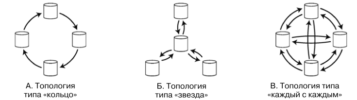
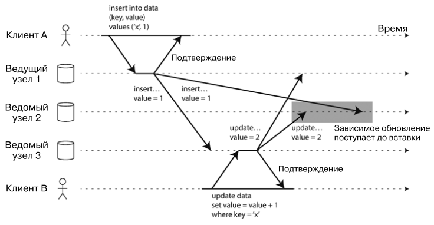
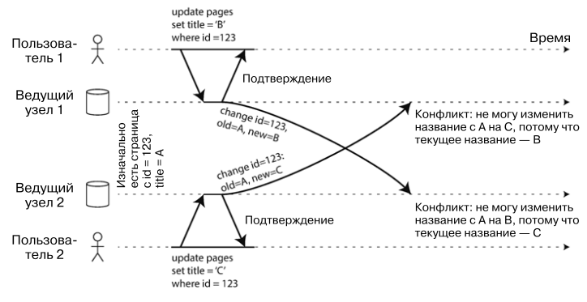
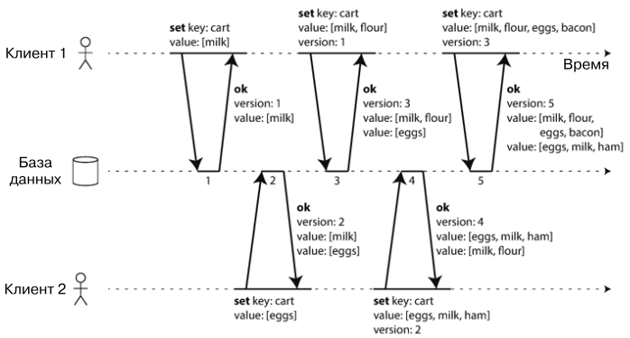

# Репликация
Репликация - хранение копии одних и тех же данных на нескольких машинах. Существует несколько причин для репликации:
1) Ради хранения данных географически ближе к пользователю
2) Чтобы система могла работать при отказе некоторых систем
3) Для увеличения количества машин, способных принимать запросы на чтение

Основная сложность репликации в том, чтобы поддерживать репликации актуальными. Существуют при популярных алгоритма 
решения этой задачи: репликация _с одним ведущим узлом_ (single-leader), _с несколькими ведущими_ (multi-leader) и 
_без ведущего узла_ (leaderless). 

Зачастую, транзакции в реплицируемых БД не поддерживаются в силу сложности и дороговизны таких операций. 

## Ведущие и ведомые узлы
Каждая операция записи в базу должна учитываться всеми репликами. Наиболее распространенное решение - репликация с
ведущим узлом (_leader-based replication_). Ее алгоритм:

1) Одна из реплик становится _ведущей_ (leader). Запись происходит только в ведущую реплику.
2) Другие реплики называются _ведомыми_ (followers). Ведущая реплика отправляет им все свои изменения и ведомые все 
повторяют.
3) Для чтения можно обратиться к ведущему или ведомому узлу.

Такой режим работы встроен во множество реляционных БД (PostgreSQL, MySQL, Oracle, SQL Server) и некоторые 
нереляционные БД (MongoDB, Espresso). Такой механизм так же используется в брокерах сообщений (Kafka, RabbitMQ)

#### Синхронность репликаций
Ведомая репликация называется синхронной, если ведущий узел ждет, пока репликация не повторит те же шаги. Если ожидания 
не происходит, ведомая репликация не синхронна.

Узел 1 в примере синхронный, узел 2 нет.  

Преимущество синхронности - всегда есть реплика, в точности повторяющая лидера. Теоретически такая реплика может 
подменить лидера в случае сбоя последнего. Недостаток - если ведомый узел не отвечает, приостанавливается работы 
системы, запись не сможет отработать.

Многие системы хранения данных позволяют выбрать полусинхронный вариант: когда ведомая синхронная реплика не отвечает,
на ее место выбирается одна из рабочих реплик (в случае необходимости в реплику дописываются данные с лидера).

#### Создание новых ведомых узлов
Алгоритм создания ведомого узла:
1) Время от времени делать снимок БД ведущего узла
2) Скопировать снимок состояния на ведомый узел и накатить этот снимок
3) Ведомый узел подключается к ведущему и запрашивает изменения, произошедшие с момента создания снимка
4) Снимок наверстал упущенное и готов к использованию

#### Перебои в обслуживании узлов
В случае перебоя в работе ведомого узла его можно восстановить. Для этого ведомый узел запрашивает у ведущего
все изменения за то время, пока он был недоступен.

В случае перебоя в работе ведущего узла у нас есть 3 задачи:

- один из ведомых узлов сделать ведущим
- настроить клиенты на отправку запросов новому ведущему
- другие ведомые должны получать обновления от нового ведущего

Все вышеперечисленное называется восстановление после отказа (failover). Алгоритм восстановления следующий:
1) Правильно определить перебой в узле. Обычно для этого используются healthcheck.
2) Выбрать новый ведущий узел. Используется процесс выборов или задействуется узел-контроллер (node controller). 
Оптимальным кандидатом является реплика с наиболее свежими изменениями данных.
3) Настроить систему на использование нового ведущего узла. Необходимо решить задачу 2 и 3. На случай, если старый 
ведущий узел проснется, его надо сделать ведомым.

Естественно, во время восстановления может произойти куча нестандартных проблем, для которых не существует 
легких решений. Поэтому многие придерживаются ручного восстановления, чтобы оперативнее и точнее решать возникающие 
проблемы. 

#### Журналы репликации
1) **Операторная репликация**  

Простейший случай - ведущий узел записывает все входящие операции (для БД это INSERT, UPDATE, etc) и этот журнал далее
передается ведомым узлам. У этого есть свои минусы:

- Все недетерминированные операции (например NOW()) выполняются по-разному на каждой реплике
- При параллельном выполнении запросов могут быть различные поведения на разных репликах
- Триггеры, хранимые процедуры и пользовательские функции могут приводить к различным действиям на разных репликах

Операторная репликация использовалась в MySQL до версии 5.1

2) **Перенос журнала упреждающей записи (WAL)**

Такой журнал позволяет только дописывать в конец и хранит результаты всех операций. Ведомые узлы, прочитав журнал, 
создают такие же копии данных у себя. Из минусов: такой журнал описывает данные на низком уровне, поэтому зависит от 
системы хранения. Если версия БД разная на двух узлах, такой журнал может не сработать.

Журнал WAL используется в PostgreSQL и Oracle.

3) **Логическая (построчная) журнальная репликация**  

Логический журнал представляет собой последовательность готовых строк, добавляемых в хранилище:

- При вставке строки журнал включает новые значения всех столбцов
- При удалении строки журнал хранит информацию, достаточную для однозначной идентификации удаляемой строки
- При обновлении строки журнал хранит информацию, достаточную для однозначной идентификации обновляемой строки + 
новые значения всех обновляемых столбцов

Используется в бинарном журнале MySQL.

4) **Триггерная репликация**  

При помощи триггеров можно заносить все изменения в отдельную таблицу, откуда будет читать изменения внешний процесс
и синхронизировать реплики. Такой внешний процесс можно гибко настроить, но как правило такой подход больше подвержен
ошибкам.

Используется в Databus (Oracle) и Bucardo (PostgreSQL).

## Проблемы задержки репликации
С введением реплик есть соблазн создать большое количество ведомых узлов и распределить по ним чтение. Это снизит 
нагрузку с ведущего узла и позволить увеличить масштабируемость на чтение. Такой подход называется _масштабируемая
по чтению архитектура_ (read-scaling architecture). Однако этот подход работает только при асинхронной записи. При 
синхронной выведение из строя одного узла может заблокировать запись. Соответственно, чем больше узлов, тем больше 
шанс аварии.

К сожалению, асинхронные ведомые узлы могут иметь устаревшую информацию. Это приводит к несогласованности хранилища. 
Как правило, такая несогласованность - временное явление, если немного подождать, то реплики подтянут изменения
и станут согласованными. Такой эффект называется _конечная согласованность_ (eventually consistency), а время 
необходимое для согласования называют _задержкой репликации_ (replication lag). Задержка репликации, как правило, 
составляет доли секунды. Однако в случае проблем может увеличиваться до нескольких секунд и даже минут. 

При столь длительной задержке несогласованность может представлять опасность, вот основные ситуации, приводящие к 
такой задержке и способы с ними бороться:

1) Читаем свои же записи

**Проблема**: Вы записали данные, пытаетесь прочитать, натыкаетесь на несогласованную реплику и не видите своих изменений.  
**Решение**: Данные, которые пользователь мог изменить - читаются с ведущего узла, остальные с ведомого. Например, 
отслеживать время последнего изменения и в течении минуты читать данные только с ведущего узла. 

2) Монотонные чтения

**Проблема**: Вы записали данные, читаете в первый раз с согласованной реплики, а второй раз с несогласованной. 
Во второй раз не видите своих изменений.  
**Решение**: Для каждого пользователя обеспечить чтение из определенной реплики (например на основе id юзера). 
Это не гарантирует быструю согласованность, но данные не будут пропадать в более поздних вызовах.

Перечисленные методы не решат проблему задержки репликации в несколько минут, но смогут снизить количество явных проблем
для пользователя. Было бы лучше, если бы разработчики не должны были заботиться о подобных нюансах, а могли просто
довериться своим БД.

## Репликации с несколькими ведущими узлами
Напрашивающее расширение модели с одним ведущим узлом - репликации с несколькими ведущими узлами. Такая модель 
называется multi-leader replication или реплика master-master.

Некоторые БД поддерживают схему с несколькими ведущими узлами по умолчанию. Но эта схема так же часто реализуется с 
помощью внешних утилит, например Tungsten Replication для MySQL, BDR для PostgeSQL, GoldenGate для Oracle.

Сценарии использования репликации master-master:
1) Эксплуатация несколькими ЦОДами
2) Офлайн клиенты (календарь в телефоне синхронизируется с облаком)
3) Совместное редактирование документов

Можно установить ведущий узел в каждом из ЦОДов. Внутри каждого ЦОДа есть ведущая и ведомые реплики. Ведущие двух ЦОДов
обмениваются информацией друг с другом. Вот плюсы такой схемы:
- Производительность. Все записи обрабатываются в локальных ЦОДах ближе к пользователю, субъективная задержка 
пользователя становится меньше.
- Устойчивость к перебоям ЦОДов. В случае выхода из строя какого-то ЦОДа, его работу может взять на себя другой рабочий.
- Устойчивость к перебоям сети. В случае проблем с сетью для региона, можно перенаправить трафик в ЦОД другого региона.

Однако есть свои минусы:
- Одни и те же данные могут одновременно редактироваться в двух различных ЦОДах. **Такие конфликты необходимо разрешать**. 
- Может оказаться проблематичным использование триггеров, auto increment ключей и ограничений целостности. Поэтому
репликация с несколькими ведущими узлами **считается опасной вещью, которой лучше избегать**.

Топология ведущий реплик может быть разной: 

Кольцо и звезда просты в реализации, но отказ даже одного узла способен прервать поток сообщений между репликациями. 
Топология каждый с каждым надежнее, но одни сетевые вызовы могут быть быстрее других, что может привести к ситуации, как 
на рисунке ниже, когда вызова обогнали друг друга:

Репликации с несколькими ведущими узлами сложны и ненадежны, так что необходимо внимательно изучить документацию и
провести тщательное тестирование.

#### Обработка конфликтов записи
Пример конфликта: два пользователя одновременно редактируют страницы википедии и сохраняют ее. Каждый запрос попадает 
в свой ЦОД с ведущим узлом, каждый ведущий узел обрабатывает модификацию и передает изменения другому ведущему узлу 
в другом ЦОДе. Что в таком случае делать?

1) **Предотвращение конфликтов**

Простейшая и лучшая стратегия - избегать конфликтов. Если система гарантирует, что все изменения определенного документа
проходят через один и тот же ведущий узел, то конфликты невозможны. Привязать документ к ЦОДу можно на основе его id 
или географической принадлежности.

2) **Сходимость к согласованному состоянию**

Этот способ заключается в присвоении какой-то метки каждой новой записи и после на основе этой метки определить, какая
запись должна остаться в базе, а какая перезаписаться. В качестве метки можно взять дату и время, которую будет 
проставлять клиент, какая запись имеет более позднюю метку, та и останется. 

3) **Пользовательская логика решения конфликта**

Многие БД позволяют реализовать пользовательскую логику разрешения конфликтов при записи или чтении. Пользователь не 
может принимать участие в разрешении конфликта, только написанный скрипт или код. 

4) **Связь типа "происходит до" и конкурентный доступ**

Работа алгоритма:

- Сервер хранит номера версий для всех ключей, увеличивая номер версии всякий раз при модификации значения для этого 
ключа. 
- При чтении ключа сервер возвращает все последние значения и их номер версий. 
- Клиент, модифицируя значения для ключа, должен включить номер версии из полученной предыдущей операции чтения, а также
объединить все полученные значения.
- Сервер, получив информацию об операции записи с конкретным номером версии может перезаписать все данные меньшей версии

## Репликация без ведущего узла
Некоторые системы предлагают другой подход: в целом отказаться от ведущего узла, еще увеличив таким образом пропускную
способность.

Запись и чтение в такую базу производится _по кворуму_ сразу в несколько узлов. Общее правило таково: 
при наличии N реплик операция записи считается успешной, если была подтверждена W узлами, причем мы должны опросить 
как минимум R узлов для каждой операции чтения. Если W+R>N, то система считается надежной, так как из прочитанных R 
реплик, хотя бы одна будет иметь обновленные данные. Для того чтобы понять, какие данные более новые, используется 
версионность. Каждая запись имеет свою версию и та запись, что имеет бОльшую версию, считается самой последней и 
корректной. Кворум так же может быть нестрогим (W+R<N), это еще больше увеличивает пропускную способность 
(не нужно ждать ответ реплик), но уменьшает согласованность данных.

Разрешение конфликтов происходит двумя инструментами:
1) _Разрешение конфликтов при чтении_: если при чтении видно, что некоторые реплики имеют устаревшие данные, эти 
данные заменяются более новыми.
2) _Процесс противодействия энтропии_: на фоне работает процесс, который читает разные реплики и ищет устаревшие данные.

# Итог
Репликация служит нескольким целям:
1) Высокая доступность (разбиение по ЦОДам)
2) Работа в офлайн режиме
3) Уменьшение задержки
4) Масштабирование

Тем не менее репликация является непростым делом. Помимо недоступности узлов и разрывов по сети могут появиться 
конфликты при записи и программные ошибки.

Существует 3 типа репликации:
1) Репликация с одним ведущим узлом - широко распространена в силу простоты и доступности
2) Репликация с несколькими ведущими узлами - более устойчивы к отказам узлов и ЦОДов, но сложны и обеспечивают слабые 
гарантии
3) Репликация без ведущего узла - увеличивают пропускную способность, но еще более сложны и обеспечивают еще более 
слабые гарантии

Репликация может быть синхронной и асинхронной. Асинхронная репликация быстрее, но при большой задержке репликации могут
появиться проблемы чтения устаревших данных. В случае выхода из строя ведущего узла есть вероятность потери последних
записей в него. 

Существуют несколько моделей согласованности при большой задержке репликации:
1) Согласованность "чтение после записи" - пользователи всегда должны видеть данные, которые они сами отправили в БД
2) Монотонное чтение - после того, как пользователь увидел данные по состоянию на какой-то момент, позже он должен 
увидеть те же данные (или более новые данные).

Наконец, мы обсудили различные алгоритмы решения конфликтов записей, которые актуальны для репликаций с несколькими 
ведущими узлами и без ведущих узлов. 