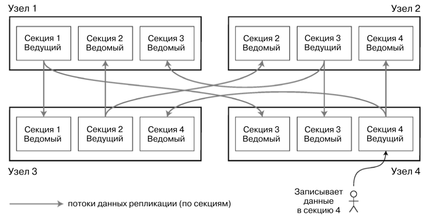
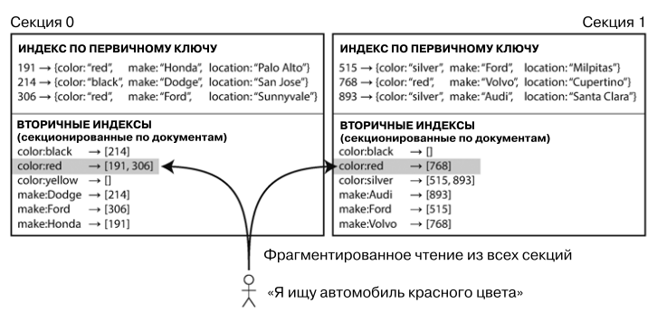
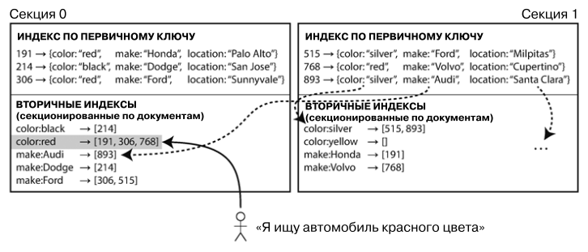
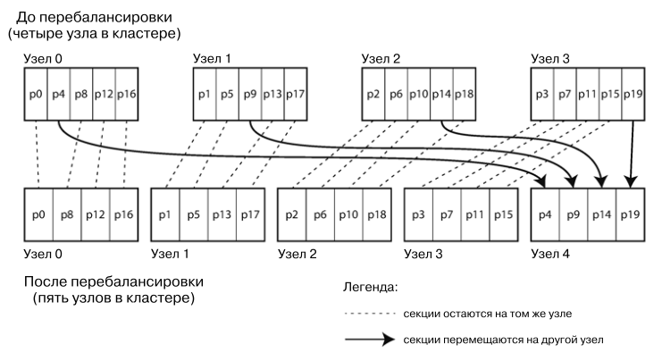
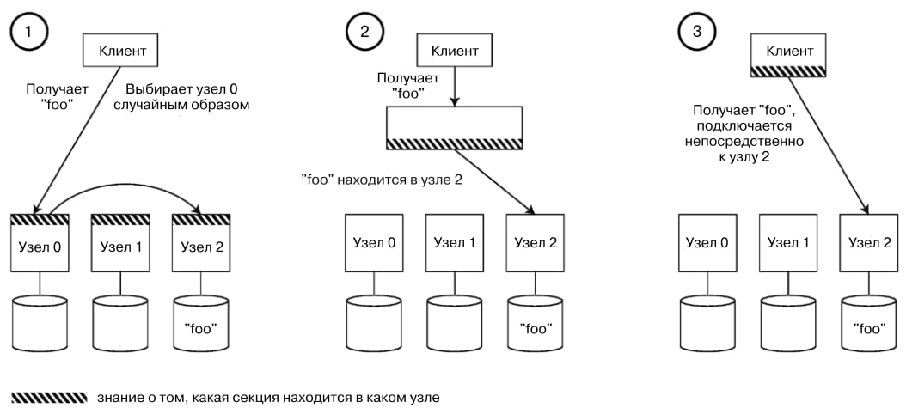
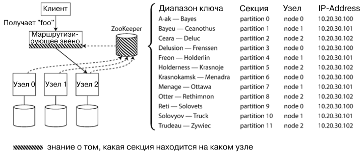

# Партиции
В случае больших объемов данных бывает необходимо разделить одно хранилище данных на несколько партиций (секций). Это 
называют выполнением шардинга (sharding) данных. Основная цель партицирования данных - масштабируемость. Разные партиции
можно разместить на разных узлах кластера. Следовательно большой объем данных можно разделить на несколько жестких дисков
и процессоров.

## Партиции и репликации
Партиции обычно идут бок о бок с репликациями. То есть копии одной и той же партиции повторяются на нескольких узлах, на
узле может хранится больше одной партиции. Делается это все в целях отказоустойчивости. 

## Способы разбиения на партиции
Цель партиций - равномерно распределить нагрузку и данные между узлами. Если партиции равномерны, то 10 узлов смогут
обработать в 10 раз больше запросов. Если не равномерны, то от партиций не будет толку. Такое разбиение партиций 
называют ассиметричным, а партиции с высокой нагрузкой - горячей точкой (hot spot).

Способы разбиения на партиции:
1) **По диапазонам значений ключа**  

Каждая партиция содержит данные по непрерывному диапазон значений ключа. Диапазоны не обязательно должны быть одинакового
размера, главное чтобы данные распределились равномерно.

Недостаток такого разбиения - некоторые паттерны записи данных приводят к горячим точкам. Например если разбиение было 
выбрано по датам или на основании каких-то повторяющихся и близких по значению данных.

2) **По хешу ключа**

Меньшей асимметрией обладает распределение на основе хеша ключа. Каждая партиция партиция в таком случае хранит диапазон
значений хеша. Может возникнуть вопрос, почему диапазон, а не остаток от деления (mod N). Потому что при увеличении 
числа партиций придется перемещать большое количество данных. В случае диапазона этот процесс лучше управляется.

Однако в случае использование хеша, близкие по значению ключи не обязательно будут находится в одной и той же партиции.
Поэтому запросы по диапазону будут иметь производительность похуже, так как будут отправляться во все партиции.

## Партиции и вторичные индексы
Партиции так же поддерживают и вторичные индексы. Сложность с ними в том, что вторичные индексы ссылаются на множество 
записей, а не одну. Отсюда вытекает проблема - их нельзя поставить в четкое соответствие партициям. Данные по одному и 
тому же вторичному индексу будут храниться в разных партициях. 

Тем не менее, есть два подхода к реализации вторичных индексов:
1) **По документам**

В таком случае каждая партиция хранит данные о вторичных индексах, которые встречаются в этой партиции. При чтении 
необходимо пройтись по всем партициям, это минус. Однако при модификации данных достаточно изменить данные о вторичном 
ключе только в модифицируемой партиции, это плюс.

Используется в MongoDB, Riak, Cassandra, ElasticSearch, etc.

2) **По термам**

В данном подходе партиция хранит данные о вторичном индексе, встречающимся во **всех** партициях. Для обеспечения 
масштабируемости вторичные индексы также разбиваются по всем партициям по диапазону. Например партиция 1 хранит
данные о вторичном индексе начинающихся с букв 'a' - 'f', партиция 2 'g' - 'p' и т.д.

Преимущество такого подхода, что для чтения достаточно обратиться к одной партиции. Недостаток - в замедлении и 
усложнении модификации данных, поскольку запись в документ может затронуть изменение в нескольких партициях, где 
хранятся данные о вторичных индексах.

На практике обновление индексов происходит асинхронно, так что можно попасть в случаи, когда вторичный индекс содержит
не всю информацию о записях. Поэтому мало какие СУБД поддерживают данную реализацию вторичных индексов.

## Перебалансировка партиций
Со временем данных в БД становится больше или они могут неправильно распределиться по партициям. Для этой цели 
необходима перебалансировка партиций.

Существует множество градаций между автоматической и ручной ребалансировкой. Полностью автоматическая уменьшает объем
работы по обслуживанию, однако ее результаты могут оказаться неожиданными. Процесс ребалансировки способен сильно 
нагрузить кластер, так что необходимо проводить эту операцию с большой осторожностью. Так что присутствие человека
при ребалансировке - хоть и медленнее, но позволить предотвратить операционные сюрпризы.

Существуют следующие методики:
1) **Фиксированное количество партиций**

Создать большое количество партиций и распределять их по разным узлам в случае необходимости.

Количество партиций задается при первой настройке базы данных и потом не меняется. Следовательно заданное число равно
максимальному количеству узлов, которое БД будет поддерживать. Так что число необходимо подбирать достаточно большое, 
чтобы не упереться в потолок, но и брать слишком большое число нельзя из-за больших накладных расходов. Выбор 
правильного количества особенно сложен при изменчивости общего размера набора данных.

Такой подход используется в Riak, ElasticSearch, Couchbase, etc

2) **Динамическое количество партиций**

Есть второй подход: когда партиция превышает по размеру определенный порог, она разбивается на две равные партиции. И 
наоборот, если партиция слишком маленькая, она может объединиться с соседней. 

Преимущество - адаптация количества секций к объему данных.

3) **Количество партиций пропорционально количеству узлов**

Количество партиций динамично и меняется в зависимости от количества узлов. На каждый узел приходится фиксированное 
количество узлов. При добавлении нового узла, выбирается фиксированное число существующих партиций и оттуда забирается
половина данных. 

## Маршрутизация запросов
Откуда клиент знает, к какому узлу и партиции ему надо подключиться, что получить данные? Учитывая, что узлы могут 
падать и подниматься, а партиции ребалансироваться, это довольно острый вопрос. Необходим какой-то наблюдатель сверху,
который будет знать необходимые метаданные для маршрутизации. Это частный случай более общей задачи, называемой
обнаружением сервисов (service discovery). 

На высоком уровне существует несколько вариантов решений:
1) Разрешить клиенту обращаться к любому узлу. Узел либо отдает искомые данные, либо перенаправляет в другой узел, 
который хранит искомые данные
2) Отправлять все поступающие запросы клиентов сначала в некий маршрутизатор, который в свою очередь будет 
перенаправлять в необходимый узел
3) Клиент сам должен знать, в какой узел ему необходимо обращаться

Многие системы используют второй вариант и сервис ZooKeeper в качестве маршрутизатора. Все узлы регистрируется в этом 
сервисе и оповещают его обо всех изменениях.

# Итог
В этой главе рассмотрели различные методы партицирования большого наборы данных на меньшие поднаборы. Партиции 
необходимы, когда размер набора данных не позволяет их держать на одной машине или когда необходимо
повысить конкурентность доступа к данным. 

Цель партицирования в распределении нагрузки по данным и запросам равномерно на несколько узлов, а так же в том, чтобы
избежать горячих точек. Для этого необходимо выбрать правильную схему и конфигурацию партиций.

Есть два основных подхода к партицированию:
1) По диапазонам значений ключей - родственные данные рядом, но бОльшая вероятность появления горячих точек
2) По хешу значения ключа - меньше вероятность горячих точек, но родственные данные не рядом

Так же обсудили связь между партицированием и вторичными индексами. Для реализации последних есть два метода:
1) Индексы по документам - вторичные индексы в той же партиции, что данные. Долгое чтение, быстрая запись
2) Индексы по термам - вторичные индексы могут быть в другой партиции. Быстрое чтение, долгая запись

Так же обсудили методы маршрутизации запросов к необходимому узлу и партиции.

