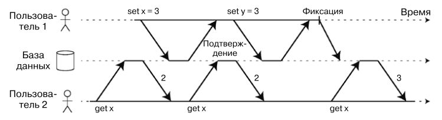
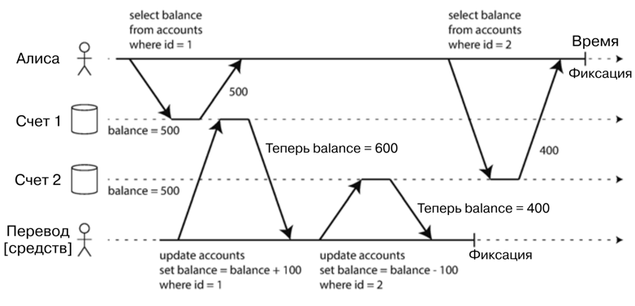
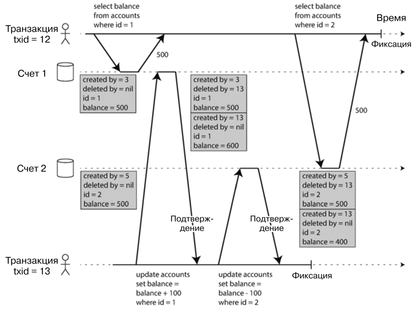

# Транзакции
Транзакции представляют собой цепочку операций, которая либо выполняется успешно (с фиксацией изменений), либо 
неудачно (с прерыванием цепочки и откатом изменений). По сути транзакции - способ борьбы со сбоями информационных 
систем, обработку таких ошибок и сбоев перед на себя база данных.

## Смысл аббревиатуры ACID
Гарантии, которые предоставляют транзакции, обычно описывают известной аббревиатурой ACID:
- Atomicity (атомарность)
- Consistency (согласованность)
- Isolation (изоляция)
- Durability (долговечность)

На практике реализация ACID отличается от базе к базе, особенно серьезные различия в понимании термина _изоляция_. 
На сегодняшний день заявление о совместимости какой-то БД с ACID не дает четкого определения о предоставляемых 
гарантиях.

#### Атомарность
Атомарность говорит нам о том, что если транзакцию не удалось завершить, то она прерывает дальнейшее выполнение и 
откатывает уже выполненные изменения. Благодаря атомарности можно быть уверенным, что в случае сбоя можно просто
еще раз повторить транзакцию и никакие данные не задублируются.

#### Согласованность
Транзакция должна приводить БД из одного допустимого состояния (инварианта) в другой допустимый. Иначе говоря, 
данные до и после транзакции должны быть согласованны, за это и отвечает данное свойство. 

Однако это довольно спорная гарантия транзакций, поскольку согласованность данных зачастую обеспечивается самим 
приложением и БД просто не может гарантировать согласованность бизнес требований. Можно даже сказать, что 
согласованность на самом деле является свойством приложения, а не транзакции.

#### Изоляция
Изоляция гарантирует, что конкурентно выполняемые транзакции изолированы друг от друга и не могут помешать друг другу.
Сериализуемость (транзакции выполняются как будто последовательно) - крайняя степень изоляции, однако она несет с 
собой большие издержки, так что зачастую используют другие механизмы изоляции.

#### Долговечность
Долговечность - обязательство базы не терять результат успешно зафиксированных транзакций даже в случае аппаратного 
сбоя.

## Уровни изоляции
Проблемы конкурентного доступа возникают, когда одна транзакция читает/изменяет данные, модифицируемые в этот момент
другой транзакцией.

Существует множество уровней изоляций транзакций. Сериализуемость - самый безопасный из них, но при этом очень дорогой.
Многие БД используют другие механизмы изоляции, которые защищают от _части_ проблем конкурентного доступа. Многие 
популярные БД используют слабую изоляцию, так что обязательно нужно читать документацию, чтобы понять потенциальные 
ошибки.

#### Read committed
Read committed (чтение зафиксированных данных) - самый базовый уровень изоляции. Он обеспечивает 2 гарантии:
- При чтении из БД клиент видит только зафиксированные (закомиченные) данные других транзакций
- При записи данных клиент может перезаписать только зафиксированные данные других транзкций

Ситуация, когда транзакция прочитала незафиксированные данные другой транзакции называется _грязное чтение_ 
(**dirty read**). Read committed защищает от такой проблемы:



Примеры проблем возникающие при грязном чтении:
1) Когда транзакция должна обновить несколько значений, а успела обновить только часть и другая транзакция 
прочитала только часть обновленных данных. Получим несогласованные данные при чтении
2) Транзакция может прочитать данные, которые другая транзакция позже откатит

Read Comitted - очень популярный уровень изоляции. Он используется по умолчанию в Oracle, PostgreSQL и SQLServer. 
Чаще всего уровень реализуют с помощью блокировки строк: прежде чем изменить конкретный объект, транзакция устанавливает
блокировку на этот объект. Данная блокировка удерживается до коммита или отката транзакции. Удерживать блокировку может
только одна транзакция одновременно. Подобные блокировки БД выполняют автоматически на уровне изоляции read comitted 
или на более сильных уровнях изоляции.

Первый способ предотвращения грязного чтения - запретить читать заблокированные данные. Однако на деле это приводит к 
большим издержкам. Поэтому большинство БД используют другой способ: база запоминает для каждого измененного объекта 
как старое значение, так и новое, устанавливаемое транзакцией. Во время выполнения транзакции всем другим транзакциям
возвращается старое значение. Только после коммита транзакцией новое значение могут считать другие транзакции.

#### Repeatable Read
Данный уровень изоляции имеет различные названия в разных БД. В Oracle он называется уровнем сериализации 
(serializable), а в PostgreSQL и MySQL - воспроизводимым чтением (repeatable read).

Ситуация, когда изменения одной транзакции мешают чтению данных другой транзакции, при которой она читает 
несогласованные данные - называется **nonrepeatable read**. То есть пострадавшая транзакция может дважды прочитать 
одни и те же данные и дважды получить разный результат.



Для решения этой проблемы чаще всего используют _изоляцию снимков состояния_ (**snapshot isolation**). Ее идея состоит
в том, что каждая транзакция читает данные из согласованного снимка состояния БД. То есть видит данные, которые были
зафиксированы на момент начала этой транзакции. Даже если данные затем изменены другой транзакцией, каждая транзакция
видит только старые данные.

Реализуют это с помощью списка версий объектов, по версии для каждой транзакции. Такой механизм получил название
многоверсионное управление конкурентным доступом (multiversion concurrency control, MVCC). В самом начале выполнения 
транзакция получает уникальный, монотонно возрастающий идентификатор (txid). При каждой записи транзакцией новые 
данные помечаются номером этой транзакции (поле created_by). Если транзакция удаляет строку, она записывается в поле
deleted_by. Изменение строки == удаление старой строки и создание новой. В дальнейшем, когда уже никакая транзакция 
не обратится к удаленным данным, сборщик мусора БД очистит эти данные. 



Выполняя чтение транзакция использует идентификатор, чтобы понять, какие данные она может прочитать. Правило видимости
таковы:
1) В начале каждой транзакции БД определяет список выполняемых, но еще не зафиксированных транзакций. Все выполняемые
этими транзакциями изменения игнорируются, даже если впоследствии будут зафиксированы.
2) Все операции записи выполненные транзакцией с более поздним txid игнорируются независимо от их результата.
3) Результаты всех остальных транзакций видны.

Другими словами версия объекта видна, если:
1) На момент начала читающей транзакции создавшая объект транзакция уже зафиксирована
2) Объект не помечен на удаление. Если помечен, то запросившая удаление транзакция не была зафиксирована на момент 
начала читающей транзакции

##### Serializable


## Предотвращение потери обновлений
При конкурентном выполнении транзакций возможна проблема _потери обновлений_ (**lost update**). Проблем может возникать,
когда транзакция читает данные, изменяет их и записывает обратно. При конкурентном выполнении такого действия мы можем
потерять одно из изменений.

Способы решения:
1) Атомарные операции записи

Доступны, когда описываемое изменение можно описать в SQL запросе, например 
```sql
UPDATE customers SET value = value + 1 WHERE key = 'foo'
```

2) Явные блокировки

Блокировка при помощи `SELECT ... FOR UPDATE` после которого приложение может изменять данные. Другим транзакциям при
попытке изменения этих данных придется ждать.

3) Автоматическое обнаружение потери обновлений

Можно разрешить транзакциям выполняться конкурентно, но проверять: изменилось ли значение после чтение и до изменения 
данных. Если изменилось, попробовать снова. Этакий аналог `compare-and-swap`

## Асимметрия записи
Асимметрия записи - когда две конкурентные транзакции изменяют данные и нарушают бизнес требования/ограничения. Например,
необходимо, чтобы кабинетом пользовались не более 1 человека, но в какой-то момент две транзакции двух разных 
пользователей одномоментно смогли занять кабинет.

Способы решения: использовать уровень сериализуемости или явная блокировка строк необходимых для обновления с помощью 
`SELECT FOR UPDATE`.