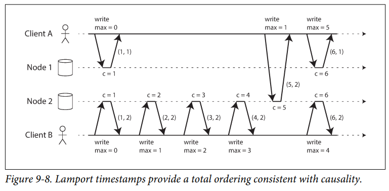
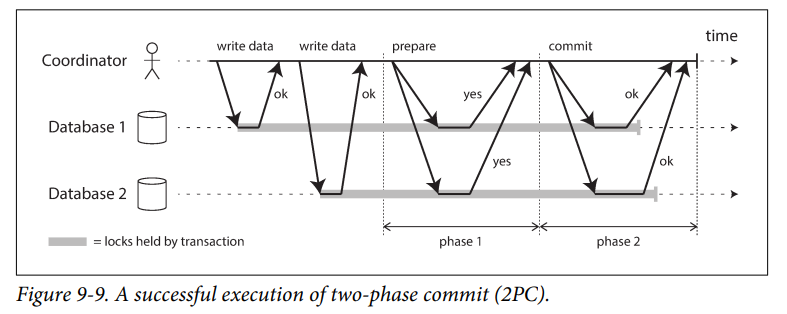
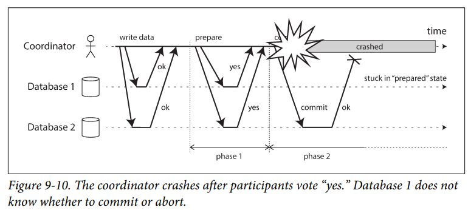

# Согласованность и консенсус
Согласованность в системе БД - обязательная для решения задача в системах распределенного хранения данных. Существует 
несколько способов реализации согласованности, ниже мы рассмотрим несколько из них. 

Однако согласованность не решает всех проблем с распределенным хранением и обработкой данных. Зачастую для нескольких
узлов необходимо составить единое решение о какой-то проблемы конкурентной работы. Решением этой проблемы является 
консенсунс. Обеспечение консенсуса - удивительно сложная задача.

## Гарантии согласованности
Большинство реплицированных БД гарантируют конечную согласованность (eventually consistency), однако это очень слабая 
гарантия. Она ничего не говорит о том, когда данные будут консистентны и до этого момента операции чтения возвращать
что угодно или вообще ничего. При работе с такой БД надо постоянно помнить об этих ограничениях. Такое поведение очень
сильно отличается от классического однопоточного выполнения программ, когда свежезаписанную переменную можно прочитать
и получить новое значение. Отсюда часто возникают ошибки, которые довольно сложно отловить на этапе тестирования.

Существуют более сильные модели согласованности. У каждой из них есть своя цена: системы с более сильной согласованностью
имеют худшую производительность или быть менее отказоустойчивыми.

## Линеаризуемость
Линеаризуемость - свойство, которое гарантирует, что любая операция чтения или записи в базу данных будет выполнена
атомарно и в определенном порядке. Например, если два пользователя пытаются изменить одну и ту же запись в базе данных,
то линеаризуемость гарантирует, что только одно из этих изменений будет выполнено первым, а второе будет выполнено после
того, как первое изменение будет завершено. Это предотвращает возможные конфликты и ошибки в данных. Под капотом
линеаризуемость работает при помощи блокировок и транзакций.

> :exclamation: **Линеаризуемость - самая сильная гарантия согласованности.**

В линеаризуемой системе предполагается, что есть некий момент времени (во время записи), при котором значение меняется 
со старого на новое. После этого момента времени _все_ последующие операции чтения обязаны возвращать новое значение.

Список областей, в которых может понадобиться линеаризуемость:
1) **Блокировка и выбор ведущего узла**: у всех узлов в системе должно быть единое понимание, кто является 
ведущим узлом. На деле чаще всего это решается при помощи инструментов по типу Zookeeper, который используется 
для решения консенсусный алгоритм.
2) **Ограничения и гарантия уникальности**: чтобы поддерживать уникальность некоторого поля, нужна линеаризуемость, ведь
в случае конкурентной записи необходимо однозначно определить, кто запишет значение первым, а кому не дать записать
повторяющееся значение.
3) **Межканальные синхронизационные зависимости**: в случае если один сервис записывает данные в БД, а другой из нее 
читает (тут же или через некоторое время), эта БД должна быть линеаризуема, чтоб второй сервис смог получить
свежезаписанные данные.

Реализация линеаризуемых систем:
1) **Репликация с одним ведущим узлом**: потенциально линеаризуемо. Если чтение происходит из мастер или 
синхронизированных реплик, то такая система линеаризуема. Однако на практике этому может помешать архитектура БД или 
ошибки возникающие из-за конкурентных операций. Архитектурно мешают следующие нюансы: чтение из всех реплик, 
неправильный выбор нового мастера, изоляция снимков состояния, етс.
2) **Консенсусные алгоритмы**: БД построенные на основе консенсусных алгоритмов (Zookeeper) тоже могут быть 
линеаризированы. Все благодаря алгоритмам, которые лежат в их основе, их мы рассмотрим дальше.
3) **Репликация с несколькими ведущими узлами**: не являются линеаризуемыми из-за их конкурентной природы записи.
4) **Репликация без ведущего узла**: иногда можно получить подобие линеаризуемости, если правильно настроить 
кворум (w + r > n).

Важно знать про **цену линеаризуемости**, коротко ее можно выделить так:
1) Если приложение _требует_ линеаризуемость, то в случае проблем в сети часть реплик могут стать недоступными (потому что
не могут связаться с другими репликами для синхронизации). Таким образом, мы _теряем доступность_.
2) Если приложение _не требует_ линеаризуемость, то в случае проблем в сети реплики продолжат работу (потому что
им больше не нужно синхронизироваться). Таким образом мы _получаем высокую доступность_, хоть и теряем линеаризуемость.

Если совсем коротко, то приложения не требующие линеаризуемости, более устойчивы к неполадкам в сети. Это представление
более широко известно как **CAP теорема**.

Аббревиатура CAP расшифровывается как Consistency, Availability, Partition Tolerance (Согласованность, Доступность,
Устойчивость к нарушению связности). При нарушении связности можно выбрать только что-то одно: согласованность данных
или доступность БД в целом. Таким образом, любая система БД может быть AP или CP.

Зачастую в современных системах отказываются от линеаризуемости, только не в угоду доступности, а в угоду 
_быстродействию_. Именно поэтому сейчас активно приходят новые теоремы на смену CAP. В реальных сетях с задержками
линеаризуемость работает **медленно**. Быстрых алгоритмов для линеаризуемости еще не придумали, однако можно более слабые
модели согласованности данных и таким образом ускорить систему. 

## Гарантии упорядоченности
Более слабая версия согласованности - упорядоченность (причинность, ordering). Даная гарантия упорядочивает зависимые
операции, но допускает параллельную обработку независимых операций. Можно провести параллель с git, где коммиты в одной
ветки строго упорядоченны, но коммиты из разных веток могут быть параллельны. Можно сказать, что линеаризуемость - 
абсолютная упорядоченность, поскольку любые два действия будут упорядочены относительно друг друга, мы уже рассматривали,
к каким накладным расходам это может привести. Зачастую системам хватает упорядоченности для правильной и быстрой работы.

Для сохранения причинно-следственных связей используются _порядковые номера_ или _временные метки_. Такая метка 
ставится не по физическим часам, а по логическим часам - алгоритм генерации последовательности чисел для 
идентификаций операций. Такая метка является компактной и может обеспечивать полную упорядоченность, поскольку любые
две операции имеют свой номер и по нему можно понять порядок операций. Конкурентные операции могут быть упорядочены
произвольно.

В базе данных с одним ведущим узлом именно он монотонно генерирует эту последовательность номеров. Таким образом, если
реплика выполняет операции в порядке согласно номерам, то его состояние всегда является причинно-упорядоченным. 

Если единого ведущего узла нет, то можно использовать метод временных меток Лампорта: каждый узел имеет ID и хранит 
увеличивающийся счетчик операций. Данный счетчик передается во всех запросов и ответах. Если узел или клиент встречают
значение счетчика, большего своего, они немедленно увеличивают свой счетчик до этого значения. Если у двух узлов
одинаковое значение счетчика, то при конкурентном запросе сначала обработается узел с меньшим ID. 

Несмотря на то, что метки Лампорта определяет полную последовательность счетчика согласованную с причинностью, их 
недостаточно для решения многих проблем. Например, если два пользователя хотят создать аккаунт с одинаковым именем 
пользователя, это должно получится только у одного из них. На первый взгляд кажется, что меток Лампорта хватит: 
завершается только та операция, которая имеет меньшую метку, а другая отклоняется. Однако такой метод работает только 
для сравнения постфактум, сначала надо собрать все операции создания аккаунтов, а потом можно сравнивать их временные 
метки. Этого недостаточно, если узлу необходимо принять решение моментально при получении запроса. 

Проблем в следующем: полное упорядочение операций происходит после того, как были собраны все операции. Если при 
записи уникального значения ни один другой узел не может заявить права на то же значение (но с более ранней временной 
меткой), то такую операцию можно считать успешной. Эта идея - знать когда общая последовательность построена - 
реализована в методе _рассылки общей последовательности_. 

## Рассылка общей последовательности
Рассылка общей последовательности - протокол обмена сообщениями между узлами, для него есть 2 требования:
1) _Надежная доставка_ - ни одно сообщение не должно быть потеряно. Если сообщение доставлено одному узлу, оно будет
доставлено всем узлам.
2) _Полностью упорядоченная доставка_ - все сообщения доставляются во все узлы в одном и том же порядке.

Рассылка общей последовательности решает многие вопросы (репликация, консенсунс, етс), сервисы консенсуса (Zookeeper)
реализовывают рассылку общей последовательности. Важным ее аспектом является то, что последовательность фиксируется в 
момент доставки и нельзя вставить данные задним числом. 

Линеаризуемый реестр с атомарным приращением счетчика и рассылка общей последовательности эквивалентны консенсусу. Иными
словами, если одна из указаных проблем решена, то она превращается в решение для других. 

## Распределенные транзакции и консенсус
Цель консенсуса - заставить несколько узлов согласовать некие объекты (принять общее решение).

Ситуации, в которых важно, чтобы узлы были согласованны:
1) Выбор ведущего узла
2) Распределенные транзакции (единое решение о коммите или роллбеке между узлами)

2PC (two-phase commit) - популярный алгоритм двухфазной фиксации распределенных транзакций. На самом деле, 2PC является
своего рода консенсусным алгоритмом (хоть и не очень хорошим). Так же, Zookeeper и etcd построены на базе консенсусных
алгоритмов.

В одноузловых транзакциях за атомарную фиксацию отвечает одно устройство на одном узле. Если узлов несколько, то 
недостаточно просто отправит запрос на фиксацию всем узлам. Может произойти так, что на одних узлах транзакция применится,
а на других откатится и как следствие, нарушится гарантия атомарности. Такие узлы станут несовместимы между собой, не 
получится отменить уже зафиксированную транзакцию на части узлов.

2PC гарантирует, что все узлы либо зафиксируют транзакцию, либо прервут ее. Вместо одного запроса на фиксацию, в 2PC 
процесс разбит на две фазы (подготовка, фиксация). 2PC для этого использует новый компонент - _координатор_.

Когда приложение готово к фиксации, координатор начинает этап 1: он отправляет запрос на подготовку каждому из узлов,
спрашивая их, могут ли они выполнить фиксацию. Каждый участник проверяет, что точно может завершить транзакцию при 
любых обстоятельствах (даже в случае поломки диска). Отвечая "Да" участник обещает зафиксировать транзакцию без 
ошибок в случае надобности. _После этого у участника **нет права** отменить транзакцию_. После получения ответов всех
участников, координатор записывает решение себе на диск, чтобы в случае сбоя понять, какое решение было принято (это 
называется точка фиксации). Если все узлы могут, то на этапе 2 координатор отправляет запрос фиксации. Если хотя бы 
один участник не может, то на этапе 2 всем узлам отправляет запрос прерывания. Если запрос до участника не дошел, то 
координатор будет пытаться отправить его снова и снова. Это точка невозврата: в случае принятия решения оно должно быть
исполнено. 

Две точки невозврата: ответ участника "Да" и принятие решения координатором обеспечивают атомарность 2PC.

Если с координатором случится сбой перед отправкой запросов на подготовку, то участник может безопасно прервать
транзакцию. Но как только участник получил запрос на подготовку и ответил "да", он больше не может самостоятельно 
отменить транзакцию. В таком случае участнику остается только ждать, а такая транзакция называется сомнительной или 
неопределенной. Единственный способ завершения процедуры - ожидание восстановления координатора. Вот почему он 
записывает свои решения на диск, прежде чем отправлять участникам запрос на фиксацию или откат.

Из-за этой проблемы 2PC называют блокирующий протоколом атомарной фиксации. В качестве альтернативы предложен алгоритм
трехфазной фиксации (3PC), однако он требует наличие сети с ограниченной задержкой и узлами с ограниченным временем 
отклика. В большинстве систем с неограниченными сетевыми задержками и паузами процессов он не гарантирует атомарность. 
В общем случае для неблокирующего протокола нужна идеальная сеть (или идеальный детектор отказов), что на практике 
нереализуемо, поэтому все продолжают использовать 2PC. 