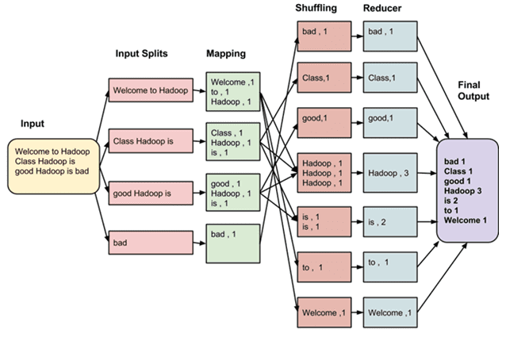
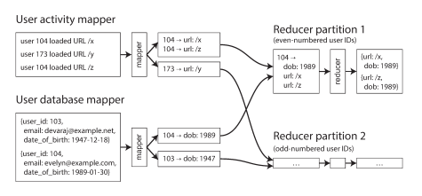

# Пакетная обработка
Выделяют 3 типа систем:
1) **Сервисы** (онлайновые системы) - сервис ожидает запроса от клиента. После того, как запрос получен, сервис пытается 
обработать его максимально быстро и возвращает отклик. Отклик является первичной мерой производительности сервиса.
2) **Системы пакетной обработки** - принимает большое количество данных, запускает задачу для их обработки и выдает некие 
данные на выход. Подобные задачи выполняются долго, так что пользователь не ждет их выполнения. Главная мера 
производительности - пропускная способность. **В этой главе мы рассмотрим именно такие системы**.
3) **Системы поточной обработки** - поточная обработка представляет собой что-то среднее между потоковой и онлайновой 
обработкой. Как и при пакетной обработке, эта система принимает данные на входе и генерирует выходные данные. Однако в 
случае появления событий поточные задачи реагируют на них, в то время как пакетные работают только с фиксированным 
набором входных данных.

Системы пакетной обработки используются в компаниях, связанные с аналитикой/обработкой big data. Самый популярные 
алгоритм обработки больших данных является MapReduce (о нем мы поговорим позже). MapReduce используется в Hadoop, 
CouchDB и MongoDB. 

### MapReduce
MapReduce схож по принципу работы с утилитами Unix. Он принимает один или несколько потоков ввода и производит
один или несколько потоков вывода. MapReduce не изменяет входные данные и не имеет побочных эффектов, только генерирует 
выходные данные. При помощи этого алгоритма можно обрабатывать большие объемы данны при помощи распределенной 
вычислительной системы. 

Задача MapReduce состоит из двух частей (двух функций):
1) Отображение (map) - функция отображения принимает на вход список значений и применяется к каждому элементу списка. 
Результатом функции служит другой список (может даже пустой) из объектов ключ-значение. Таким образом, на выходе из 
функции отображения может быть список большего или меньшего размера, чем исходный.
2) Свертка (reduce) - функция свертки преобразует список к некоему атомарному значению, которое нас интересует. Так же 
применяется поэлементно, но имеет промежуточный результат между выполнениями. 

Между Map и Reduce просходит процесс **shuffling**, в этом процессе все пары ключ-значения после функции отображения
группируются по ключу. Функция свертки применяется к группе значений по одному ключу.

Распределенная работа MapReduce (пояснения после картинки):

Большой плюс MapReduce в возможности использовать распределенные вычисления. Данные, поступающие на вход, 
секционнируются. Обычно объем каждого входного файла составляет сотни мегабайт. Планировщик задач MapReduce запускает 
функцию отображения на каждой машине, где хранятся данные и где хватает памяти/процессорных мощностей для запуска этой 
функции. Данный принцип называется "где данные, там вычисления". Самого кода этой функции на машине нет, поэтому среда 
MapReduce сначала копирует код (JAR архив) на машину и затем запускает выполнение этого кода. Результат выполнения 
является список пар ключ-значение.

Для каждой такой пары ключ-значение после отображения вычисляется кеш по ключу. На основе этого ключа определяется, в 
какую машину направить такую пару. Все пары с одним ключом попадают на одну машину. На одной машине может быть несколько
разных ключей, но будет произведена группировка, поэтому сначала обработаются все пары по одному ключу, затем по 
другому.

Как на самом деле происходит шафлинг? Данных ведь много и не получится сначала все отобразить, как это сгруппировать и 
потом отправить на свертку - не хватит оперативной памяти. Для решения этой проблемы после функции отображения каждая 
машина сортирует какую-то часть данных, которую она только что обработала. Когда какая-то машина закончила и отсортировала 
данные - уведомляются машины с функцией свертки. Каждая машина свертки сходит к машине отображения и заберет необходимую ей
часть данных.

Обычно одна задача (функция отображения + функция свертки) может решить ограниченный круг задач: например посчитать сколько
раз купили тот или иной товар. Если же мы хотим решить более сложную проблему (например получить топ 10 самых 
продаваемых товаров), то нужно сделать еще одну задачу MapReduce (еще раз отфильтровать данные, полученные с первого
шага). Таким образом, в боевых примерах, MapReduce задачи представляют собой pipeline из задач, результат одной 
передается на вход другой.

Поговорим про **объединения (join)** в пакетной обработке, такой как MapReduce. Представим пример, что у нас есть 2 типа 
данных: данные пользователя и их действия. Перед нами стоит задача связать возраст пользователя с его действиями. 
Существует 2 подхода к решению данной задачи:

1) **Объединение на этапе свертки** (Reduce-side joins)
Функция отображения извлекает ключ и значение из полученных данных. У данных обоих типов есть общий ключ - ID 
пользователя. Таким образом одна функция отображения извлекает возраст пользователя по его ID, а вторая извлекает
действия пользователя по его ID. На этапе свертки такие данные сгруппируются по ключу - ID пользователя и мы получим 
данные о его действиях и возрасте в одном наборе данных.

2) **Объединение на этапе отображения** (Map-side joins)
Объединение на этапе свертки может потребовать довольно больших вычислительных затрат. Когда удается сделать 
определенные предположения о входных данных, можно ускорить объединение, используя map-side join. При таком подходе
используется упрощенная задача MapReduce без свертки и сортировки. Отображение просто читает один блок входных файлов и
записывает в файловую систему один выходной файл. 