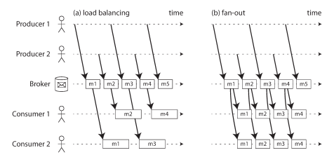

[Назад](./README.md)

1. [Передача потоков событий](#передача-потоков-событий)  
2. [Базы данных и обмен сообщениями](#базы-данных-и-обмен-сообщениями)  
3. [Обработка потоков](#обработка-потоков)  
4. [Резюме](#резюме)

# Потоковая обработка
Данные для пакетной обработки конечны и ограничены по размеру. В реальной жизни так происходит далеко не всегда, 
зачастую данные просто генерируются пользователем неограниченное время. Такой поток данных можно обрабатывать пакетным
образом, например дискретно каждый день/час/минуту. Но в таком случае пользователи увидят итог своих действий не сразу, 
а тогда, как в следующий раз сработает пакетная обработка. Для решения такой проблемы существует _потоковая обработка_
данных. В этом случае поток данных слушается на постоянной основе и свежепоступившие события обрабатываются сразу (в
порядке очереди, если обработчик не успевает).

## Передача потоков событий
В потоковой обработке вместо файлов используются _события_. Это может быть что угодно: действие пользователя, замеры 
датчиков, результаты наблюдений, етс. События могут представлять из себя что угодно: JSON строки, просто строки, 
бинарные данные, етс. События генерируют _инициатором_ (издатель/отправитель), а затем обрабатываются разными 
потребителями (подписчиками/получателями). Взаимосвязанные события объединяются в _тему_ или _поток_.

Что делать, когда инициатор поставил новое событие? Потребители могут сами опрашивать инициатора раз в какое-то время,
но это добавляет накладные расходы (особенно если делать проверки часто). Вместо этого лучше отправлять потребителям
уведомления о появлении новых событий. Традиционные БД не предназначены для поддержки такого механизма. Вместо этого для
доставки событий были разработаны специальные инструменты.

Общий принцип уведомления пользователя заключается в использовании **системы обмена сообщениями (messaging system)**:
инициатор отправляет сообщение в систему, а она затем рассылает его всем потребителям.

Системы обмена сообщениями используют широкий спектр подходов, единой технологии на все случаи жизни не существует. Для
классификации этих систем можно задать себе следующие вопросы:
1) Что произойдет, если инициаторы будут отправлять сообщения быстрее, чем потребители смогут их обрабатывать? Есть
3 варианта: отбрасывать сообщения, буферизовать их в виде очереди, использовать контроль обратно потока (backpressure).
2) Что произойдет, если узел даст сбой и будет временно недоступен? Будут ли утеряны данные? Как и в случае с БД
могут быть применены различные комбинации записи на диск и/или репликации. 

Типы систем обмена сообщениями:
1) **Прямой обмен сообщениями** - использовать TCP/UDP протоколы для прямой связи инициатора и подписчика. Самый 
быстроработающий способ, но представляющий меньше всего гарантий. Существует большой круг проблем, которые данные системы
не умеют решать и придется решать их на уровне кода. 
2) **Брокеры сообщений** - отправка сообщений осуществляется через отдельный брокер. По существу это своего рода БД, 
оптимизированная для обработки потоков сообщений. Он работает как сервер: инициаторы и подписчики подключаются к нему
как клиенты. Благодаря централизации такие системы умеют из коробки решать многие проблемы: подключение/отключение
клиентов, различные проблемы обеспечения надежности. Результатом очередей является то, что они становятся
асинхронными: инициатор не сможет получить подтверждение обработки от подписчика, только подтверждения получения 
сообщения от брокера. 

Разница между БД и брокером сообщений:
1) Информация в БД хранится до тех пор, пока явно не будет удалена. В то время большинство брокеров сообщений удаляют
сообщение сразу, как оно было доставлено подписчику.
2) Большинство брокеров расчитано на относительно небольшой рабочий набор данных. Если данных становится больше, 
брокерам приходится буферизовать данные на жесткий диск и начинает страдать производительность.
3) Базы поддерживают вторичныек индексы и различные способы поиска данных, в то время брокеры сообщений обеспечивают
только подписку на определенное подмножетство сообщений.

Когда несколько потребителей читают сообщения в одной теме, используются два основных паттерна обмена сообщениями:
1) Распределение нагрузки (рис. 11-1 а) - каждое сообщение доставляется одному подписчику, вследствие чего потребители
могу распределять между собой обработку сообщений в теме. Данный паттерн полезен, когда обработка сообщения занимает
продолжительное время и желательно ее распараллелить.
2) Разветвление (рис. 11-1 б) - каждое сообщения доставляется всем подписчикам. Разветвление позволяет нескольким
потребителям независимо друг от друга читать одну и ту же тему.

В любой момент у потребителя может случиться сбой: чтобы не потерять сообщения брокер ждет **подтверждение получения 
сообщения**. Только после подтверждения брокер удалит сообщение. Даже если сообщение на самом деле было обработано, но 
ответ потерялся в сети - брокер еще раз отправит это сообщение. Если использовать распределение нагрузки, то сообщения
могут обработаться **в порядке отличном от порядка отправления**. Более старое сообщение от упавшего потребителя может
перейти к другому потребителю, который уже обработал более новые сообщения.

3) **Брокеры сообщений на базе журналирования** - почему бы не создать гибрид сочетающий надежный подход
хранения данных (БД) и оповещение с малой задержкой (системы обмена сообщений).

Журнал - просто хранящаяся на диске последовательность записей с разрешением только на добавление в конец. Такую 
структуру можно использовать в брокере сообщений. Инициатор добавляет сообщения в конец журнала, а потребитель читает
с конца журнала. Если потребитель дошел до конца журнала, то ждет уведомления о добавлении нового сообщения. Чтобы 
обойти ограничения возможностей одного диска - можно использовать секционирование. Журнал разделяется на разные 
_партиции_ на отдельных машинах (дисках) для распаралеливания записи и обработки. Внутри каждой партиции брокер 
назначает каждому сообщению монотонно увеличивающийся порядковый номер (_смещение, offset_). 

По указанной технологии работают Apache Kafka, Amazon Kinesis Streams, Twitter DistributedLog. Несмотря на то, что 
брокеры записывают все сообщения на диск, они способны обеспечивать пропускную способность до миллионов сообщений в 
секунду за счет секционирования и высокую отказоустойчивость за счет репликаций.

У брокеров на базе журналирования есть еще одна сильная сторона - использование смещение (offset) для потребителей. В
таком случае брокеру (и потребителям) легко понять, какие сообщения уже были прочитаны: те, у которых порядковый номер
меньше смещения (offset). Это позволяет не реализовывать сложную логику слежения за чтением сообщений. Если узел
потребителя вышел из строя, то новый узел может сразу начать читать дальше - достаточно получить offset. Однако
если узел обработал сообщение, но не успел сместить offset - это может привести к проблемам, решение которых мы обсудим
позже.

Что же лучше: традиционные брокеры или брокеры на базе журналирования? Журнал - простейший способ обеспечить рассылку 
сообщений: несколько пользователй могут читать журнал независимо друг от друга, при этом сообщения не удаляются из 
журнала. Партиции помогают равномерное распределение нагрузки. Однако из партиции сообщения читаются последовательно
однопоточным способом. Из-за этого кол-во узлов-потребителей не может быть больше кол-ва партиций и если какое-то
сообщение медленно обрабатывается, то это задерживает обработку остальных сообщений партиции. Таким образом, если
обработка одного сообщения ресурсоемкая, есть желание сильно распаралелить процесс и порядок сообщений не важен, то 
**предпочительнее традиционные брокеры**. В ситуациях с высокой пропускной способностью, быстрой обработкой одного 
сообщения и необходимостью соблюдать последовательность - **лучше использовать брокеры на базе журналирования**.

## Базы данных и обмен сообщениями
К базам данных можно применить идеи из области обмена сообщениями. В любой комплексной системе есть несколько источников
данных: база для хранения, кэш для быстрого получения, поисковый индекс для полнотекстового поиска. Как синхронизировать
все эти хранилища данных? Путь к решению - чтение журнала реплицирования. В этот журнал попадают все данные, перед тем
как они будут сохранены в базу. Можно подумать "почему бы не использовать триггеры" - они имеют тенденцию давать сбои
и требуют значительных накладных расходов. 

Такой подход используются инструменты _перехвата изменений данных_ (change data capture, CDC). По сути при перехвате 
изменений одна база данных становится ведущим узлом, а остальные ведомыми. Для переноса изменений событий из исходной 
базы хорошо подходит брокер сообщений на основе журналирования. Перехват изменений является асинхронным процессом со 
всеми вытекающими проблемами и достоинствами.

Зачастую журнал реплицирования не хранит абсолютно все данные, которые есть в БД - раз в какое-то время он чистится. 
При таком поведении журнала необходимо выгрузить снапшот БД, соотнести его с журналом и далее использовать этот журнал.
Некоторые инструменты CDC поддерживают такое из коробки, для других необходимо проводить данную процедуру вручную.

## Обработка потоков
Что можно делать с имеющимися потоками:
1) Извлекать данные из событий и щаписывать их в БД/кэш/поисковый индекс/етс
2) Передавать события пользователям: письмо на электронную почту, предупреждение, етс
3) Обрабатывать один или несколько потоков и создавать на их основе один или несколько новых потоков

Рассмотрим 3й пункт, в рамках этой активности можно:
1) Обрабатывать сложные события - (complex event processing, CEP) технология для анасила потоков событий. Обработчик
слушает поток и проверяет все события на некий паттерн (заранее прописанный). В случае если событие удовлетворяет 
паттерну, генерируется сложное событие.
2) Аналитика потоков - отличается от предыдущего типа тем, что заинтересована не столько в поиске, сколько в сборе 
большого количества событий и генерации статистики.
3) Поддержка материализованных событий - получение альтернативного представления для некоторого набора и поддержание
его актуальности. По сути то, что было описано раннее, когда на основе БД поддерживаются кеш и поисковый индекс.
4) Поиск в потоках - поиск событий по полнотекстовому поиску.

Потоковые процессоры часто имеют дело со временем, особенно когда необходимо подсчитать что-то за "последние 5 минут".
Потоковый процессор в таком случае ориентируется на метку времени в событии, поскольку если процессор быстрый, он может
за 5 минут прочитать события последних лет или наоборот, если процессор замедлился, он может сильно отстать. Сложность
в том, когда нам понять, что события за определенный промежуток больше не придут? Что если случилась задержка сети или
одна из предыдущих систем начала работать медленнее? Можно посчитать временной интервал закрытым, выдать результаты и
по разному реагировать на появление старых данных:
1) Игнорировать оставшие значения - особенно разумно, когда их небольшой процент от общего числа
2) Опубликовать поправку к старому посчитанному значению

Существует 2 типа объединения потоков: 
1) **Объединение поток-поток**.  
У каждого события в обоих потоках должен быть по ключ, по которому события можно связать. Поточный процессор 
запоминает последние события обоих потоков и сохраняет их в памяти. Процессор постоянно проверяет, можно ли совместить
какие-либо два сохраненных события. Если такие совпадения находятся - генерируется новое событие с совпадением. Если
какое-то событие долго провисело без пары, то генерируется событие об отсутствие пары.
2) **Объединение поток-таблица**.  
В потоковый процессор загружается копия базы и запрашивается соответствие для каждого пришедшего события.

Потоковые обработчики сохраняют состояние в удаленном хранилище данных для обеспечения отказоустойчивости. В случае 
сбоя можно восстановить данные прошлого удачного состояния и заново выполнить обработку событий.

# Резюме
Потоковая обработка реализуется с помощью брокеров сообщений. Существуют два популярных типа брокеров сообщений: 
1) **брокеры сообщений типа AMKP/JMS** - брокер отправляет сообщение потребителю, те высылают подтверждение, после этого 
сообщения удаляется. Такая технология годится, когда точный порядок обработки сообщений неважен и нет необходимости
возвращаться читать сообщения заново.
2) **брокер сообщений на основе журналирования** - брокер отправляет все сообщения из партиции одному узлу-потребителю 
(на группу) и всегда в одинаковом порядке. Параллелизм достигается путем секционирования.

Представление базы данных в виде потоков открывает широкие возможности для интеграции систем. Можно постоянно 
поддерживать актуальность информационных систем (индексы, кэши, полнотекстовый поиск) используя журнал изменений БД.

Существует множество способов обработки потоков данных: поиск событий по шаблону, вычисление оконных агрегаций, 
поддержание производных систем в актуальном состояние, етс.

Существует 2 типа объединения потоков: 
1) **Объединение поток-поток**. Потоковый процессор хранит состояния двух потоков и на фоне постоянно ищет совпадения.
2) **Объединение поток-таблица**. Потоковый процессор загружает копию бд и для каждого события ищет там совпадение.