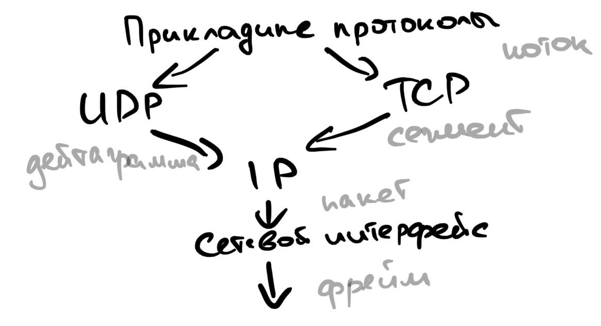
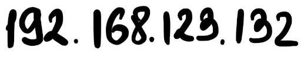
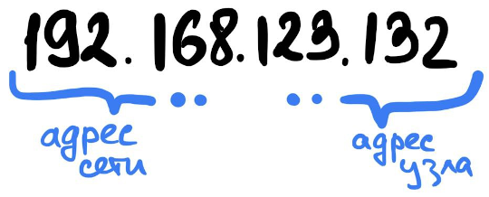
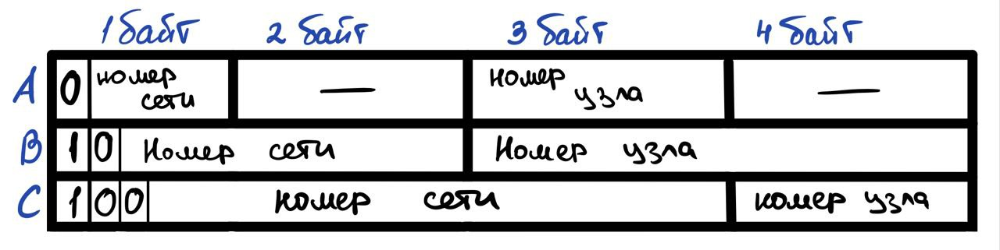

# TCP/IP
## Адресация в стеке TCP/IP
Одно из достоинств TCP/IP - примерить непримиримое. Различные подсети могут быть разных технологий и масштаба.  

В задачи адресации TCP/IP входит:

- Согласованность использования имен (доменное <-> межсетевое <-> локальное)
- Обеспечение уникальности имен
- Конфигурация межсетевых интерфейсов

[!] Главный плюс TCP/IP в задачах адресации - масштабируемость

## Структура стека протоколов TCP/IP 
| Уровень                     | Протоколы                           |
|-----------------------------|-------------------------------------|
| Прикладной уровень          | FTP, Telnet, HTTP, SMTP, SNMP, TFTP |
| Транспортный уровень        | TCP, UDP                            |
| Сетевой уровень             | IP, ICMP, RIP, OSPF                 |
| Уровень сетевых интерфейсов | Не регламентируется                 |

Взаимодействие протоколов разных уровней происходит следующим образом:
1) Пользовательские приложения используют прикладной уровень для генерации **потока** данных
2) Данный поток передается на вход транспортному уровню, он нарезает поток на **сегменты** и используя
сетевой уровень (как инструмент) передает сегменты по сети
3) Сетевой уровень укладывает сегменты по **пакетам**
4) Сетевой уровень затем передает пакеты уровню сетевых интерфейсов, а они преобразуют их в **кадры**
и физическ отправляет данные по кабелю

#### Почему уровень сетевых интерфейсов не регламентируется
Фишка TCP/IP в том, что он не регламентирует сетевые интерфейсы, сетевая технология сама разрабатывает
стандарт (интерфейс) TCP/IP, который позже становится частью уровня сетевых интерфейсов.  

Для всех популярных технологий (Ethernet, ATM, x.25) есть такой интерфейс, а для новых технологий разработчики
должны озадачиться его появлением.

## Типы адресов TCP/IP
В каждой подсети может использоваться своя система адресация в зависимости от технологии.
Протокол TCP/IP вступает в силу, когда такие подсети объединяется и необходимо резолвить локальные адреса подсети.

Для решения этой проблемы в TCP/IP есть глобальные адреса. Они состоят из адреса подсети и адреса узла в подсети.
Такая пара называется сетевым адресом или **IP адресом**. Такие числовые адреса сложно запомнить человеку,
поэтому были придуманы символьные **DNS (доменные) имена**.

## Формат IP адресов
IP адрес имеет вид  
  
Так же он состоит из адреса сети и адреса узла  
  
Разделение это может происходить двумя разными способами

### RFC 950
Разделение адресов происходит по маске подсети, которая передается вместе с IP адресом.   
Маска имеет вид 111..1100..000. Где единицы указывают, что этот бит адреса сети, а ноль, что этот бит адреса узла. 

### RFC 791
Разделение происходит так же по маске, но чтобы не плодить бесконечно множество классов IP адресов, 
было решено ввести 5 классов. Каждый класс IP адреса имеет определенную стандартом маску. 
Класс IP адреса задается в первых битах адреса.

## Классы IP адресов
Класс IP адреса (согласно RFC 791) определяется первыми байтами. 
Классы представлены на картинке
  

Классы A, B, C - обычные индивидуальные адреса.  
Помимо этих классов, есть классы D, E - которые являются групповыми адресами и 
обрабатываются особым способом. Один адрес класса D указывает на группу индивидуальных адресов.

