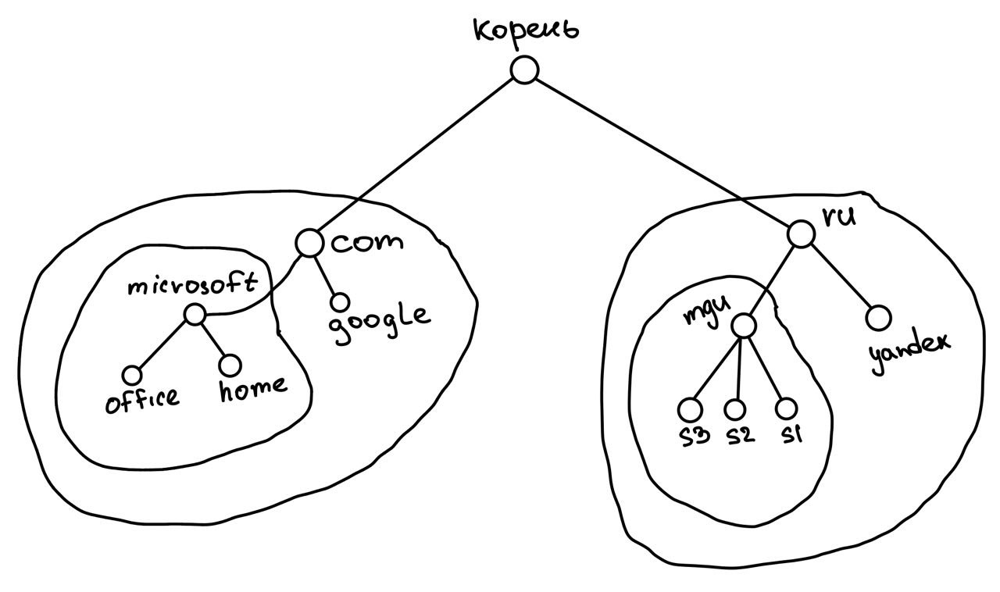
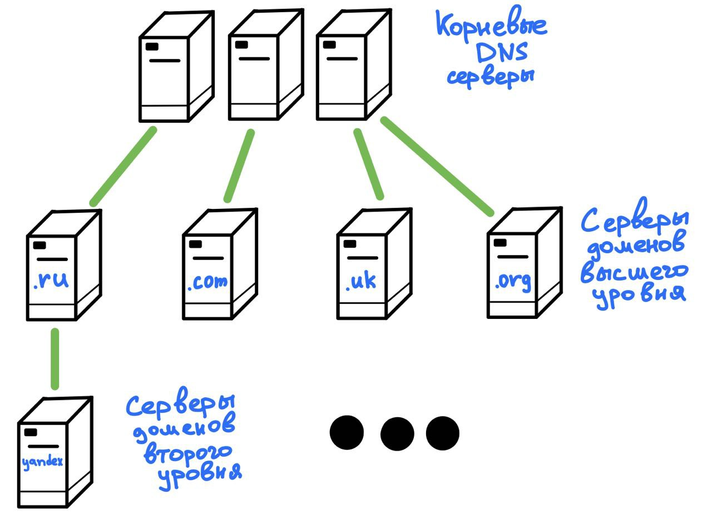
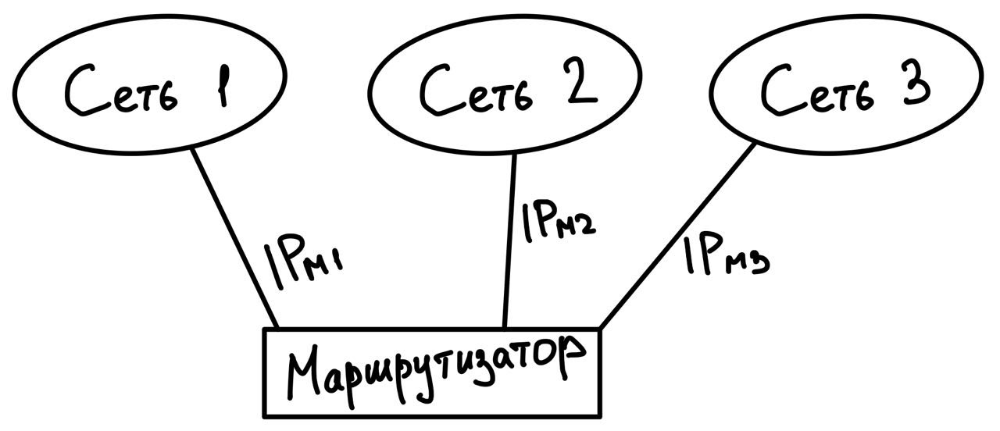

# DNS
## Иерархия DNS имен
  
Такая иерархия упрощает администрирования DNS пространств. 
Таким образом проще поддерживать уникальность имен и распределение серверов.

Доменное имя собирается слева направо, то есть начиная от .ru 
(самый старший разряд DNS имени), до www (самый младший разряд DNS имени).

## Сервер, клиент и протокол DNS
Когда интернет только зарождался, на каждом узле сети был файл **hosts.txt**. 
В этом файле хранились пары DNS имен к IP адресам. По мере развития интернета, такой 
подход оказался не масштабируемым.

Широковещательные запросы на глобальной сети так же не представляются возможным, так что
было выбрано централизованное решение **Domain Name System (DNS)**.

В это решение входило:
* Сервер (хранит перечисление пар DNS - IP)
* Клиент (ПК, телефон, маршрутизатор)
* Протокол DNS

Общая схема работы:  
  
1) Пользователь посредством клиента (например браузер) обращается по некоторому DNS.
2) Браузер обращается к операционной системе с просьбой узнать IP адрес по DNS.
3) В каждой сетевой ОСи есть специальный resolver, который обращается к DNS серверу.

## Иерархия серверов DNS
  
Обращение клиента происходит сначала в корневой DNS сервер.  
Исходя из домена корневой сервер узнает, в какой сервер высшего уровня отправить клиента дальше.  
Сервер высшего уровня узнает домен yandex и отправляет клиента в сервер доменов второго уровня.  
Сервер второго уровня отправлять клиенту IP по запрашиваемому DNS имени.

## Схема IP маршрутизации
### Ремарка
Маршрутизатор не имеет выделенного адреса и не является отдельным узлом. 
Вместо этого маршрутизатор имеет выделенный узел и адрес в каждой сети, к которой 
он относится. Таким образом маршрутизатор - это совокупность адресов в каждой сети.
  