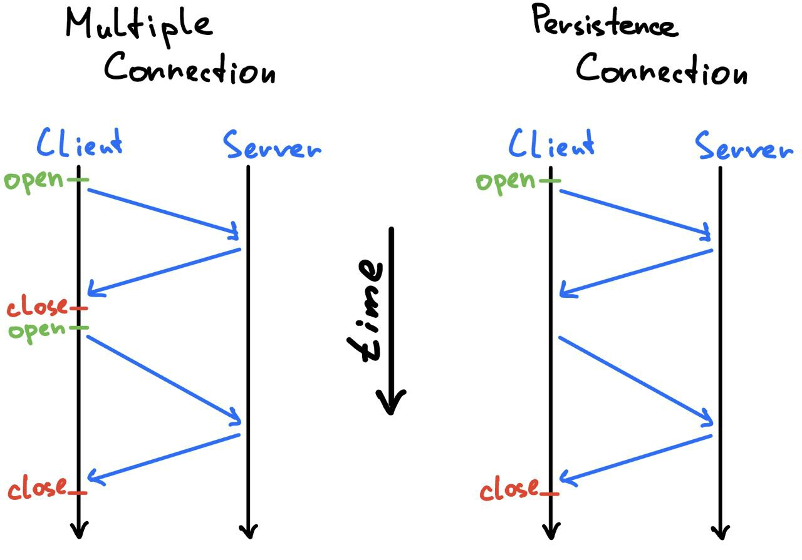

# Информационные службы IP сетей
## Протокол HTTP
HTTP - протокол передачи гипертекста, в качестве транспортного протокола использующий TCP.

HTTP соединения бывают:
1) Multiple - каждый HTTP запрос открывает новый TCP коннект
2) Persistence (default since http 1.1) - в рамках одного TCP коннекта 
может быть произведено много HTTP запросов.



Формат HTTP запроса и ответа

| Описание                                                              | HTTP запрос                                                 | HTTP ответ                                   |
|-----------------------------------------------------------------------|-------------------------------------------------------------|----------------------------------------------|
| Стартовая строка <br/>(обязательно должна быть в начале)              | Method URL HTTP/1.x                                         | HTTP/1.x Code Phrase                         |
| Заголовки. <br/>Могут быть в производном порядке и могут отутствовать | Host / User-agent / Authorization etc                       | Date / Server / Content-Length etc           |
| Пустая строка                                                         |                                                             |                                              |
| Тело сообщения                                                        | Какой-либо контент, необходимый серверу. Например json файл | Какой-либо ответ сервера. Например json файл |

Пример:  
HTTP request:
```
POST /cgi-bin/process.cgi HTTP/1.1
User-Agent: Mozilla/4.0 (compatible; MSIE5.01; Windows NT)
Host: www.tutorialspoint.com
Content-Type: application/x-www-form-urlencoded
Content-Length: length
Accept-Language: en-us
Accept-Encoding: gzip, deflate
Connection: Keep-Alive

licenseID=string&content=string&/paramsXML=string
```

HTTP response:
```
HTTP/1.1 200 OK
Date: Mon, 27 Jul 2009 12:28:53 GMT
Server: Apache/2.2.14 (Win32)
Last-Modified: Wed, 22 Jul 2009 19:15:56 GMT
Content-Length: 88
Content-Type: text/html
Connection: Closed

<html>
<body>
<h1>Hello, World!</h1>
</body>
</html>
```