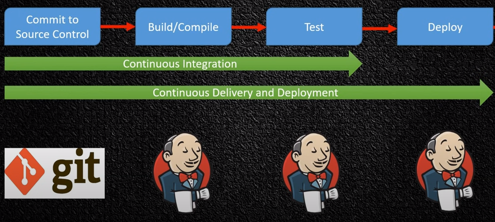

CI - devops модель, при которой после гит пуша в ветку начинается процесс сборки и тестирования кода из этого коммита.  
CD - devops модель, при которой после гит пуша в ветку начинается процесс сборки, тестирования и деплоя кода из этого
коммита.

**Jenkins** - опенсорс CI/CD инструмент написанный на Java.

У Jenkins есть **Master node**, которая хранит логи, конфигурацию и занимается планированием сборок. Сами сборки при
этом принято запускать на **Slave node** (их еще называют агентами). Можно и без этого, тогда сборки будут происходить
на Master node.

Преимущества использования Slave node:
1) Снизить нагрузку с Master
2) Можно сделать больше одновременных билдов
3) Можно сделать билд разных платформ на разных Slave (.Net на Slave_1, Java на Slave_2, etc)

Jenkins из коробки поставляется с минимальной функциональностью, докрутить его для ваших сценариев можно с помощью
**плагинов**. Плагины это по сути небольшие Java архивы, которые привносят новую функциональность. Установить можно
через GUI администрирования Jenkins (меню так и называется, manage plugins). Либо вручную при помощи `.hpi` файла,
который можно скачать с репозитория плагинов Jenkins. При выборе плагинов надо быть аккуратным и выбирать
поддерживаемые и популярные плагины.

Основной компонент Jenkins - **Jenkins job**. По сути это объект, который и отвечает за сборки приложения. Jenkins job
хранит перечень шагов, которые выполняются последовательно. Создать джобу можно из перечня базовых джоб (их можно
расширить за счет плагинов), но самый универсальный тип джобы - `Freestyle Project`. Непосредственно билд джобы
можно составить из следующих шагов:
1) Execute Windows batch command
2) Execute Linux shell
3) Invoke Ant - Указывает список вызываемых целей Ant
4) Invoke Gradle Script - Предназначен для проектов, которые используют Gradle в качестве системы сборки.
5) Invoke top-level Maven targets - Предназначен для проектов, которые используют Maven в качестве системы сборки.
6) Run with timeout - Если сборка не завершается за указанное время, она автоматически завершается и помечается как прерванная.
   Время по умолчанию будет не менее 3 минут.

Различные типы билд степов можно увеличить с помощью плагинов. То есть даже для деплой степа нужен будет отдельный
плагин.

Джобы можно сделать parameterized, такая джоба имеет параметры, которые задаются при старте джобы. Параметрам можно
указать значения по умолчанию. Под капотом это будет считаться переменными окружения. Существуют разные типы параметров:
логические, строки, выбор из списка, логин, пароль, файл. Увеличить количество параметров можно с помощью плагинов.

Чтобы не писать каждый раз джобы в GUI был придуман **Pipeline**. Pipeline - CI/CD as code. Есть две версии синтаксиса:
более новый Declarative Syntax, более старый Scripted Syntax (который под капотом на самом деле Groovy). Для работы
с пайплайном надо установить плагин Pipeline. Хранить pipeline можно как в самой джобе, так и отдельно в гит репозитории
и подтягивать его в джобу с помощью SCM инструментов (плагин будет установлен вместе с Pipeline). При помощи
pipeline можно написать все те же джобы, что и с помощью GUI.