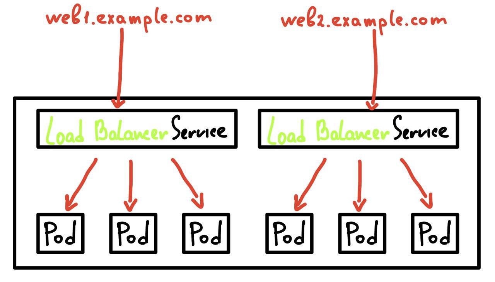
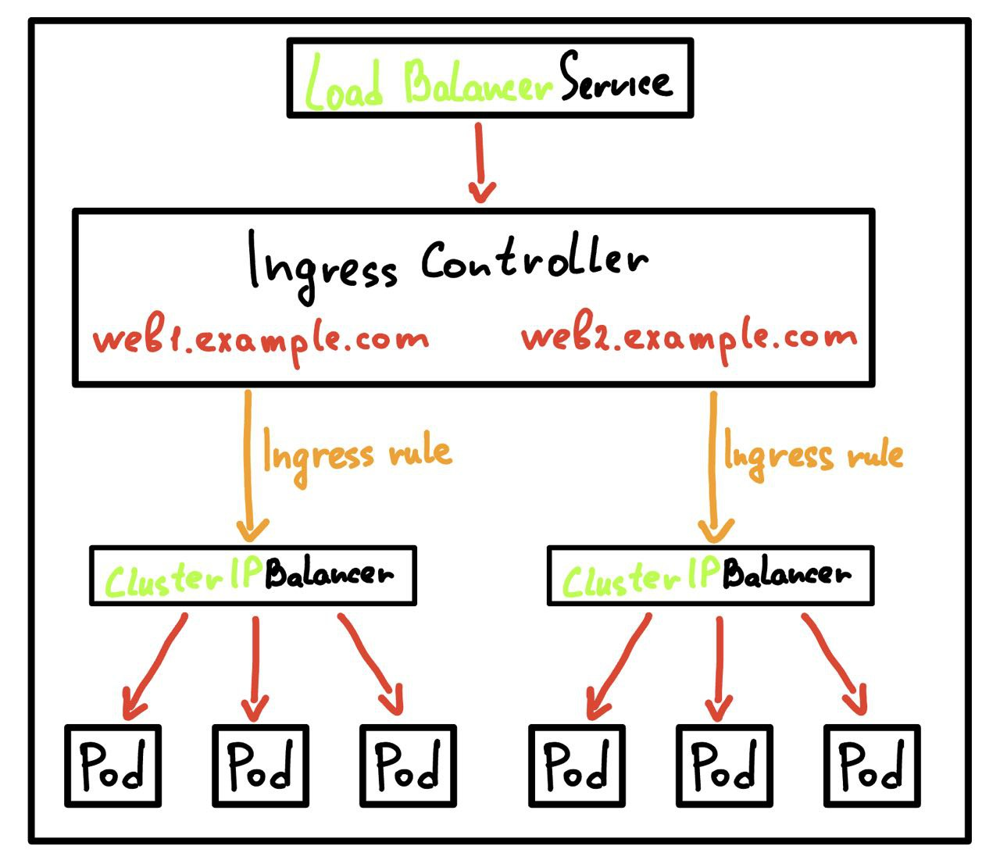

# Ingress Controller
Ingress - объект k8s, предоставляющий внешний доступ к сервисам.

Представим, что у нас есть два деплоя с сервисом типа LoadBalancer:

Такая схема будет работать, но в ней есть нюанс: каждый LoadBalancer стоит денег. И чем больше будет 
разрастаться наша система, тем больше нужно LoadBalancer'ов и тем больше все это будет стоить. Так же на каждый
balancer нужно выдумывать хост или порт.

Благо, k8s предлагает решение этой проблемы, **ingress controller**:

Все предыдущие сервисы типа LoadBalancer внутри кластера заменяются на сервисы типа ClusterIP. Такой сервис ничего 
не стоит. Далее ставится и настраивается ingress controller, который в зависимости от правил (например по URI) 
будет определять, в какой сервис отправлять запрос. Чтобы до ingress контроллера можно было достучаться извне,
ставится один сервис типа LoadBalancer. 

Таким образом, мы заменили потенциально большое количество сервисов типа LoadBalancer на один, используя ingress 
контроллер.

Есть множество реализаций ingress контроллеров, исходя из ситуации можно выбрать подходящий вам и не писать 
велосипеды.

## Использование манифестов
Ingress контроллеры создаются в манифестах. Создадим свой ingress контроллер, а так же пропишем для него ingress rules.

Пример манифеста можно посмотреть [здесь](./manifests/ingress_manifest.yml)

Запустить манифест можно командой:
```console
user@user-PC:~$ kubectl apply -f ./ingress-manifest.yml 
ingress.networking.k8s.io/ingress-wildcard-host created
```

Посмотрим описание нашего ingress контроллера:
```console
user@user-PC:~$ kubectl describe ingress ingress-wildcard-host
Name:             ingress-wildcard-host
Labels:           <none>
Namespace:        default
Address:          
Ingress Class:    <none>
Default backend:  <default>
Rules:
  Host         Path  Backends
  ----         ----  --------
  foo.bar.com  
               /bar   service1:80 (<error: endpoints "service1" not found>)
  *.foo.com    
               /foo   service2:80 (<error: endpoints "service2" not found>)
Annotations:   <none>
Events:        <none>
```