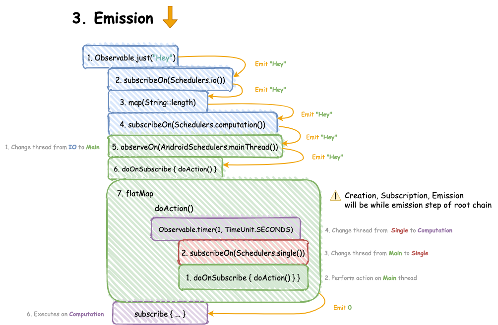

1. [Observer и Observable](#Observer-и-Observable)
   - [Hot&Cold Observable](#hotcold-observable)
   - [ConnectableObservable](#connectableobservable)
   - [Single, Completable, Maybe](#single-completable-maybe)
   - [Disposable](#disposable)

# Observer и Observable
В реактивном программировании одними из основных понятий являются `Observable` и `Observer`. По сути, Observable это сущность,
которая проталкивает (push) некоторые события (это называется выбросы или emissions). После эти выбросы читает Observer.

```java
import io.reactivex.rxjava3.core.Observable;

public class ObservableExample {
    public static void main(String[] args) {
        Observable<String> myStrings = Observable.just("Alpha", "Beta", "Gamma");
    }
}
```

Однако пример выше не имеет никакого смысла, кроме объявления Observable мы ничего не сделали. Чтобы что-то произошло,
нужно чтобы кто-то прочитал данные, которые предоставил Observable. Для этого существует Observer. Самый простой способ
создать Observer - задать ламбда функцию в методе `subscribe`.

```java
import io.reactivex.rxjava3.core.Observable;

public class ObservableExample {
    public static void main(String[] args) {
        Observable<String> myStrings = Observable.just("Alpha", "Beta", "Gamma");
        myStrings.subscribe(s -> System.out.println(s));
    }
}
```

Observable пропихивает по реактивной цепочке 3 типа события: `onNext`, `onComplete` и `onError`. При помощи onNext передается 
следующий элемент. onComplete сигнализирует, что новых элементов не будет. onError сигнализирует об ошибке. Все эти 
способы протолкнуть очередной элемент нужны для более тонкой настройки Observer.

Стоит отметить, что `onNext` не посылает данные напрямую в Observer, а лишь передает данные дальше по реактивной
цепочке. Между Observable и Observer может стоять большое количество различных преобразований. Составление таких
цепочек является фишкой реактивного программирования. Флоу кода легко читать слева направо, снизу вверх. Почти как книга.



## Hot&Cold Observable
Observable бывают двух видов: hot и cold.

**Cold Observable**:

- Не рассылает объекты, пока на него не подписался хотя бы один observer.
- Если observable имеет несколько подписчиков, то он будет рассылать всю последовательность объектов каждому подписчику.

Cold Observable создаются при использовании `Observable.just` и `Observable.fromIterable`. Иначе говоря, когда
Observable создается из датасета (конечного множества данных). Скорее всего все observable, что вы будете создавать, 
являются холодными.Можно провести аналогию, что холодные observable работают как CD диски. Каждый, получивший такой 
диск, может прослушать все треки от начала.

**Hot Observable**:

- Рассылает объекты, когда они появляются, независимо от того, есть observer или нет.
- Каждый новый observer получает только новые объекты, а не всю последовательность.

Hot Observable используются, когда речь идет о событиях. Например, когда Observable настроен на нажатие кнопки.

## ConnectableObservable
Холодный observable можно превратить в горячий при помощи метода `Observable.publish`. Данный метод возвращает 
`ConnectableObservable`, который разошлет объекты всем подписчикам сразу. Чтобы запустить этот процесс нужно вызвать 
метод `ConnectableObservable.connect()`.

```java
import io.reactivex.rxjava3.core.Observable;

public class ConnectableObservableExample {
    public static void main(String[] args) {
        ConnectableObservable<String> source = Observable.just("Alpha", "Beta", "Gamma").publish();

        source.subscribe(s -> System.out.println("First observer: " + s));
        source.subscribe(s -> System.out.println("Second observer: " + s));

        source.connect(); // push objects to all observers at one time
    }
}
```

## Single, Completable, Maybe
Single, Completable, Maybe - специальные формы observable, которые должны упростить код.

**Single** - observable рассылающий только один объект. 

**Maybe** - observable рассылающий 0 либо 1 объект, в любом случае вызывает `onComplete()`.

**Completable** - observable не рассылающий объекты. Либо выполняется и вызывает `onComplete`, либо не выполняется и 
вызывает `onError`.

## Disposable
Disposable - объект, хранящий связь между Observable и Observer. Иногда бывает полезно управлять этой связью. Например
предотвращение утечек памяти или отмены подписки.

`Observable.subscribe` возвращает объект Disposable, управляющий этой подпиской. Чтобы прервать связь, нужно вызвать 
метод `Observable.dispose`.

```java
import io.reactivex.rxjava3.core.Observable;

public class DisposableExample {
    public static void main(String[] args) {
        Observable<String> source = Observable.just("Alpha", "Beta", "Gamma");

        Disposable disposable = source.subscribe(s -> System.out.println("First observer: " + s));
        disposable.dispose();
    }
}
```