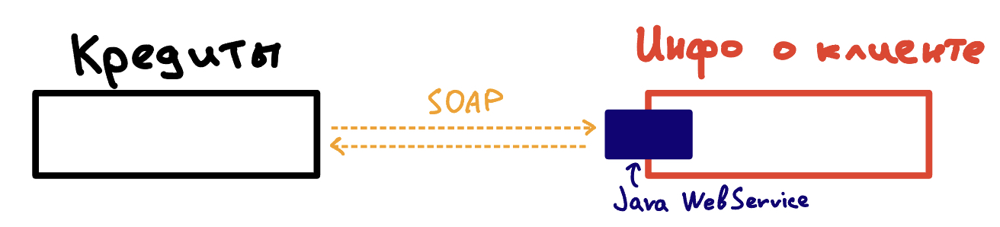

# Java WebService
**Web service** - технология, позволяющая предоставить API для обмена между разными компонентами поверх HTTP протокола.

Посредством веб сервисов между собой общаются различные компоненты в крупных системах. Особенностью веб сервиса является 
независимость от языка, на котором написаны эти различные компоненты. Например в банке компоненты кредитования написаны 
на Golang, а отдел информации о клиенте на Java. Эти два компонента смогут взаимодействовать между собой, если будут
предоставлять веб сервисы друг другу. 



Для обеспечения независимости от платформы веб сервисы предоставляют WSDL файлы. При помощи него можно сгенерировать 
клиент, который будет обращаться к данному веб сервису. Инструменты для генерации клиентов есть для всех популярных 
языков.

В Java есть своя технология для реализации и называется она Java WebService. Как правило, сейчас при проектировании 
новых систем стараются избегать этой технологии. Но в старых legacy проектах Java WebServices встречается часто.

До Java 8 (включительно) WebService входили в стандартный пакет JRE, но начиная с Java 9 необходимо подключать 
дополнительные библиотеки (com.sun.xml.ws:jaxws-rt). Это является одной из незначительных проблем при переходе с Java 8 
на Java 11+. 

Существует два типа WebService:
1) SOAP - Java библиотека JAX-WS (Java API for XML Web Services). Встречается чаще.
2) REST - Java библиотека JAX-RS (Java API for XML Rest web Services)

## Практика
Создадим небольшой Soap Web Service. Предположим, что для этого уже есть необходимые библиотеки.

Вот весь необходимый код:
```java
import jakarta.jws.WebMethod;
import jakarta.jws.WebService;
import jakarta.xml.ws.Endpoint;

@WebService // Объявляем, что данный класс является веб сервисом
public class HelloWorldWebService {
    
    // Объявляем веб метод. Этот метод будут вызывать посредством SOAP сообщения, указывается в Body sayHello элемент с 
    // необходимым параметром msg.  
    @WebMethod  
    public String sayHello(String msg){
        return "Hello " + msg;
    }

    public static void main(String[] args){
        // Объявляем эндпоинт, на котором будет принимать обращения даный веб сервис
        Endpoint.publish("http://localhost:8888/testWS", new HelloWorldWebService());
    }
}
```

Чтобы получить WSDL к этому веб сервису достаточно перейти по ссылке `http://localhost:8888/testWS?wsdl`. Эту wsdl можно
использовать, чтобы создать запрос в Postman или SOAP UI. Попробуем написать запрос при помощи Curl:

```bash
curl --location --request POST 'http://localhost:8888/testWS' \
--header 'Content-Type: text/xml; charset=utf-8' \
--data-raw \
'<?xml version="1.0" encoding="utf-8"?>
<soap:Envelope xmlns:soap="http://schemas.xmlsoap.org/soap/envelope/">
  <soap:Body>
    <ns2:sayHello xmlns:ns2="http://demo.example.com/">
        <arg0>GitHub</arg0>
    </ns2:sayHello>
  </soap:Body>
</soap:Envelope>'
```

Получим ответ:
```xml 
<?xml version='1.0' encoding='UTF-8'?>
<S:Envelope xmlns:S="http://schemas.xmlsoap.org/soap/envelope/">
    <S:Body>
        <ns2:sayHelloResponse xmlns:ns2="http://demo.example.com/">
            <return>Hello GitHub</return>
        </ns2:sayHelloResponse>
    </S:Body>
</S:Envelope>
```

## Полезные ссылки
1) Документация Java WebService от Oracle [тут](https://docs.oracle.com/javaee/7/tutorial/partwebsvcs.htm)
2) На удивление, методичка от Юго-Западного Государственного Университета (ЮЗГУ). Мое почтение. [тут](https://swsu.ru/structura/up/fivt/isit/manuals/SOAP.pdf)
2) Статья в DigitalOcean [тут](https://www.digitalocean.com/community/tutorials/java-web-services-tutorial)