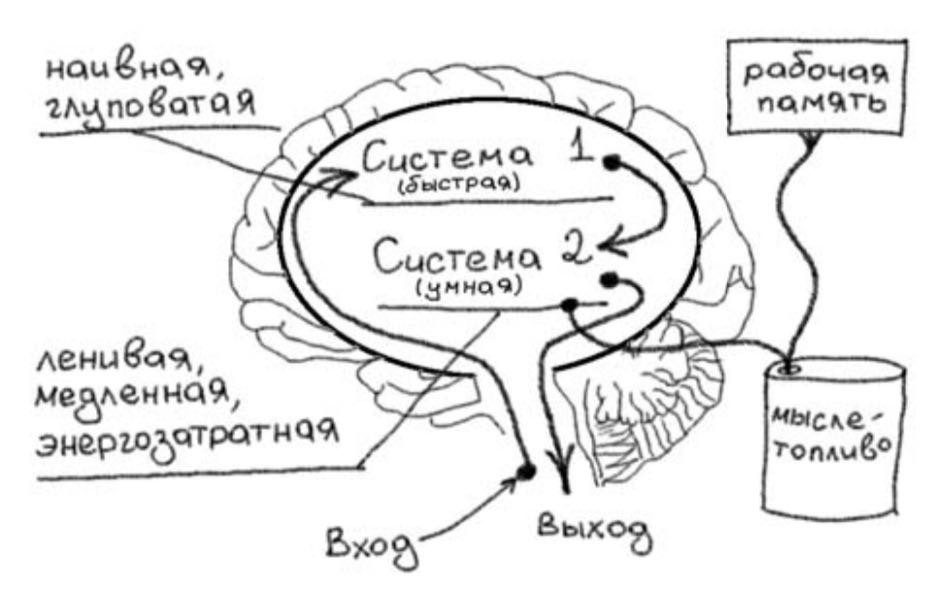

# Мышление
## Модель Дэниэля Канемана
По Дэниэлю Канеману существуют 2 типа мышления: быстрое и медленное. Быстрое мышление глуповатое и поверхностное, но 
зато почти бесплатно с точки зрения энергетических затрат. Медленное мышление более глубокое, но ленивое, медленное и
затратное.  
Все поступающие импульсы сначала попадают в быстрое мышление. Быстрое мышление предлагает какое-то решение и передает 
его в медленное мышление. Медленное мышление либо принимает решение и передает его дальше в нервные импульсы, либо 
переделывает это решение.

## Вольная интерпретация модели
Когда человек делает что-то осмысленно, он потребляет энергию. Недостачу этой энергии каждый из нас чувствовал, когда 
нет сил что-либо делать и начинаешь просто пялить в монитор или скролить ленту в соцсетях. Эту энергию мы назовем 
**мыслетопливо**. Количество мыслетоплива разное у всех людей, но у всех это количество конечное.

Хотелось бы увеличить количество этого мыслетоплива, чтобы больше делать за день до тех пор, пока окончательно 
не устанешь. Но автором предлагается не увеличивать количество мыслетоплива (потому что это сложно и долго), а 
научиться рационально его использовать (это легче и быстрее).

**Вольная интерпретация модели мышления**: внутри нас живет обезьянка и разумный человек. Обезьяна большую часть времени 
находится у рули и управляет нами. Она не способна думать, часто отвлекается и умеет выполнять только несложные 
поручения. Но обезьянка во время управления почти не потребляет наше мыслетопливо.

Человек разумный внутри нас включается только в критических случаях, когда нужно посидеть и подумать. Эта часть нас 
проводит всю интеллектуальную деятельность, но взамен потребляет много мыслетоплива.

**Модель работы памяти**:
Наша рабочая память (что мы держим сейчас в голове) тоже потребляет мыслетопливо. Более того, чем больше информации
мы держим в рабочей памяти, тем хуже мы начинаем думать и тем хуже мы себя контролируем (легче выходим из себя, заходим
скролить соцсети, етс).  
Наша постоянная память (что мы помним всегда) почти не потребляет мыслетопливо, и не мешает способности думать. Но 
записывать в постоянную память может быть проблематично.

Таким образом, чтобы начать рационально использовать мыслетопливо, **нам необходимо**:
1) Как можно больше дел передать обезьяне, чтобы разгрузить разумного человека.
2) Следить, чтобы обезьяна не отвлекалась от выполнения задач.
3) Следить за использованием рабочей памяти и частотой смены контекста.

Перед тем, как идти дальше, разберем **частые ошибки**, мешающие продуктивности и тратящие мыслетопливо:
1) **Не записывать появляющиеся идеи в дневник.**  
В течение дня нам приходят различные идеи. Если не записывать их в дневник, то мы будем стараться о них помнить, в 
конечном итоге их забудем, а через некоторое время эти идеи всплывут в нашем сознании снова. Все это тратит нашу 
энергию, лучше куда-нибудь записывать появляющиеся идеи. 
2) **Вести список дел "в уме".**  
Содержание списка дел занимает лишнее место в рабочей памяти и тратит мыслетопливо. К тому же, мы можем потерять часть
этого списка и можем забыть что-то сделать.
3) **Отсутствие разбиения больших задач на подзадачи.**  
Большие задачи в списке дел вызывают прокрастинацию или откладывание ее на потом. К тому же, большие задачи тяжело 
оценить по времени выполнения.
4) **Слишком большой список ближайших дел.**  
Слишком большой список дел вызывает лишь панику, нужно найти для себя оптимальное количество задач в списке и стараться 
поддерживать список на этом уровне.
5) **Слишком большая временная оценка работы.**  
Все отведенное на задачу время будет использовано. Вытекает из пункта 3.
6) **Ожидание большого отрезка свободного времени.**  
Все мы ждем больших отрезков свободного времени, чтобы начать делать какую-то задачу. Нам кажется, что за 20 минут мы
ничего не успеем или только успеем погрузиться в задачу. На самом деле, если правильно разбивать большие задачи, то 
за 20 минут можно успеть сделать хотя бы часть задачи. Более того, если собрать все такие щепки по 20 минут, то за день
может набежать приличное время, которое мы просто сидели и ждали более крупного отрезка свободного времени. Лучше 
научиться использовать эти 20 минутные щепки.