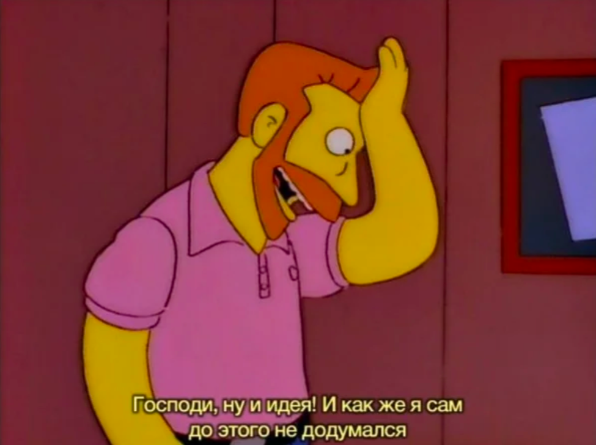

# Как пасти котов

## Рецензия
250 страниц воды и советов капитана очевидности. На этом в принципе можно и закончить.

Но если серьезно: первая редакция книги была написана в 2002 году и отсюда растут ноги многих ее проблем. Она не готова
предложить что-то читателю в 2023 году. Все технические советы безбожно устарели, а советы межличностного общения 
как будто списаны с детских программ по никелодиум. Мне кажется людей, которых эта книга чему-то научит, сейчас 
не возьмут даже на джуна по итогам технического или софт интервью (нужное подчеркнуть). Нонсенс в том, что книга 
переиздается, а значит правится и редактируется, но абсолютно непонятно, что же они там исправляют.

Просто для понимания масштабов проблем, автор сетует на дорогой проводной интернет, который необходим для видеосвязи. 
Ну и советы из разряда "хочешь понять, что чувствует твой сотрудник? Поставь себя на его место". 

  
Картинка идеально описывает всю книгу.

Ну и конечно же В О Д А. Я понимаю, что литература не техническая, но когда главу на 30 страниц можно уместить в 10 
тезисных строчках, это уже перебор. Обычно наличие воды не мешает понять суть. Имеется какая-то четкая 
структура, большое количество полезной информации-нагрузки и для того, чтобы это было читать легче и мозг не уставал, 
автор льет воду. В данной книге автор как чукча, который сидит на берегу реки и пишет то, что видит. Цель и смысл 
прочитанного уследить сложно, текст плохо структурирован, мысли прыгают, отвлеченная вода не бьется с темой предыдущего 
абзаца. Отдельно стоит упомянуть просто невообразимое число повторений. Некоторые мысли повторяются стабильно в каждой 
главе.

Как итог, советую к прочтению, только если вы жили в бункере последние лет 20, работали в небольших стартапах на 10 
сотрудников и абсолютно не понимаете, как общаться с людьми. Среднестатистический разработчик не вынесет для себя из 
этой книги ничего нового. Написание краткого содержания этого шедевра, думаю, не стоит лишних усилий. Уверен, что вы 
сможете написать книгу не хуже.