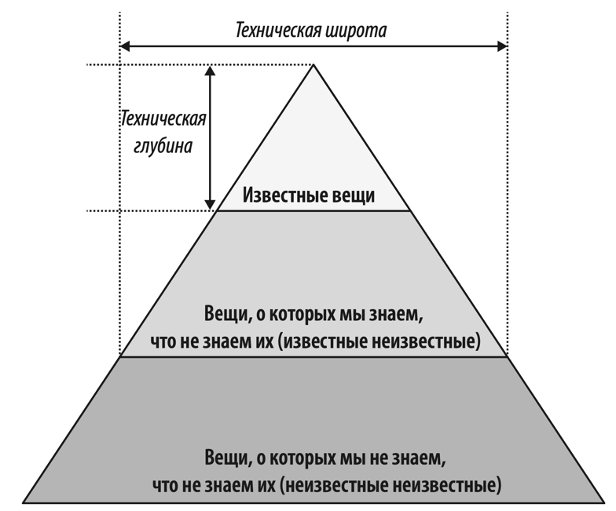

# Архитектурное мышление
Рассмотрим традиционную схему обязанностей архитектора: 
  
Согласно этой схеме архитектор имеет свою зону ответственности, результаты которой он спускает в одностороннем порядке
разработчикам. Самая главная проблема в таком положении дел: слабая коммуникация между командой и архитектором. Решения
архитекторов может исказиться или быть неправильно понятым, а проблемы разработчиков "на местах" могут быть не услышаны
архитектором. **Общение между архитектором и командой разработки должно быть тесным и двусторонним.**

Поговорим о разнице знаний между архитектором и разработчиком. В целом знания любого специалиста можно выразить такой
пирамидой:
  
Разработчик, проходя свой путь от джуниора к сеньору, прокачивает глубину своих технических знаний. Например, Java 
разработчик изучает Java, Spring, PostgreSQL и с каждым годом понимает свои инструменты чуть лучше, чуть _глубже_.
Таким образом, сеньор разработчик имеет хорошую глубину знаний в своих используемых инструментах. Но это ограничивает 
разработчика. Если предложить ему решить какую-то проблему, он выберет знакомые технологии (что может быть не всегда
лучшим решением). Поэтому архитектор должен прокачивать ширину технических знаний. Достаточно поверхностно знать 
технологию, в том числе ее плюсы и минусы, чтобы в нужный момент использовать эту технологию в своих решениях. **Для
архитектора ширина важнее глубины.**

**В архитектуре нет хороших и плохих решений, все соткано из компромиссов.** Задача архитектора не найти "лучший вариант",
а понимать, какие есть минусы у лучшего варианта и к чему в дальнейшем это может привести. 

Архитектор должен **делегировать** реализацию критически важных мест архитектуры своим лучшим разработчикам. Таким образом
у команды разработки будет еще один источник знаний об архитектуре системы, а архитектор, благодаря грамотному 
делегированию, имеет больше свободного времени. Тем не менее архитектору следует поддерживать навыки написание кода.
Таким образом вы сможете понимать насущные боли своей команды разработки, знать тонкости реализации бизнес процессов и
поддерживать скиллы разработки. Поскольку у архитектора много обязанностей, ему нельзя давать задачи с четкими 
дедлайнами, от которых зависят цели команды. Что если у команды все задачи именно такие и не представляется возможности
написания кода? Есть выход:
1) Частая проверка концепций - при выборе технологии можно накинуть примерное решение и посмотреть, насколько 
оно жизнеспособное
2) Устранение технического долга / багов
3) Написание простых инструментов командной строки, которая может как-то облегчить жизнь разработчикам
4) Частые код ревью