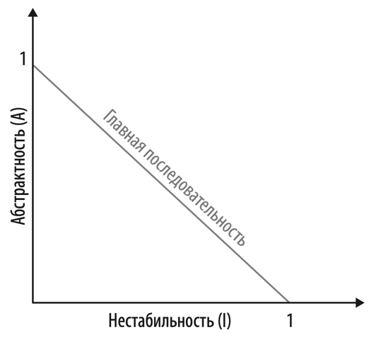

# Модульность
Почти все платформы представляют различные способы повторного использования кода (объединение его в модули). В Java
это пакеты (packages) Если архитектор не обращает внимание на взаимосвязанность элементов модулей, то в конечном итоге 
он **получает множество проблем**. Программное обеспечение моделирует сложные системы и оттого склонно к беспорядку, 
поэтому архитекторы должны уделять время и силы приведению системы в порядок.

Архитектор должен знать, как разработчики формируют пакеты, поскольку это оказывает существенное влияние на архитектуру.
Например, если несколько пакетов тесно связано, то повторное использование таких пакетов где-либо еще может быть
затруднительным.

Модульность - понятие субъективное. Тем не менее существует несколько объективных характеристик, которые можно 
однозначно посчитать. Рассмотрим их ниже.

**Связность** (cohesion) - степень взаимосвязанности элементов модуля между собой. Модуль обладающий максимальной 
связностью невозможно поделить на более мелкие модули. Степень связности, тем не менее, остается на усмотрение 
архитектора. Рассмотрим пример, какая вариант правильный?

```java
interface CustomerMaintenance {
    void addCustomer();
    void updateCustomer();
    Customer getCustomer();
    List<Order> getCustomerOrders();
    void cancelCustomerOrder();
}

// --- OR ---
interface CustomerMaintenance {
    void addCustomer();
    void updateCustomer();
    Customer getCustomer();
}

interface OrderMaintenance {
    List<Order> getCustomerOrders();
    void cancelCustomerOrder();
}
```

Ответ зависит от контекста:
- Ограничивается ли OrderMaintenance только двумя операциями? Если да, то имеет смысл первый вариант
- Ожидается ли расширение CustomerMaintenance? Если да, то имеет смысл второй вариант
- Требуется ли в OrderMaintenance подробная информация о клиенте, которая не позволит использовать OrderMaintenance без
CustomerMaintenance? Если да, то имеет смысл первый вариант

Так же для оценки связности существует определение **LCOM** - количество наборов методов, не использующих общие поля. 
Рассмотрим класс, у которого множество методов и два приватных поля: a и b. Если половина методов обращаются только к 
полю a, а другая половина только к полю b, то количество наборов, совместно не использующих a и b, велико. Значит 
показатель LCOM большой, что говорит о недостаточной связности данного класса. Получается класс можно уменьшить, поделив
его на более мелкие классы с бОльшей связностью. 

**Связанность** (coupling) выражается двумя концепциями: количество исходящих соединений с другими компонентами 
(эфферентная связанность) и количество входящих соединений (афферентная связанность). На основе этих показателей выводят
следующие показатели:
1) Абстрактность - отношение количества интерфейсов/абстрактных классов к их реализациям. Слишком большая и слишком 
маленькая абстрактность затрудняет поддержку системы.
2) Нестабильность - эфферентные связи / (эфферентные связи + афферентные связи). Чем выше показатель, тем легче сломать
систему при внесении изменений (поскольку у нее высокая степень связанности). 

Существует производная метрика на основе нестабильности и абстрактности - главная последовательность:


Компоненты, которые находятся вблизи главной последовательности имеют сбалансированное соотношение нестабильности и 
абстрактности. Компоненты, слишком удаленные в верхний правый угол, входят в зону бесполезности. Такие компоненты 
слишком абстрактные и их тяжело поддерживать. С другой стороны в левом нижнем углу находится зону страданий. Недостаток 
абстракций слишком сильно связывает код, что делает его хрупким. 