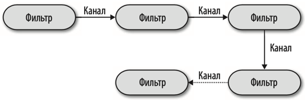

# Архитектурные стили

1) [Минусы распределенных архитектур](#минусы-распределенных-архитектур)
2) [Многоуровневная архитектура](#многоуровневная-архитектура)
3) [Конвейерная архитектура](#конвейерная-архитектура)
4) [Микроядерная архитектура](#микроядерная-архитектура)
5) [Архитектура на основе сервисов (service based)](#архитектура-на-основе-сервисов-service-based)
6) [Событийная архитектура](#событийная-архитектура)
7) [Архитектура на основе пространства](#архитектура-на-основе-пространства)
8) [Микросервисы](#микросервисы)
9) [Выбор подходящего архитектурного стиля](#выбор-подходящего-архитектурного-стиля)

### Минусы распределенных архитектур
Распределенные архитектуры (например микросервисы) **мощнее и более масштабируемые**, но имеют свои минусы:
1) **Проблемы с надежностью сети**: абсолютно надежных сетей не бывает и из-за этого страдает надежность распределенных 
архитектур. 
2) **Проблемы с задержками сети**: При проектировании систем архитектору необходимо знать среднее время задержки сети. 
Если задержка 100мс, то на 10 последовательных вызовов потратится уже целая секунда. Так же необходимо знать 95-99 
перцентили задержек, большие перцентили могут убить производительность системы. 
3) **Пропускная способность сети ограничена**: даже если каждый запрос весит пару килобайт, то при большом количестве 
пользователей это может забить пропускную способность вашей сети. Чтобы этого избежать необходимо использовать минимум
полей в контрактах API, использовать GraphQL или другие селекторы необходимых полей
4) **Сеть небезопасна**: в распределенной системе становится больше открытых эндпоинтов, их все необходимо защищать 
должным образом.
5) **Топология сети может постоянно меняться**: что может вызывать неработоспособность системы
6) **Сетью занимаются несколько администраторов**: что может усложнить получение информации о сети
7) **Сеть дорогое удовольствие**: необходимое оборудование для сети надо купить/арендовать и поддерживать
8) **Сеть неоднородна**: в одной сети может быть оборудование нескольких произодвителей, что не делает сеть более устойчивой

Так же распределенные структуры усложняют ведение логов (необходима трассировка), появляется проблема распределенных
транзакций (что вводит конечную согласованность).

# Многоуровневная архитектура
Самый распространенный архитектурный стиль. Все благодаря своей простоте, известности и невысоким затратам. 

Компоненты в многоуровневой архитектуре собраны в логические горизонтальные уровни. Каждый уровень выполняет 
определенную задачу (отображение интерфейса пользователю, реализация бизнес-логики и тд). Ограничений в количестве 
уровней нет, но большинство таких архитектур состоит из 4 частей: представление, бизнес-логика, сохранение информации, 
база данных. В некоторых случаях два последних уровня объединяются в один. 

Эта концепция слоей и разделения ответственности упрощает разработку, сопровождение и тестирование каждого отдельного 
слоя. Компоненты в рамках одного слоя работают в единой области действия, относящейся к данному уровню. Компромиссом 
является скорость изменения архитектуры. При внесении правок необходимо править все слои архитектуры.

Многоуровневая архитектура разбивается _по техническому принципу_ (существует еще _предметное разбиение_). Компоненты
разбиваются не по предметным областям (например клиенты, товары, корзина), а по своей технической архитектурной роли в 
проекте.

Каждый уровень в такой архитектуре может быть открытым или закрытым. Для объяснения этого принципа представим, что запрос
пользователя идет сверху вниз по слоям архитектуры. Закрытый слой означает, что каждый запрос пользователя обязан его
посетить, пропускать его нельзя. Открытый слой наоборот можно при некоторых условиях пропустить и перейти к слоям ниже.

Закрытые уровни поддерживают концепцию _уровней изоляции_. Концепция уровней изоляции состоит в том, что изменения 
сделанные на одном уровне, как правило, не влияют на другие уровни. Только при условии, что контракты остаются 
неизменными. Закрытые уровни, тем самым, помогают изолировать изменения в архитектуре. Тем не менее бывают случаи, когда
необходим открытый уровень. Например, в уровне бизнес-логики есть некий компонент и мы хотим, чтобы уровень 
представления ни под каким предлогом не мог получить доступ к этому компоненту. В таком случае этот особенный компонент
следует вынести в отдельный уровень ниже уровня бизнес логики и сделать его _открытым_. Слой представления не будет 
иметь к нему прямого доступа, ведь его защищает закрытый слой бизнес-логики. А слой бизнес логики сможет продолжить
общаться с особенным компонентом и сможет пропускать запросы дальше, если для запроса этот компонент не нужен.

Многоуровневая архитектура является неплохой отправной точкой, когда еще точно неизвестно, какой в конечном итоге 
будет выбран архитектурный стиль. В таком случае следует минимально переиспользовать код и наследование объектов. Тогда
переход к другому архитектурному стилю будет проще. 

При использовании данной архитектуры следует избегать _антипаттерна "воронка"_. Антипаттерн возникает, когда слой 
представления отвечает за простую логику, например отображение данных о клиенте, и большинство запросов слоя 
представления просто проксируются следующими слоями. Сдеующие слои не делают никакой полезной работы, просто передают
запрос далее. В любой архитектуре будут встречаться такие сценарии, допустимо, когда из всех запросов данному 
антипаттерну соответствуют 20%. Если более, то скорее всего выработанная архитектура не подходит сценарию использования.

**Когда использовать данный стиль**: Многоуровневый архитектурный стиль считается вполне подходящим для небольших 
простых приложений или веб-сайтов. Он также является удачным архитектурным выбором, особенно в качестве отправной точки,
когда еще не ясно, какую архитектуру следует использовать. Из-за своей простоты и освоенности многоуровневая
архитектура является, наверное, одним из самых дешевых архитектурных стилей. По мере усложнения приложения прослеживается
негативное влияние многоуровневой архитектуры на такие свойства, как сопровождаемость, гибкость, тестируемость и 
развертываемость. 

Одна звезда в оценочной таблице свойств означает, что данное архитектурное свойство плохо поддерживается в архитектуре, 
а пять звезд — что архитектурное свойство является одной из самых сильных сторон архитектурного стиля.

Низкие оценки по тестируемости и развертываемости объясняются высоким риском и сложностью частых деплоев. Простое 
изменение в файле может потребовать регресс всего приложения. Общая надежность имеет среднюю оценку благодаря отсутствию
сетевого трафика.

# Конвейерная архитектура
Данная архитектура так же известна как архитектура каналов и фильтров (pipe & filters). Используется в bash и zsh.

**Канал** представляет собой однонаправленный способ передачи данных от фильтра к фильтру. **Фильтры** выполняют 
определенные задачи (1 фильтр = 1 задача). Фильтры характеризуются независимостью друг от друга и, как правило, не 
имеют состояния. Всего есть 4 типа фильтров:
1) **Производитель** - источник данных
2) **Преобразователь** (transformer) - принимает входные данные, может выполнять преобразование данных и отправить их 
в канал. Аналог map из функционального программирования
3) **Тестер** (tester) - принимает входные данные, выполняет проверки и на основе проверок может выдать новые данные. Может 
и не выдать. Может и не новые данные, а старые
4) **Потребитель** - конечная точка конвейера. Может, например, сохранять данные в базу, либо что-то отображать 
пользователю.

Конвейерная архитектура применяется в системах с односторонней обработкой данных. Например: преобразование документа из
одного формата в другой, обработка и перемещение данных из одного хранилища в другое, оркестраторы и медиаторы. Apache 
Camel построен на такой архитектуре.

Рассмотрим пример, приложение получает данные из кафки и на основе содержимого сообщений может записать их в MongoDB:

ServiceInfoCapture - фильтр производитель (читает kafka). Duration Filter и Uptime Filter - два фильтра-тестера. Они 
квалифицирует данные и отправляют их в следующий фильтр (duration -> uptime -> завершение). Если данные удовлетворяют
заданным фильтрам, они отправляют их в соответствующие duration calculator и uptime calculator. Это фильтры 
преобразователи, они как-то видоизменяют данные, чтобы их в дальнейшем можно было записать в базу при помощи фильтра
потребителя database output. В этом примере показаны свойства расширяемости архитектуры. После фильтра uptime можно 
добавить еще один или несколько фильтров тестеров. 

Сильными сторонами архитектуры конвейерного стиля являются общая стоимость и простота. В монолитной конвейерной 
архитектуре нет сложностей, характерных для распределенных архитектурных стилей. Благодаря выраженной модульности
части системы можно изменять и заменять без какого-либо влияния на другие части системы. Так же благодаря модульности 
у архитектуры неплохие оценки развертываемости и тестируемости. Надежность тоже на уровне из-за отсутствия сетевых 
вызовов. Тем не менее архитектуре свойствены проблемы монолитов, так что эти же параметры (развертываемость, 
тестируемость, надежность) страдают. 

# Микроядерная архитектура
Другое название: архитектура плагинов. Состоит из двух типов компонентов: ядро системы (одно) и множество подключаемых
к нему плагинов. В ядре содержится основная логика приложения, плагины (модули) содержат какую-то дополнительную логику,
которая расширяет возможности ядра. Такой подход обеспечивает расширяемость, адаптируемость и изолированность функций 
приложения. 

Ядро системы формально содержит минимально необходимый функционал для работоспособности системы. Хорошим примером может 
послужить любая IDE - ядро такой системы обычный текстовый редактор. Только при помощи плагинов IDE превращаются в 
полезный продукт. Как правило именно ядро общается с БД, если таковая имеется в системе.

Подключаемые модули независимы друг от друга и содержат функционал, предназначенный для улучшения и расширения ядра. 
Как правило плагины подключаются к ядру как библиотеки. Ядро вызывает плагин посредством простого вызова метода. 
Добавить новые плагины можно прямо в рантайме с помощью dynamic class loading. Второй способ подключения модулей при 
помощи сети. Модули в таком случае вызываются, например, с помощью HTTP REST вызовов. Таким образом можно немного
улучшить масштабируемость, но следует помнить про недостатки сети (и все минусы распределенных систем). 

Микроядерная архитектура применяется во многих инструментальных средствах для разработки ПО (IDE, Jira, Jenkins, etc). 
Другие популярные продукты - браузеры. Если говорить про более бизнесовые сценарии, то допустим, что мы живем в США и
хотим написать приложение для обработки юридических исков. В каждом штате юридические правила разнятся. Если пытаться 
уместить это в одной кодовой базе, то можно легко прийти к большому количеству if. Микроядерная архитектура позволяет
этого избежать. Ядро системы - основные бизнес сценраии обработки юридических исков (принятие, обработка, отправка в 
суд, сопровождение, етс). Каждый подключаемый плагин будет содержать в себе правила обработки исков для конкретного 
штата. 

Сильной стороной микроядерной архитектуры является простота и общая стоимость, а слабыми масштабируемость, 
отказоустойчивость. Возможность изоляции функциональности положительно влияют на тестируемость и надежность. Плагины 
положительно влияют на модульность и расширяемость. Неизменный интерес в рамках этой архитектуры вызывает 
масштабируемость. Но как правило приложения, выбравшие данную архитектуру не растут взрывными темпами.

# Архитектура на основе сервисов (service based)
Архитектура на основе сервисов это распределенная архитектура, состоящая из отдельно развернутых крупномодульных 
сервисов и монолитной базой. Каждый сервис независим и делятся по предметным областям. Таким образом каждый сервис это 
какой-то кусок функциональности. Например один сервис может полностью отвечать за заказы, другой за доставку и тд. Данная 
архитектура похожа на микросервисную, об их различиях мы поговорим ниже.

Одним из наиболее важных аспектов архитектуры является использование монолитной централизованной базой данных. Это 
позволяет сервисам применять типичные SQL запросы **с поддержкой ACID транзакций**. Небольшое количество сервисов (от 4 
до 12) не создает сложностей с подключениями к базе данных. Такая изюминка позволяет архитектуре обходиться без 
распределенных транзакций. Каждый бизнес процесс использует один сервис, который в свою очередь использует единый 
контекст SQL запроса с единой транзакцией. Данная архитектура соблюдает принципы ACID транзакций лучше, чем любая 
другая распределенная архитектура.

Чтобы лучше понять эту разницу с микросервисной архитектурой, рассмотрим бизнес-запрос по размещению заказа. Это один 
запрос к OrderService, который в свою очередь выполнит: размещение заказа, создание идентификатора заказа, запуск 
механизма оплаты, обновление сведений о складских запасах. Все это в рамках одно сервиса и в рамках единого SQL запроса 
с ACID транзакцией. В рамках микросервисной архитектуры это было бы множество запросов к различным узконаправленным 
микросервисам. Если архитектура на основе сервисов сильно разрастается, то ее могут располовинить. В таком случае могут
появиться распределенные транзакции, но в куда меньшем объеме, чем в микросервисной архитектуре.

Архитектура на основе сервисов разбивается по предметному признаку. Каждый сервис является отдельно развернутым
модулем программы. Изменения внесенный в конкретный сервис влияют только на его предметную область, что упрощает 
тестирование. Разбиение на отдельные сервисы позволяет оперативнее вносить изменения (гибкость системы), возможность
более частых развертываний уменьшает связанные с этим риски по сравнению с монолитами. 

Так же в архитектуре высоко оценены отказоустойчивость. Крупные сервисы не обращаются друг к другу, а значит исключается 
сетевое взаимодействие между сервисами и связанные с этим проблемы. Так же если упадет один сервис, то это никак не 
скажется на других сервисах. В целом для более крупных сервисов данной архитектуры харктерен меньший сетевой трафик, 
меньший объем распределенных транзакций и используется меньшая пропускная способность, что увеличивает общую надежность 
архитектуры.

Разумеется существуют гораздо более эффективные стили распределенной архитектуры, но некоторым компаниям это либо 
слишком дорого поддерживать, либо попросту не нужно. 

Наконец, данная архитектура станет удачным выбором, если необходимо достичь высокого уровня архитектурной модульности. 
Как только сервисы приобретают более узкоспециализированный характер, появляются сложность с оркестровкой и 
хореографией, этих минусов лишена рассматриваемая архитектура.

# Событийная архитектура
Популярный стиль архитектуры для создания высокопроизводительных масштабируемых систем. Состоит из отдельных 
компонентов, которые асинхронно получают и обрабатывают события. Модель событийной архитектуры реагирует на конкретные 
действия, которые генерирует события (event). 

Существуют две основные топологии событийной архитектуры: на основе брокеров и на основе медиатора. Можно сравнить с 
оркестрацией и хореографией в паттерне SAGA. Топология на основе медиатора имеет некий центральный объект, который 
следит за выполнением бизнес процесса, возникновением ошибок и тд. В топологии на основе брокеров такого элемента нет 
и событие просто передается от одного обработчика к другому. Топология медиатора чаще всего используется там, где 
требуется контроль над рабочим процессом событий, а топология брокера — там, где требуется быстрая реакция и 
динамический контроль над обработкой событий.

В **топологии брокеров** нет центрального элемента, события передаются от одного обработчика к другому при помощи 
какой-либо очереди сообщений (MQ, RabbitMQ, ActiveMQ, etc). Как правило топология применяется при простых бизнес 
процессах, где нет необходимости отслеживания процесса выполнения и в случае ошибки можно все исправить с помощью
хореографии обработчиков.

В топологии брокеров есть четыре основных элемента:
- **Инициирующее событие** (initial event)
- **Брокер событий** (event broker) - MQ
- **Обработчик событий** (event processor) - компонент, который читает сообщение из брокера, делает какое-то действие и
отправляет событие обработки (с результатом обработки) в другую очередь брокера
- **Событие обработки** (processing event) - генерируется обработчиком события непосредственно после обработки. Кажется, 
что если потребителя у события нет, то это лишняя операция, но это не так. Если всегда генерировать событие обработки, 
то архитектура становится более расширяемой, необходимые события уже есть в очередях.

Пример онлайн магазина с такой архитектурой:

Все обработчики событий разделены и независимы друг от друга. Отсюда вытекает важный плюс: компоненты можно 
масштабировать независимо. Собственно главными преимуществами такой топологии является масштабируемость и 
производительность. Но есть и ряд негативных моментов. Прежде всего это отсутствие контроля выполнения события. Если на
каком-то этапе возникнет ошибка, то перезапустить выполнения события с самого начала не выйдет. Даже отследить ошибку
может быть нетривиальной задачей. Таким образом после ошибки бизнес процесс события может застопориться и не продолжиться
без какого-нибудь вмешательства. А что если перед ошибкой какой-то обработчик уменьшил количество товара на складе? Надо
вызывать компенсирующие действия, что может быть нетривиальной задачей, если обработчиков в цепочке много. 

Центральное место в топологии медиатора занимает собственно медиатор событий. Он управляет процессом обработки события,
следит за ошибками и соглаванной работой обработками, может перезапустить процесс и тд. В отличие от топологии брокеров
инициирующее событие отправляется при помощи брокера не в первого обработчика, а в медиатора. Медиатору известная полная
цепочка обработки события и он поочередно отправляет событие в необходимые обработчики. Обработчики событий отправляют 
событие обработки, но слушает эти события только медиатор. Чаще всего в этой топологии есть не один медиатор, а несколько
под каждую предметную область и сложность обработки. Чтобы система была более отказоустойчивой, лучше конечно иметь
несколько медиаторов.

В зависимости от сложности процесса медиатор может быть реализованным разными способами. Для простых событий не 
требующих сложных обработок как правило достаточно инструментов типа **Apache Camel, Mule ESB, Spring Integration**. В этих
медиаторах пути обработки событий могут прописываться на языке Java. Если сценарии очень сложные с большим количеством 
условий, динамических маршрутов, обработок ошибок, то используют **Apache ODE** или **Oracle BPEL Process Manager**. 
В них логика описывается на специальном XML-подобном языке BPEL (Business process execution language). Если в процессах
существуют длительные транзакции требующие участие человека, то все предыдущие инструменты не годятся и используют 
механизм BPM (business process management), например jBPM. Довольно редко все сценарии относятся к одному классу 
сложности. Поэтому рекомендуется разбивать сценарии и использовать несколько инструментов их обработки. 

Минусы топологии на основе медиатора собственно в самом медиаторе. Он добавляет единую точку отказа, его надо 
масштабировать (что иногда может быть нетривиальной задачей). Так же медиатор сильно связывает компоненты архитектуры 
из-за чего не может быть достигнта высокая производительность. 

Событийная архитектура имеет одну важную особенность: она постреона на асинхроном общении. Это может здорово **сократить 
время отклика системы**. Рассмотрим пример: публикация комментария. Допустим сервис публикации комментария выполняет
свою работу за 3000мс, время доставки запроса по сети 25мс. Таким образом при синхронном взаимодействие публикация 
комментария займет 3050мс. При асинхроном взаимодействие мы просто отправим событие публикации комментария в очередь
и отрисуем пользователю его новый комментарий, это займет у нас 25мс. Время отклика сократилось на порядки. Тем не 
менее, при синхроном взаимодействии мы получаем гарантию публикации комментария (при положительном ответе). При 
асинхроном взаимодействии мы узнаем об этом лишь пост фактум (получим событие ответ) и необходимо продумать коммуникацию
с пользователем в случае ошибки. 

Из-за асинхроного типа общения событийная архитектура подвержена потери данных на различных этапах:
1) Сообщение не попадает в очередь от обработчика
2) Обработчик читает сообщение и выходит из строя, не успев его обработать

Проблема 1 решается синхронной отправкой. Синхронная отправка приводит к блокирующему ожиданию в обработчике до тех пор,
пока сообщение не запишется в брокер. Проблема 2 решается ручным acknowledgment'ом. Как правило, по умолчанию сообщение
считается прочитанным сразу, как его получил обработчик. Необходимо перенастроить это так, чтобы commit в брокер уходил
тогда, когда сообщение обработано.

Иногда необходимо взаимодействие по типу запрос-ответ. В событийной архитектуре это реализуется через обмен сообщениями
в очереди. Этот подход называют псевдосинхронный обмен данными. Есть два способа реализации этого механизма: 
использование связующего идентификатора (более распространенный способ) и временная очередь. Первый подход заключается 
в использовании **связующего идентификатора** в заголовке сообщений топика. Каждый запрос имеет 
уникальный ID. Потребитель получает сообщение, обрабатывает его и отправляет ответ в ту же очередь. В сообщение ответа
вставляется хедер correlation ID (CID), который равен ID реквеста. Таким образом по полю CID внутри сообщения можно 
связать запрос с ответом. Второй подход заключается в использование **временных очередей**. Для каждого запроса брокер 
создает отдельную очередь и после получения ответа данная очередь моментально уничтожается. Выглядит данный способ 
проще, но сильно нагружает и замедляет брокер.

**Когда применять событийную архитектуру?** Если запросы в системе гибкие, основаны на действиях. Сама система требует
высокой отзывчивости (минимальное время отклика) и большой масштабируемости. Обработка событий сложная и динамичная.

**Когда применять архитектуру на основе запросов?** Запросы в системе четко структурированные основанные на данных 
(например надо получить информацию о профиле клиента). Сама система требует определенных ответов и контроля над 
процессом обработки запроса. 

| Преимущества событийной архитектуры                     | Недостатки                              |
|---------------------------------------------------------|-----------------------------------------|
| Быстрое время отклика                                   | Только окончательная согласованность    |
| Отличная масштабируемость и расширяемость               | Слабый контроль над процессом обработки |
| Приспособленность к принятию решений в реальном времени | Трудности тестирования и отладки        |

Хотя многие приложения используют событийную архитектуру в качестве основной, зачастую она применяется в сочетании 
с какой-либо другой архитектурой, формируя гибридную архитектуру. Добавление событийной архитектуры позволяет избавиться
от узких мест и позволяет достичь лучшего уровня отзывчивости на пользовательские действия.

Данная архитектура имеет техническую природу разбиения, а значит одно изменение может потянуть за собой правки в 
нескольких обработчиках, медиаторах и других компонентах системы. 

Основные сильные стороны данного архитектурного стиля: производительность, масштабируемость и отказоустойчивость. Высокая
производительность достигается благодаря асинхронному обмену сообщения в паре с возможностью высоким уровнем 
параллельной обработки. Высокая масштабируемость обуславливается легкостью добавления новых инстансов обработчиков. 
Отказоустойчивость достигается путем все того же асинхронного обмена сообщений. 

Проблемы в тестируемости и простоте обусловлены частыми недетерминированными динамическими потоками событий. 

И наконец, еще один плюс данной архитектуры - простая расширяемость. Добавление нового функционала выполняется просто 
при помощи добавления новых обработчиков. Все необходимые очереди и данные для этого уже есть.  

# Архитектура на основе пространства
Архитектура на основе пространства специально создана, чтобы решать проблемы масштабирования. Высокая масштабируемость 
достигается путем избавления от центральной базы данных. Вместо нее используются реплицированные сетки данных (которые 
представляют собой кэши). Вся система делится на блоки обработки, которые выполняют некоторую полезную работу. Внутри 
каждого блока есть сетка данных в оперативной памяти. Различные блоки обработки могут иметь одинаковые отреплицированные 
сетки данных. Когда в сетке обновляются какие-то данные, они асинхронно обновляются в базе данных. Блоки обработки 
могут останавливаться и запускаться динамически в зависимости от нагрузки.

Рассмотрим топологию сети внимательнее. В нее входят:
- блок обработки данных - содержит код приложения и выполняет некую полезную работу
- виртуализированное мидл слой (virtualized middleware) - управляет блоками обработки и координирует их действия
- средства переноса данных - для асинхронной отправки измененных данных в БД
- средства записи данных - для записи данных (полученных из средств переноса) в бд
- средства чтения данных - для чтения данных из бд

Блок обработки, помимо бизнес логики, так же содержит сетку данных в памяти и механизм репликации. Популярные 
инструменты для этого: Hazelcast, Apache Ignite, Oracle Coherence.

Виртуализированный мидл содержит в себе несколько компонентов:  
- **Сетка обмена сообщениями.**
Управляет входным запросом и следит за состоянием сессии. Когда запрос пользователя поступает в систему именно сетка
обмена сообщениями решает, какой блок обработки может принять такой запрос и перенаправляет запрос туда. Как правило
реализовывается с помощью обычного веб сервера (например HA Proxy или nginx).  
- **Сетка данных.**  
Как правило, сетка данных реализовывается исключительно в блоках обработки, но в случае распределенного кэша (о нем 
поговорим позже) сетка данных может быть расположена как в блоке обработки, так и на мидле. **Каждый блок обработки 
должен содержать в памяти идентичные данные.** Кэши могут быть разные, но если два блока обработки занимаются 
пользователями и содержат в себе кэш пользователей, он должен быть синхронизирован. Для этого используется механизм
реплицирования. Если какой-то блок изменяет данные, то эти изменения автоматически **асинхронно** реплицируются в 
смежные блоки обработки. Из-за асинхронности конечно появляется конечная согласованность, что может привести к проблемам
консистентности данных.  
- **Сетка обработки.**
Компонент, который отвечает за согласованность действий, если в обработке запроса участвуют несколько блоков обработки.
- **Диспетчер развертывания**
Динамически разворачивает новые блоки обработки, если того требует нагрузка.

Так же в топологии есть 3 связных компонента: средство переноса данных, средства записи и средство чтения данных. 
Когда блоки обработки как-то меняют данные, они отправляют эти изменения при помощи средства переноса данных. Как 
правило, это брокер сообщений. После средство записи данных читает этот брокер и записывает изменения в базу данных. 
Средство чтения необходимо, чтобы прочитать данные из базы и заполнить таким образом кэш. Средство чтения данных
по возможности вызывается минимально и только в случаях, когда необходимо заполнить самый первый кэш какими-то данными
из БД. Все последующие кэши отреплицируются от первого.

Из-за асинхронной репликации кешей друг с другом возможны различные проблемы с консистентностью данных. Один из таких 
примеров: коллизии данных. Если в кеше блока А изменились данные и в блоке Б изменились эти же данные, то эти изменения
необходимо как-то мержить. Способ решения необходимо выбирать в каждом конкретном случае. Шанс коллизии прямо 
пропорционален количеству активных блоков, частоте обновлений кэша (этот параметр влияет прям сильно) и задержке 
репликации. При увеличении этих параметров увеличивается шанс коллизий. Коллизии обратно пропорционален размеру кеша,
при увеличении этого параметра шанс коллизии уменьшается.

Кеширование в сетках данных может быть реплицированным и распределенным. При реплицированном кешировании каждый блок
обработки в своей памяти содержит свою копию кеша данных, которая синхронизируется со всеми связанными блоками 
обработки. Такой подход очень отличается высокой скоростью работы, хорошей отказоустойчивостью, но проблемами с 
согласованностью данных. Так же такой подход невозможно использовать, если объем данных очень большой (не хочется
хранить такое в оперативной памяти). Подход с распределенным кэшем использует выделенный сервер с redis/hazelcast/etc. 
Блоки в таком случае не хранят данные, а ходят за ними в выделенный сервер. Такая модель поддерживает высокий уровень
согласованности данных, но страдает быстродействие и отказоустойчивость. 

Архитектура на основе пространства может использоваться там, где наблюдается взрывной рост нагрузки, а так же системы с 
постоянно высокой нагрузкой. В качестве примера первого сценария можно привести систему покупки билетов. Когда 
популярная группа объявляет о концерте, большое количество пользователей может разом хлынуть в систему. Архитектура на 
основе пространства, благодаря разворачиванию отдельных блоков обработки, может очень быстро масштабироваться. Однако 
стоит помнить про проблемы с согласованностью данных.

Самые сильные стороны архитектуры на основе пространства: адаптируемость, масштабируемость и производительность. Это 
достигается путем отказа от синхронной работы с единой базой данных и использованием кеша (реплицированного или 
распределенного). По эти же причинам, а так же из-за появления конечной согласованности на уровне репликаций кеша и на 
уровне синхронизации с базой данных, данный стиль считается весьма сложным. Так же не стоит забывать про проблемы с 
согласованностью данных. Помимо этого могут появиться сложности с тестированием.

# Микросервисы
В основу микросервисов были положены идеи domain driven development (DDD). В частности значительно повлияла на появление
микросервисов концепция ограниченного контекста. Размеры сервисов в данном стиле значительно меньше, чем в других 
архитектурных стилях. Каждый сервис независим и содержит все необходимое: базу данных, другие зависимые компоненты и тд. 
Микросервисы стараются избегать связанности, поэтому в них часто встречается дублирование кода.

Распределенность сервисов часто негативно сказывается на общей производительности системы. Сетевые вызовы гораздо 
дороже локального вызова метода. Более того, в каждом эндпоинте приходится дополнительно проводить проверки 
безопасности. Все это требует тщательного подхода к гранулярности сервисов. Как же правильно очертить границу 
ответственности между сервисами? Единственно верный способ - итеративный. Архитекторам довольно редко удается с первого 
раза правильно разделить ответственность между сервисами. 

Еще одна особенность данного стиля - изолированность данных. В других архитектурых стилях зачастую есть единая база 
данных. Но микросервисы избегают связанности и у каждого домена/сервиса есть своя база данных. В связи с этим данные
хранятся распределенно и есть два способа работы с этим: считать предметную область источником данных и получать данные
по API или воспользоваться реплицированием данных из предметной области источника.

На многих схемах микросервисной архитектуры можно найти API gateway сервисы. Их наличие необязательно, но на них можно
смотреть как на прокси сервисы, которые могут выполнять некоторую полезную работу. Главное не использовать API слой
как медиатор или оркестратор, так как это противоречит сути микросервисной архитектуры и выносит логику за область 
ограниченного контекста. 

Для повышения гибкости архитектуры применяют паттерн service discovery. Вместо того чтобы сразу вызвать необходимый 
сервис, запрос проходит через инструмент обнаружения сервисов. Данный инструмент позволяет решить проблемных деплоев на 
различные машины (так как обращение проходит на определенный хост и порт). Так же данный инструмент может отслеживать 
нагрузку и масштабировать необходимые сервисы. 

Общение между сервисами в данной архитектуре может быть синхронное (REST, gRPC, SOAP), так и асинхронное (MQ, brokers, 
асинхронный http). Для асинхронного общения часто используются приемы из событийной архитектуры. Брокер и медиатор в 
микросервисной архитектуре становятся хореографией и оркестрацией. У хореографии нет центрального координатора, сервисы
просто вызывают друг друга по необходимости.

Альтернативный вариант - введение оркестратора, который бы следил за процессом выполнения всего бизнес процесса. 
Обратите внимание, что оркестратор это не сервис API уровня, он находится внутри ограниченного контекста. 

Ни один из этих вариантов не идеальный, у каждого есть свои плюсы и минусы. Хореография имеет большую изолированность, 
но появляется дублирование общего кода обработки запросов. Так же более сложные бизнес процессы легче реализовывать 
через оркестрацию, чем через хореографию.

Изолированность данных (database per service) представляет собой еще большую проблему, когда необходимы распределенные
транзакции. В целом выстраивание транзакций, которые затрагивают несколько сервисов, нарушает основной принцип 
изолированности в микросервисной архитектуре. Поэтому первый совет: оно вам не надо. Лучше скорректировать 
гранулярность сервисов таким образом, чтобы распределенная транзакция больше не нужна была. В целом границы 
транзакций хороший способ определения гранулярности сервисов. Но если без распределенной транзакции не обойтись, то для
таких случаев есть паттерны оркестровки транзакций. Один из них - Saga. Сервис вызывает каждую часть транзакции и 
координирует ее выполнение. В случая сбоя в одной из части транзакции (в одном из сервисов) saga отправляет запрос в уже
выполнившие свои транзакции сервисы. По этому запросу сервисы выполняют компенсирующие транзакции. 

Микросервисы подвержены всем проблемам распределенных архитектур: избыток сетевого межсервисного общения вызывает 
проблемы надежности и отказоустойчивости. Тем не менее с этими проблемами можно справиться путем масштабирования или
инструментов service discovery. Так же микросервисы подвержены проблемам производительности по причине тех же сетевых
вызовов, к тому же каждый эндпоинт должен проводить различные проверки запроса. Для этого тоже есть инструменты решения,
такие как кеширование, репликация данных и тд. 

Сильными сторонами этой архитектуры являются масштабируемость, адаптируемость и легкость изменений. 

# Выбор подходящего архитектурного стиля
Все зависит от обстоятельств. Но независимо от контекста есть общие идеи для принятия решения.

Прежде всего архитектор должен улавливать текущие архитектурные тенденции. Как правило, популярные технические решения
стали такими не просто так. Они должны решать какие-то проблемы предыдущих популярных технических решений. Конечно
принимать все модное как истину не стоит, но стоит понимать, почему какое-то решение сейчас модное и повсеместное. 
Исходя из этих знаний уже решать, стоит ли принимать его вам или нет.

Архитектор принимает проектные решения на основе следующих критериев:
1) Предметная область - нюансы предметной области могут как-то влиять на архитектуру
2) Необходимые архитектурные свойства
3) Архитектура данных - архитектор в целом должен тесно сотрудничать с администратором БД, для принятия верных решений
4) Организационные факторы - различные внешние факторы, например стоимость облачных серверов
5) Процесс разработки - устройство и принцип работы команд (взаимодействие разработчиков с QA, наличие 
сопровождения и тд) тоже может влиять на принятие решений
6) Предметно-архитектурный изоморфизм - некоторые предметные области прямо напрашиваются на определенную архитектуру. 
Например, система с большим количеством подключаемых настроек/плагинов и архитектура микроядра. Так же и наоборот, 
предметные области могут сразу отсечь неподходящие архитектуры. Например, системы требующего широкого масштабирования не
сочетаются с монолитными архитектурами.

Принимая во внимания все факторы архитектор должен ответить для себя на следующие вопросы:
1) **Монолит или распределенная архитектура**: будет ли необходимо системе одного набора архитектурных свойств (монолит) или 
различные части системы требуют частного подхода (распределенная архитектура). На выбор так же могут влиять и другие 
требуемые свойства, например масштабируемость
2) **Где должны находиться данные**: для монолита можно использовать одну или несколько реляционных БД, для 
распределенной архитектуры нужно решить, какие сервисы должны хранить данные и как будет проходить поток данных.
3) **Синхронное или асинхронное общение сервисов**: в большинстве случаев удобен синхронный стиль общения, но он может
привести к снижению масштабируемости/надежности из-за того, что вводит сильную связность между сервисами. Асинхронное
общение лишено этих проблем, но могут появиться проблемы с синхронизацией, блокировкой и тд. В целом если непонятно, 
какой тип общения нужен, **следует начинать с синхронного** и затем, при необходимости, сделать его асинхронным.