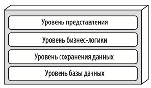

# Архитектурные стили
### Минусы распределенных архитектур
Распределенные архитектуры (например микросервисы) **мощнее и более масштабируемые**, но имеют свои минусы:
1) **Проблемы с надежностью сети**: абсолютно надежных сетей не бывает и из-за этого страдает надежность распределенных 
архитектур. 
2) **Проблемы с задержками сети**: При проектировании систем архитектору необходимо знать среднее время задержки сети. 
Если задержка 100мс, то на 10 последовательных вызовов потратится уже целая секунда. Так же необходимо знать 95-99 
перцентили задержек, большие перцентили могут убить производительность системы. 
3) **Пропускная способность сети ограничена**: даже если каждый запрос весит пару килобайт, то при большом количестве 
пользователей это может забить пропускную способность вашей сети. Чтобы этого избежать необходимо использовать минимум
полей в контрактах API, использовать GraphQL или другие селекторы необходимых полей
4) **Сеть небезопасна**: в распределенной системе становится больше открытых эндпоинтов, их все необходимо защищать 
должным образом.
5) **Топология сети может постоянно меняться**: что может вызывать неработоспособность системы
6) **Сетью занимаются несколько администраторов**: что может усложнить получение информации о сети
7) **Сеть дорогое удовольствие**: необходимое оборудование для сети надо купить/арендовать и поддерживать
8) **Сеть неоднородна**: в одной сети может быть оборудование нескольких произодвителей, что не делает сеть более устойчивой

Так же распределенные структуры усложняют ведение логов (необходима трассировка), появляется проблема распределенных
транзакций (что вводит конечную согласованность).

# Многоуровневная архитектура
Самый распространенный архитектурный стиль. Все благодаря своей простоте, известности и невысоким затратам. 

Компоненты в многоуровневой архитектуре собраны в логические горизонтальные уровни. Каждый уровень выполняет 
определенную задачу (отображение интерфейса пользователю, реализация бизнес-логики и тд). Ограничений в количестве 
уровней нет, но большинство таких архитектур состоит из 4 частей: представление, бизнес-логика, сохранение информации, 
база данных. В некоторых случаях два последних уровня объединяются в один. 

Эта концепция слоей и разделения ответственности упрощает разработку, сопровождение и тестирование каждого отдельного 
слоя. Компоненты в рамках одного слоя работают в единой области действия, относящейся к данному уровню. Компромиссом 
является скорость изменения архитектуры. При внесении правок необходимо править все слои архитектуры.

Многоуровневая архитектура разбивается _по техническому принципу_ (существует еще _предметное разбиение_). Компоненты
разбиваются не по предметным областям (например клиенты, товары, корзина), а по своей технической архитектурной роли в 
проекте.

Каждый уровень в такой архитектуре может быть открытым или закрытым. Для объяснения этого принципа представим, что запрос
пользователя идет сверху вниз по слоям архитектуры. Закрытый слой означает, что каждый запрос пользователя обязан его
посетить, пропускать его нельзя. Открытый слой наоборот можно при некоторых условиях пропустить и перейти к слоям ниже.

Закрытые уровни поддерживают концепцию _уровней изоляции_. Концепция уровней изоляции состоит в том, что изменения 
сделанные на одном уровне, как правило, не влияют на другие уровни. Только при условии, что контракты остаются 
неизменными. Закрытые уровни, тем самым, помогают изолировать изменения в архитектуре. Тем не менее бывают случаи, когда
необходим открытый уровень. Например, в уровне бизнес-логики есть некий компонент и мы хотим, чтобы уровень 
представления ни под каким предлогом не мог получить доступ к этому компоненту. В таком случае этот особенный компонент
следует вынести в отдельный уровень ниже уровня бизнес логики и сделать его _открытым_. Слой представления не будет 
иметь к нему прямого доступа, ведь его защищает закрытый слой бизнес-логики. А слой бизнес логики сможет продолжить
общаться с особенным компонентом и сможет пропускать запросы дальше, если для запроса этот компонент не нужен.

Многоуровневая архитектура является неплохой отправной точкой, когда еще точно неизвестно, какой в конечном итоге 
будет выбран архитектурный стиль. В таком случае следует минимально переиспользовать код и наследование объектов. Тогда
переход к другому архитектурному стилю будет проще. 

При использовании данной архитектуры следует избегать _антипаттерна "воронка"_. Антипаттерн возникает, когда слой 
представления отвечает за простую логику, например отображение данных о клиенте, и большинство запросов слоя 
представления просто проксируются следующими слоями. Сдеующие слои не делают никакой полезной работы, просто передают
запрос далее. В любой архитектуре будут встречаться такие сценарии, допустимо, когда из всех запросов данному 
антипаттерну соответствуют 20%. Если более, то скорее всего выработанная архитектура не подходит сценарию использования.

**Когда использовать данный стиль**: Многоуровневый архитектурный стиль считается вполне подходящим для небольших 
простых приложений или веб-сайтов. Он также является удачным архитектурным выбором, особенно в качестве отправной точки,
когда еще не ясно, какую архитектуру следует использовать. Из-за своей простоты и освоенности многоуровневая
архитектура является, наверное, одним из самых дешевых архитектурных стилей. По мере усложнения приложения прослеживается
негативное влияние многоуровневой архитектуры на такие свойства, как сопровождаемость, гибкость, тестируемость и 
развертываемость. 

Одна звезда в оценочной таблице свойств означает, что данное архитектурное свойство плохо поддерживается в архитектуре, 
а пять звезд — что архитектурное свойство является одной из самых сильных сторон архитектурного стиля.

Низкие оценки по тестируемости и развертываемости объясняются высоким риском и сложностью частых деплоев. Простое 
изменение в файле может потребовать регресс всего приложения. Общая надежность имеет среднюю оценку благодаря отсутствию
сетевого трафика.