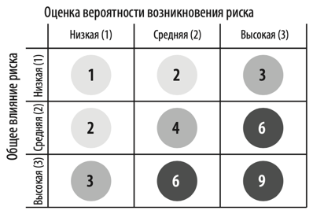
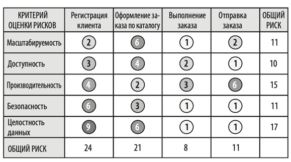

# Гибкие навыки
# Архитектурные решения
Три основных архитектурных антипаттерна:
1) Излишняя перестраховка
2) День сурка
3) Email driven development

**Излишняя перестраховка** возникает когда архитектор избегает или откладывает принятия решения из-за страха сделать
неправильный выбор. Для принятия архитектурного решения следует дождаться последнего ответственного момента. Этот 
момент наступает, когда накоплена достаточно информации для принятия и проверки решения. Так же следует всегда находиться
на связи с командой разработчиков, чтобы максимально быстро узнать о проблемах архитектурного решения.

**День сурка** возникает когда люди не понимают причин того или иного решения и постоянно возвращаются к обсуждению
изначальной проблемы. Как правило, это случается из-за того, что архитектор не может грамотно обносновать свое решение. 
Архитектору важно не забывать про бизнес-аргументацию. Зачем необходим рефакторинг? Для более оперативной реализации 
бизнес задач, уменьшения ttm, снижение затрат на разработку. Наличие грамотного обоснования решений крайне важно для 
любого решения: это лакмусовая бумажка о правильности решения, так же это позволяет быть на одной волне с бизнесом. 

**Email driven development** возникает, когда архитектурные решения не хранятся в одном месте. Люди постоянно их 
забывают или даже не знают о них, отсюда возникает большое количество коммуникации. Необходимо хранить архитектурные 
решения в ADR (о них поговорим ниже). Сами email необходимо отправлять только причастным лицам и не описывать решения в 
письме, достаточно передать только смысл решения со ссылкой на ADR.

Одним из наиболее действенных способов документирования архитектурных решений - ADR (architecture decision records). ADR
представляет собой короткий текстовый файл определенной структуры с описанием решения. Базовая структура ADR состоит 
из пяти главных разделов: Название (title), Статус (status), Контекст (context), Решение (decision), Последствия 
(consequences). 

**Название** - краткая фраза, дающая описание архитектурного решения.  
**Статус** - Предложено|Принято|Отменено|Заменено. Если статус заменен, надо указать на какое решение.  
**Решение** - собственно само решение и его полное обоснование. Лучше записывать в утвердительной форме "Мы будем 
использовать асинхронный обмен", чем "Мне кажется лучше использовать асинхронный обмен". Важно не забыть ответить, почему
было выбранно такое решение.  
**Последствия** - каждое принятое решение имеет положительные и отрицательные воздействия на систему. В данном пункте 
необходимо перечислить оба варианта. Так же данный пункт позволяет подбить все за и против решения и поможет архитектору
принять окончательное решение. 

# Анализ архитектурных рисков
Первым делом каждый риск необходимо оценить как низкий, средний или высокий. Такая оценка всегда будет субъективной, но
есть инструменты, которые помогут оценить риск с максимальной объективностью. Один из таких инструментов: матрица рисков.
Каждый риск оценивается по двум параметрам: вероятность возникновения и общее влияние риска. Каждый параметр оценивается
по трехбальной шкале. Перемножая баллы получим оценку от 1 до 9. Низкий риск 1-2 балла, средний риск 3-4 балла, высокий
риск 6-9. 

Данная матрица рисков может использоваться для оценки риска всей архитектуры. Для этого выбираются оценочные критерии и 
каждый критерий оценивается данной матрицей. После мы получим матрицу для всей системы

Таблица выше содержит оценки всей системы, но в реальности ее так не презентуют. Из таблицы лучше убрать лишний шум и 
оставить только проблемные оценки. Чтобы показать динамику оценки, можно рядом с цифрой рисовать стрелку вверх с новой 
оценкой (если оценка стала выше) или стрелку вниз с новой оценкой (если оценка стала ниже). 