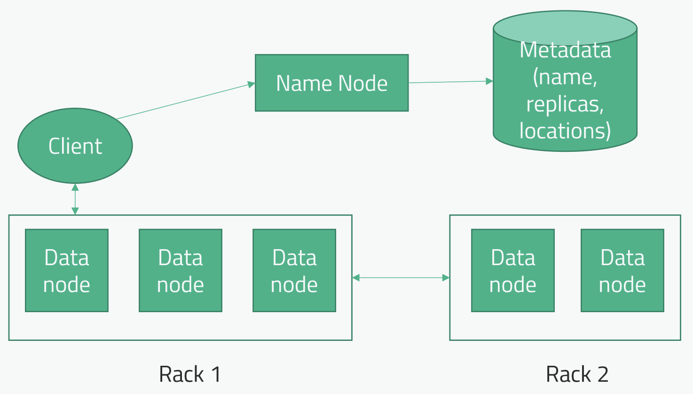
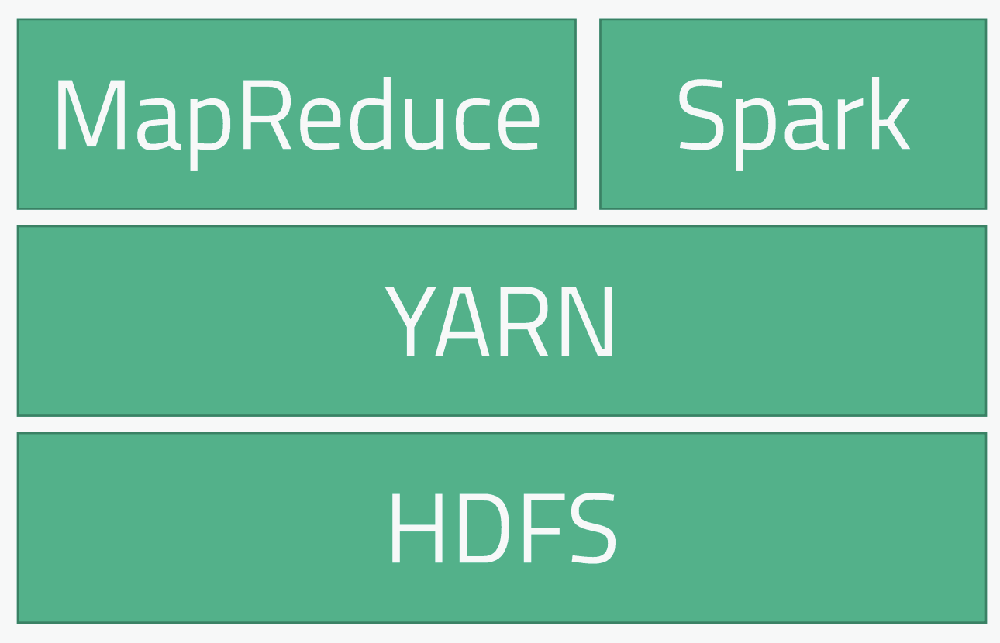
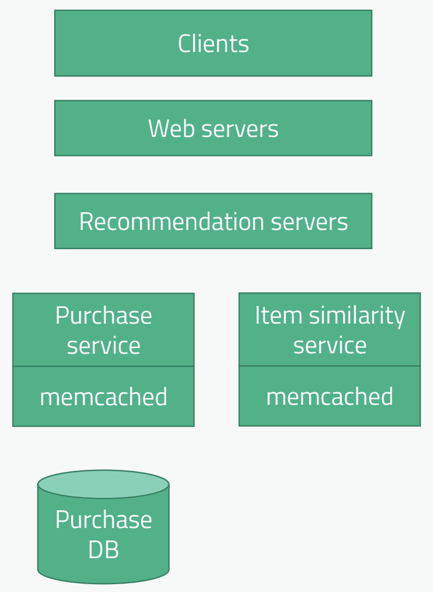

# Инсайты на SystemDesign

1. [Масштабирование](#масштабирование)
2. [Кеширование](#кеширование)
3. [CDN](#cdn)
4. [Отказоустойчивость](#отказоустойчивость)
5. [Файлохранилище](#файлохранилище)  
   5.1 [Архитектура Hadoop HDFS](#архитектура-hadoop-hdfs). 
6. [Apache Spark (big data analytics tool)](#apache-spark-big-data-analytics-tool)
7. [План прохождения System Design](#план-прохождения-system-design)
8. [Пару слов о софт скиллах](#пару-слов-о-софт-скиллах)

## Масштабирование
Один из основных навыков, которые у вас будут проверять на SystemDesign интервью. Основное решение: горизонтальное 
масштабирование с load balancer для сервисов, реплицирование и шардирование для горизонтального масштабирование базы 
данных.

Реплицированию поддаются все базы данных, основная сложность в наличии конечной согласованности, которая решается 
добавление in-sync реплик, но тогда немного страдает доступность (CAP теорема).

Шардированию наиболее поддаются NoSQL базы данных, поскольку они более денормализованы, что позволяет получить все 
данные из единого шарда. Кросс шард запросы - это боль. ACID транзакции в кросс шард запросах - невозможны (по крайней 
мере я не знаю, чтобы в какой-то SQL базе это поддерживалось). В случае кросс шард запросов данные собираются на 
уровне кода в этаком коммутаторе бд (штука которая стоит между шардами и потребителем БД). SQL тоже поддерживают 
шаржирование (Oracle вообще из коробки поддерживает), но ограничения те же: кросс шард запросы долгие (на коммутаторе) 
и ACID транзакции в кросс шард запросах невозможны. И в SQL базах тоже хорошо бы денормализовать данные, чтобы кросс 
шард запросов было по-минимуму.

При выборе базе данных нужно помнить CAP теорему. О чем я беспокоюсь в своей системе? Консистентности данных? 
Доступности данных? Если доступность, то насколько? Секундная недоступность нас устраивает или нет? Если устраивает, 
то может я на самом деле могу пожертвовать доступностью (если разговор действительно о паре секунд). Так же стоит 
помнить про необходимость ACID транзакции. Еще о формате данных (подходит ли формат больше для 
реляционного/документного/итд представления?).

## Кеширование
Cold start проблема - когда приложение поднимается без кеша и из-за наплыва пользователей падает БД. В таком случае 
можно держать сервис прогрева кеша, который будет искуственно делать запросы к сервису для прогрева кеша и только после 
этого открывать его на клиентов

## CDN
Хранит статистический контент (html, css, js, картинки) географически ближе к пользователю, чтобы уменьшить задержку 
до этих ресурсов, но стоит ощутимую денюжку. Для ютуба держать там свои видео будет дорого. Поэтому надо думать, что 
будем хранить на CDN. 

## Отказоустойчивость
Из строя может выйти один сервер, стойка серверов, дата центр, целый регион. В зависимости от требований к 
отказоустойчивости нужно решать проблему на определенном уровне.

- Выход из строя одного сервера мы покрыли горизонтальным масштабированием.
- Выход из строя стойки можно покрыть распределением серверов по разным стойкам.
- Выход из строя датацентра можно покрыть распределением по разным датацентрам.
- Выход из строя региона покрывается перераспределением трафика в другие регионы (над load balancer появляется geo 
balancer)

## Файлохранилище
Примеры: Amazon S3, Google cloud storage, Microsoft Azure, Hadoop HDFS (self hosted)

### Архитектура Hadoop HDFS
Записанные файлы делятся на блоки определенного размера (скажем 128 мегабайт). Эти блоки реплицируются на разные 
сервера (в идеале стойки). Мастер нода «Name node» координирует действия клиента, именно эта нода говорит, какой файл 
откуда можно прочитать (еще старается выдать клиенту максимально приближенную реплику). Для большей доступности должно 
быть несколько name node и metadata storage.

## Apache Spark (big data analytics tool)
Use case: есть куча данных (например логи), откуда нужно получить какую-то важную информацию (возможно даже путем 
трансформации) и отправить на хранение. Скрипты для разбора данных можно писать на разных языках (Java, Python, Scala). 
Так же при помощи Spark можно получать данные из хранилища, даже с помощью SQL запросов. 

Apache spark как правило используется совместно с Hadoop HDFS и YARN (yet another resource negotiatior). Раньше 
использовался MapReduce, теперь на смену приходит Apache Spark. У Спарка много компонентов (библиотек): для работы с 
ML, стримовым потоком данных, Spark SQL, Spark GraphX

На собесе можно предложить использовать cloud computing (Amazon, Microsoft, Google, Yandex). 

## План прохождения System Design
### Конкретизировать задачу
Необходимо понять функциональные требования.  
На собеседовании вам будет дана максимально размытая тема, например «сделай Ютуб». Ваша первая задача 
**конкретизировать**, что надо сделать и обозначить какие-то **границы функционала**. Для этого надо задавать много 
вопросов у интервьюера.

Какие вопросы следует задавать:
1. Кто клиенты: со всего мира или конкретный регион, есть ли пиковые нагрузки в течение дня которые мы должны выдерживать?
2. Как они будут пользоваться продуктом (для ограничения функциональности, весь ютуб за 20 минут не спроектируешь)
3. Масштабы данных/запросов
4. Требования доступности, задержки и согласованности (теорема пиклз)
5. Бюджет (резиновый или не особо). Есть ли ограничения бюджета

Надо работать по backwards технологии: от конечных фичей для пользователей идти обратно и думать, какие технологии 
обеспечат эту функциональность. Интервьюер хочет видеть не только техническую перспективу вашего взгляда, но и 
бизнесовую. Поэтому важно смотреть на продукт с точки зрения user experience.

### Определить требования к масштабированию/задержке/отказоустойчивости
Необходимо понять нефункциональные требования.  
Как только функциональные требования будут конкретизированы, стоит **определить требования к масштабированию**. Мы 
говорим о сотне или миллионе пользователей? Если нагрузка большая, то придется использоваться горизонтальное 
масштабирование, одна большая БД уже не подойдет. Скорее всего на систем дизайн собесах придется строить большие 
распределенные (горизонтально) системы.

Затем необходимо **определить требования к задержке**. Если задержка обязана быть небольшая, то понадобится 
кеширование и CDN.

Затем **требования к отказоустойчивости**. Какой down time для нас приемлем. Если 99.99999% доступности, то нужно 
думать о дата центрах в нескольких регионах, разные дата центры и стойки в дата центрах. Но это стоит денег. Так же 
стоит держать требования к надежности в голове. 

Так же стоит сразу обсудить вопросы метрик, мониторинга и логов. 

На все эти вопросы могут не отвечать, чтобы посмотреть, как вы размышляете в этих направлениях. Поэтому на первом 
этапе важно определить user experience, чтобы вы сами могли ответить на все дальнейшие вопросы.

### Построить верхнеуровневую диаграмму
Затем необходимо построить основную API будущей системы. Достаточно указать POST/PUT/GET/.., название метода (path 
если есть время), параметры к нему без привязки path/query/body (если нет времени).

Затем можно строить верхнеуровневую диаграмму:

Начинать лучше сверху, то есть с клиента и строить новые блоки исходя из user experience. Такая минимальная схема 
нужна, чтобы в конце собеседования была **хоть какое-то рабочее решение**. Затем можно раскрывать каждый блок схемы. 
Возможно стоит уточнить у интервьюера, какие участки схемы интересуют его в первую очередь, чтоб мы начали с них, если 
времени вдруг начнет не хватать. Не забывайте идентифицировать ботлнеки, проблемы поддержки, стоимости. **Показывайте**, 
что **вы знаете трейдофы своей схемы**. 

Затем необходимо указать основную схему данных. Как будут выглядеть схемы наших таблиц, как данные будут связаны 
между собой. Иногда возможно основные запросы.

Если интервьюер ведет вас в область, которую вы не знаете - лучше честно сказать, что вы не знаете, но готовы 
поразмышлять, если интервьюер хочет обсудить именно эту тему.

### Защита архитектуры
После этого свою архитектуру надо будет защищать. Интервьюер будет разбирать ее по кусочкам, спрашивая **каверзные 
вопросы**. Некоторые части возможно придется доработать. Так же будет обсуждаться, **были ли удовлетворены все 
требования** и что можно улучшить (если останется время).

## Пару слов о софт скиллах
На всех собеседования интервьюеры будут проверять не только ваши хард скилы, но и **умение и способность решать 
незнакомые вам задачи и работать в команде**. Так же у вас должен быть **внутренний драйв и мотивация выполнять свою 
работу**. Всем нужен самостоятельный сотрудник, который сможет сам выучить новые технологии при необходимости. 
**Подготовьте истории о ваших сложных задачах и как вы с ними справлялись**.

Так же не стоит рассказывать, как у вас на работе было нечего делать и вы ничего не делали. Расскажите, как **в 
отсутствие работы вы делали что-то полезное для компании**: изучали что-то новое с целью внедрить это у себя в 
команде, разбирались в устройстве работы какого-то компонента и тд. Подготовьте истории о вашей инициативности.

Хорошо бы оценить ценности компании перед собеседованием (если такие имеются). Надо рассказывать истории которые 
раскрывают эти принципы в вас.

Не забывайте подготовить список вопросов к собеседующим в конце. 