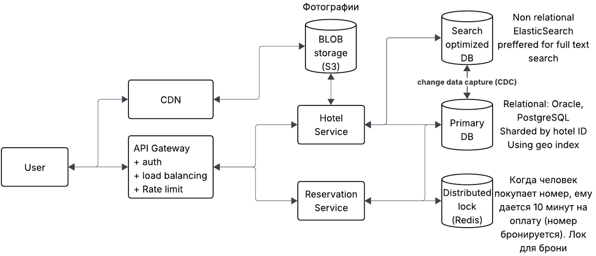

# Booking

## Вопросы
1) Ограничим функционал, чтобы успеть в наш формат встречи. Скажем, что главные функциональные требования: размещение
отелей/номеров и бронирование этих номеров.
2) В поиске отелей помимо названия фигурирует местоположение? - Да

## Функциональные требования
1) Менеджмент отелей
2) Система бронирования номеров

## Нефункциональные требования
1) Строгая консистентность при бронировании номера
2) Низкая задержка при поиске
3) Масштабируемость

## API
1) Создание отеля:  
POST /api/v1/hotel (hotel metadata) -> 200
2) Добавление/изменение номера:  
POST /api/v1/hotel/room (room metadata) -> 200 
3) Получение списка отелей:  
GET /api/v1/hotel (period, cost, geo position, etc filters) -> List of Hotel metadata
4) Получение детальной информации о типе номера:  
GET /api/v1/hotel/room (period, hotelId, roomId) -> Hotel room metadata
5)  Бронирование:  
POST /api/v1/hotel/book (hotelId, roomId, period) -> 200

## Domain objects
Hotel:
- id
- name
- address
- other metadata

RoomType:
- id
- hotel_id
- name
- price
- metadata

Reservation:
- id
- user_id
- hotel_id
- room_type_id
- check_in_date
- check_out_date
- total_price
- status

## High level design
