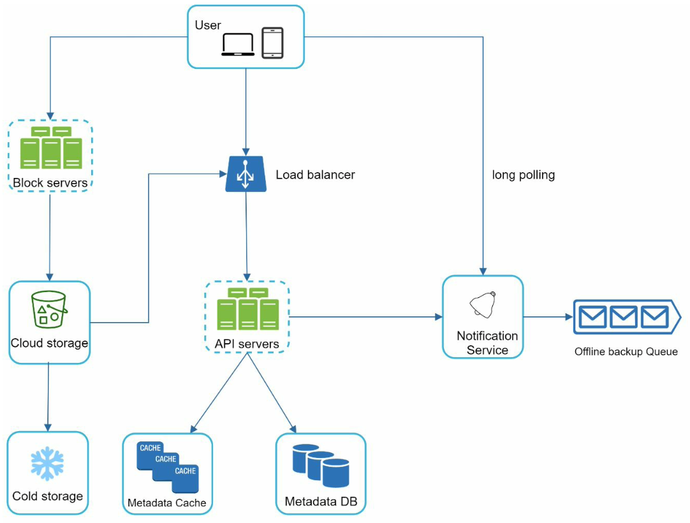
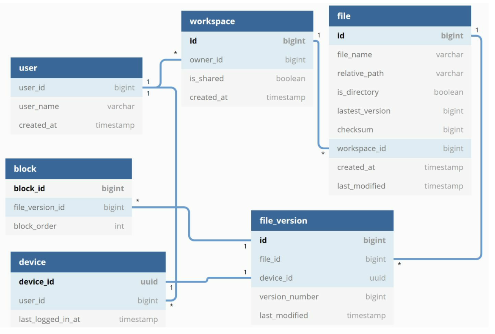
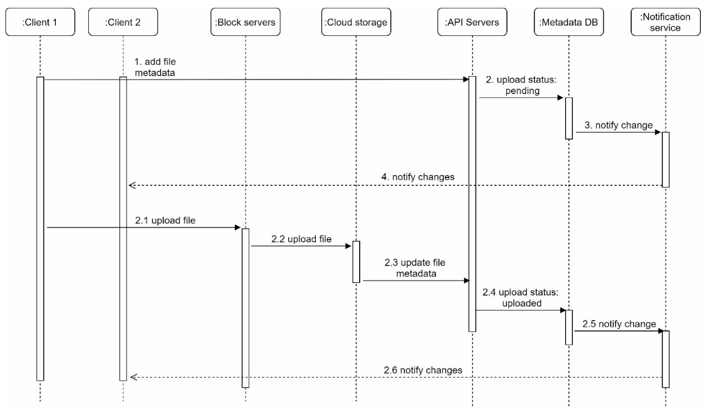
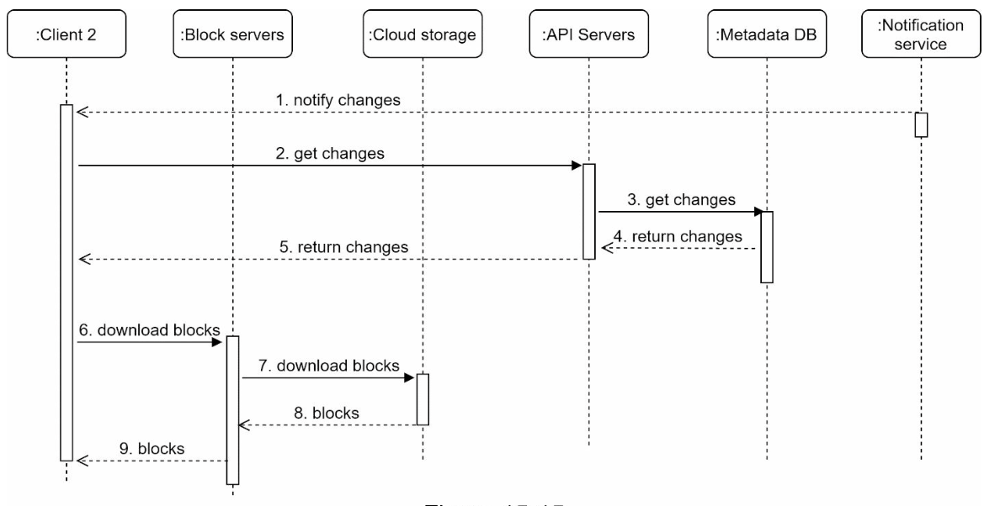

# Cloud storage
Речь идет про такие сервисы как google drive, dropbox, apple icloud.

## Требования к системе 
1) Добавление, удаление и скачивание файлов
2) Синхронизация файлов между устройствами и пользователями с общим доступом
3) Возможность просмотра предыдущих версий файлов 
4) Общий доступ к папкам

## High level design

Неочевидные компоненты системы:
1) Block servers - разбивает файлы на блоки для дальнейшей обработки. Зачем это надо, обсудим в deep dive. Этот же 
компонент сжимает и шифрует данные.
2) Cloud storage - любое объектное хранилище (например Amazon S3).
3) Cold storage - объектное хранилище для редкоиспользуемых файлов.
4) Metadata DB/Cache - БД и кэш для хранения информации о метаданных файлов и пользователях.
5) Offile backup queue - если пользователь офлайн и ему не получилось сообщить об изменениях в файлах, то такое событие 
переносится в offline backup и отправится пользователю когда он будет онлайн.

## Deep dive
### Block servers
Большие файлы выгоднее разбивать на блоки и оперировать с файлом как с массивом блоков. Таким образом при изменении 
файла надо перезаписывать не весь файл, а отдельные блоки (данная фича называется **delta sync**). Помимо этого таким 
образом можно быстрее обработать большой файл, так как блоки можно параллельно сжимать и шифровать. Так же при 
поддержке версионности можно хранить не весь файл, а разные версии блоков файла.

### Высокая согласованность системы
Система должна быть строго согласованной. Если кто-то изменил файл, нельзя допустим, чтобы кто-то другой не увидел
эти изменения. Для достижения этого необходимо соблюдать:
1) Строгая согласованность между кэшем и БД (инвалидация кэша при записи в БД)
2) Использование реляционных БД для получения ACID транзакций

### БД метаданных

### Upload flow
  
Два этих процесса идут параллельно.

**Добавление метаданных файла:**  
1. Клиент_1 отправляет запрос на добавления метаданных по будущему файлу
2. Сохранение метаданных и изменение статуса файла на "PENDING" в БД Метаданных
3. Отправление запроса к сервису уведомлений
4. Уведомления об изменениях клиента_2, клиент_2 изменяет статус документа на PENDING

**Загрузка файла в облачное хранилище:**  
2.1. Клиент_1 загружает файл в block server  
2.2. Block server делит файл на чанки. Сжимает их и шифрует. Загружает в объектное хранилище  
2.3. Как только файл загружен, объектное хранилище триггерит изменение статуса файла на "UPLOADED" в БД Метаданных. 
2.4. Генерируется уведомление об изменение файла. Клиент_2 подгружает новую версию файла.

### Download flow

1. Notification service информирует клиента_2 об изменении файла
2. Клиент_2 отправляет запрос на получение новых метаданных файла
6. После получения новых метаданных клиент_2 запрашивает измененные блоки файла

### Notification service: long pulling vs web socket
Dropbox использует long pulling для сервиса нотификаций и вот почему:
1) Коммуникация с сервисом нотификаций не двухсторонняя, клиент просто получает сообщение, но не отправляет ничего 
в ответ
2) Такая модель уведомления использует редкий обмен информацией в одностороннем порядке без всплесков данных

### Сохранение места в S3
1) Удаление идентичных блоков. Блоки идентичные, если у них одинаковый кэш.
2) Лимит версионности файлов. Некоторые файлы изменяются слишком часто, можно хранить последние N изменений.
3) Хранить редкоиспользуемые данные в холодном хранилище, например S3 glacier, который дешевле стандартного S3.