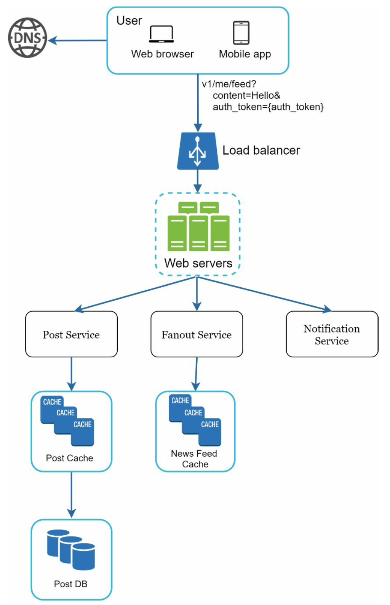
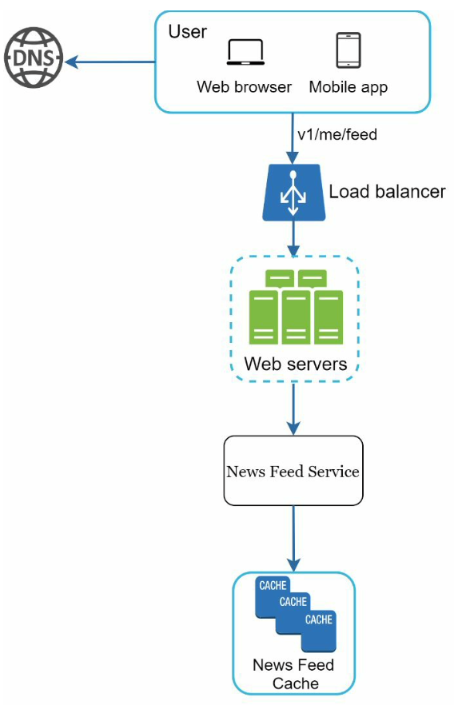
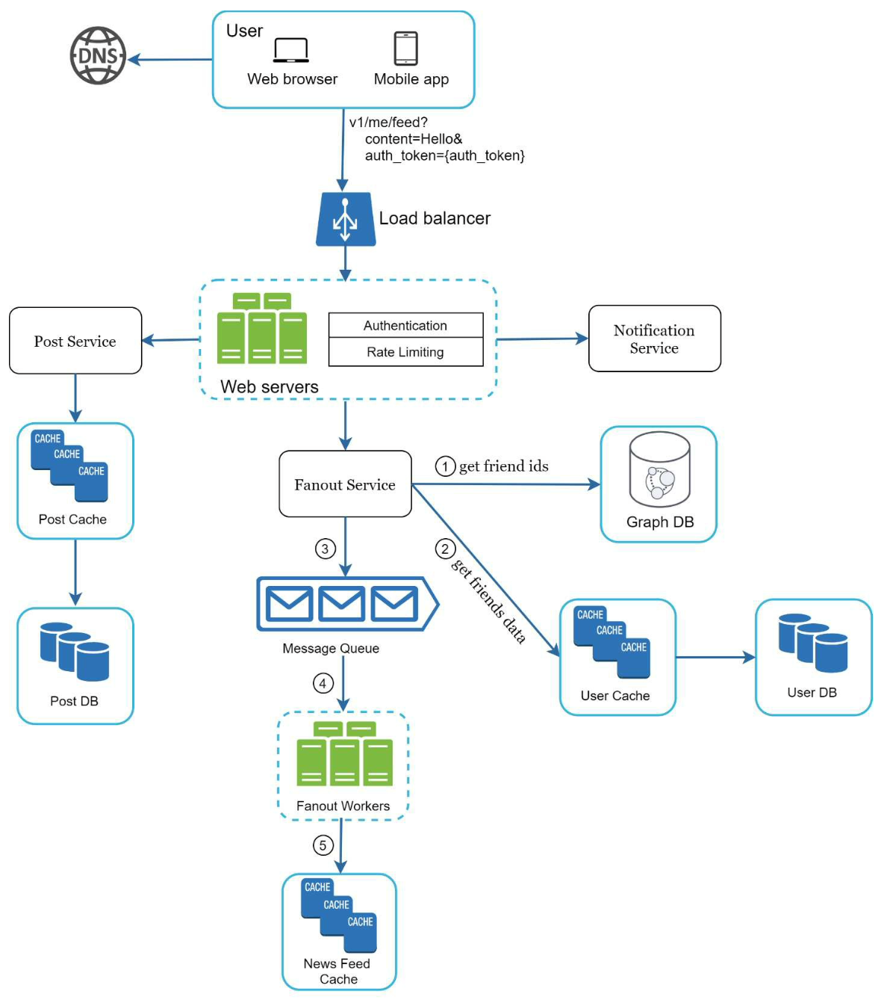

# News feed system
Система лента наподобие ВК, Facebook, Instagram, etc.

## Требования к системе
- Пользователь может публиковать запись и видеть записи своих друзей в ленте
- Новости сортируются в обратном хронологическом порядке
- Пост может содержать текст и мультимедиа

## High level design
Удобнее будет разделить архитектуру системы на 2 части: 
- Публикация поста: когда пользователь публикует пост, его необходимо сохранить в базе и сохранить в новостной ленте 
для каждого друга пользователя
- Построение новостной ленты: после первого шага в системе хранится новостная лента для каждого пользователя. 
Достаточно ее получить и отобразить пользователю

### Публикация поста

1) Пользователь отправляет запрос создания нового поста
2) Post Service - сохраняет пост в БД и кэше
3) Fanout Service - сохраняет новый пост в новостной ленте всех друзей пользователя
4) Notification Service - информирование друзей о новом посте

### Построение новостной ленты

1) Пользователь запрашивает свою новостную ленту
2) News Feed Service - получает список id постов для ленты из кеша и обогащает эти данные
3) News Feed Cache - хранит пары [userId, postId]. Так по userId можно будет найти список id постов

## Deep dive
### Публикация поста

Мы встроили **authentication** и **rate limiter**. Первый компонент комментировать не стоит, а второй необходим, чтобы 
ограничить кол-во создаваемых постов от пользователя. Таким образом можно защититься от спама, нежелательного контента и
DOS атак.

### Fanout Service
Один из ключевых элементов системы рассмотрим подробнее. Существует два способа наполнения новостной ленты 
пользователей:  

#### Наполнение при записи
Новостная лента полностью предсобрана для пользователя. Когда кто-либо пишет пост, он тут же попадает во все 
необходимые ленты. 

Плюсы:
- Новостная лента генерируется в real-time, так что пользователю всегда можно быстро отдать новостную ленту

Минусы:
- Если пользователь имеет много друзей, то получение списка друзей и изменение их новостной ленты может занять 
продолжительное время. Это называется hotkey проблемой
- Для неактивных пользователей данный способ будет просто тратой ресурсов

#### Наполнение при чтении 
Новостная лента собирается при запросе пользователя. При запросе проверяется, есть ли более свежие посты, которых еще 
нет в ленте.

Плюсы:
- Для неактивных пользователей больше не тратятся ресурсы
- Избавляемся от проблемы популярных пользователей (hotkey problem)

Минусы:
- Получение новостной ленты работает медленнее, чем при наполнении при записи

Мы будем использовать **гибридный формат**. Так как время загрузки новостной ленты важно и должно быть минимальным, 
для большинства пользователей будет использован формат наполнения при записи. Однако для популярных пользователей, у 
которых много друзей, мы используем формат наполнения при чтении. Когда друзья знаменитостей запрашивают новостную 
ленту, они будут отдельно проверять, появились ли у них новые посты.