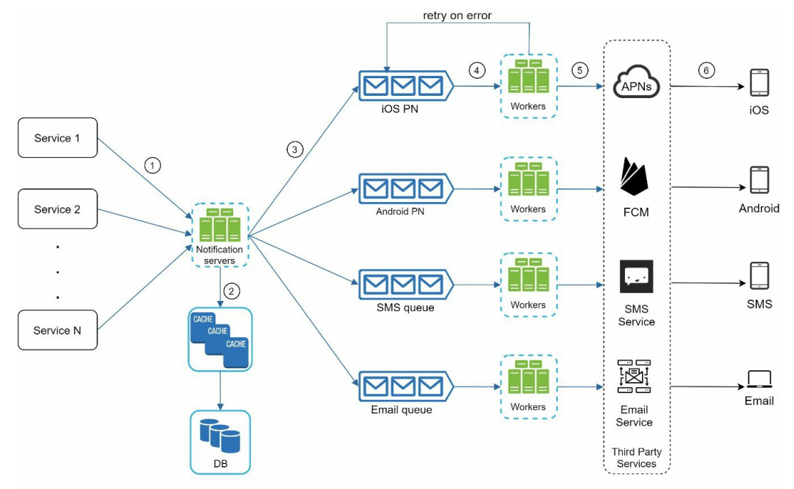
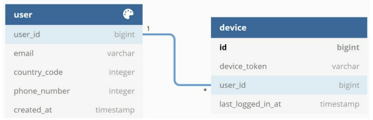
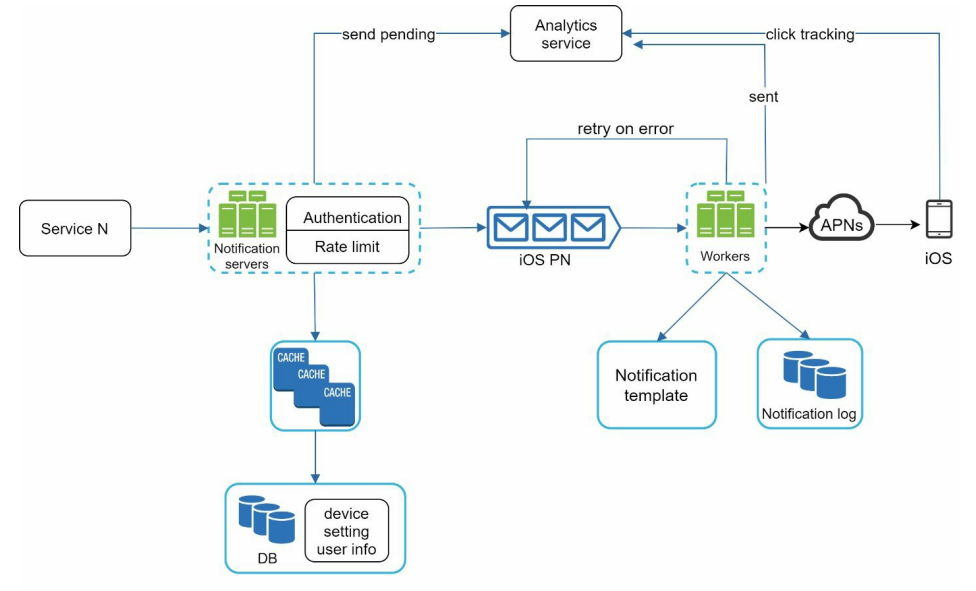

# Notification system

## Требования
1) Поддержка разных типов каналов (Push, SMS, email)
2) Уведомления должны приходить максимально быстро
3) Тригером к отправке уведомлений - смежные бизнес системы
4) Возможность пользователю отказаться от уведомлений

## High level design
Верхнеуровнево архитектура выглядит так:  


**Service 1 to N**: смежные сервисы, которые могут инициировать отправку уведомления.  
**Notification servers**: предоставляют API для отправки уведомлений, проверка правильности email, 
номера телефона и тд, обращение в базу или кеш за данными необходимыми для уведомления (номер телефона, email, 
токен устройства).  
**Cache**: User info, device info, notification templates.  
**DB**: User info, device info, notification templates. Схема хранения данных ниже:  
  
**Message queues**: для асинхронного общения между notification server и внешними сервисами для отправки уведомлений. 
Каждый внешний сервис отправки изолирован отдельной очередью, так что не повлияет на отправку других типов 
уведомлений.  
**Workers**: мини сервис, который читает сообщение и отправляет во внешний сервис. Если произошла проблема при отправке, 
то сообщение снова записывается в очередь.  
**Third-party services**: Для разных типов каналов используются разные инструменты:  
1) iOS push -> APNs (Apple Push Notification Service)
2) Android push -> FCM (Firebase Cloud Messaging)
3) SMS -> SMS Service (third party сервисы)
4) Email -> Email Service (third part сервисы)

## Deep dive
### Шаблоны уведомлений
Как правило, уведомления имеют некий общий шаблон, в который подставляются необходимые параметры. Удобно было бы 
хранить шаблоны в базе данных notification service.

### Настройки уведомлений
Пользователь может отказаться от получений уведомлений определенного типа, но продолжить пользоваться другим типом.
Поэтому в базе notification service надо хранить такие предпочтения пользователя.

```json
{
  "user_id": "bigint",
  "channel": "string",
  "enabled": "boolean"
}
```

### Rate limiter
Чтобы случайно не заспамить пользователя уведомлениями, имеет смысл ограничить их максимальное количество. Для этого
необходим встроить rate limiter рядом с notification service. Подробнее про rate limiter [тут](../RateLimiter).

### Аналитика откликов на уведомления
Метрики отклика на уведомления могут быть полезным инструментов аналитики. Для этого все события относящиеся к 
уведомлению (отправка, получение, нажатие, отписка) должны попадать в сервис аналитики.

### Итоговая схема
