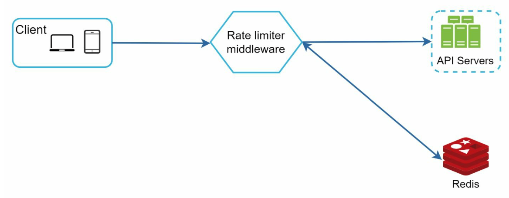
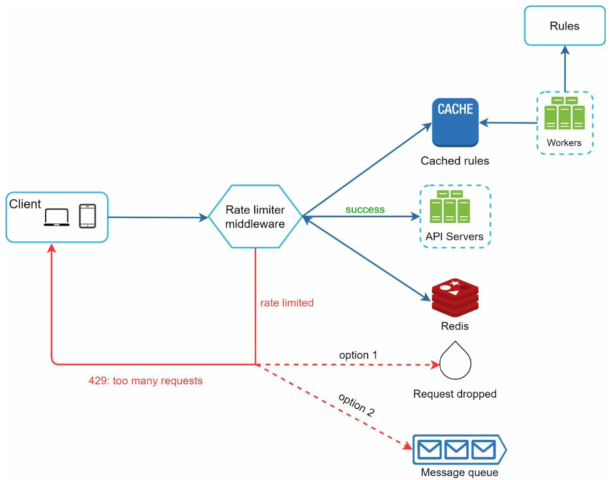

# Архитектура стандартного Rate Limiter
Дисклеймер: как и любую архитектурную задачу, я ее делаю до определенной глубины (и до определенного желания ее
расписать). Мой ресерч состоит в просмотре видосов и статей в интернете и выделения главного для себя. Желаемый
результат моего ресерча является рисунок схемы, по которой я быстро смогу вспомнить, что к чему. По возможности
буду выкладывать ссылки на исходный материал.

## Требования к Rate Limiter:
- Способность задать кол-во запросов в единицу времени. Все запросы превышающие лимит отбрасываются
- Ограничение может быть по IP, userId, etc
- Rate Limiter должен минимально влиять на время обработки запроса
- Rate Limiter должен уметь работать в распределенной системе
- Если с Rate Limiter есть какие-то проблемы, то он пропускает все запросы

## High Level Design
Нам необходимо вести счетчик запросов по определенному параметру (userId, IP, address, etc). Если для запроса счетчик
больше некоторого порога, такой запрос не пропускается далее. Счетчик лучше всего хранить в key-value БД, например такой,
как Redis. Redis как раз имеет две полезные функции INCR и EXPIRE. Правда имеются проблемы с состоянием гонки, но их 
мы обсудим позже.



## Design deep dive
Детализированная архитектура выглядит так:


1) Правила для настройки rate limiter будут описаны в файлах yaml:
```yaml
domain: messaging 
descriptors:
- key: message_type 
  Value: marketing 
  rate_limit:
    unit: day 
    requests_per_unit: 5
```
Они хранятся на диске и джобы будут периодически выгружать их в память для быстрого доступа.
2) При поступлении запроса rate limiter загружает правила из памяти, выгружает счетчик из редиса и на основе этих
данных решает пропустить запрос или ответить с 429 ошибкой. 
3) В распределенной системе может быть несколько инстансов rate limiter. В качестве единого распределенного кеша
все так же используется redis. Нам необходимы две операции: INCR для увеличения счетчика и EXPIRE для таймаута счетчика.
EXPIRE используется только если счетчик только инициируется, отсюда возможно состояние гонки, когда одновременно два
вызова пытаются инициировать счетчик и моментально инициируют его до двойки. Чтоб исключить состояние гонки можно 
использовать Lua скрипты, так как в redis они выполняются атомарно. Начиная с redis 7 есть возможность исключить
состояние гонки, так как в EXPIRE добавляется аргумент NX который означает `добавить expire если его еще нет`.