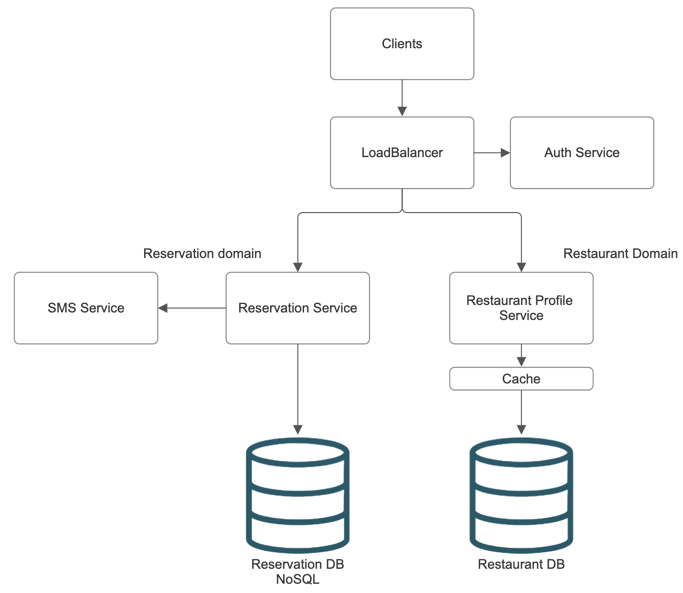

# Restaurant reservation system

## Уточняющие вопросы
1) Система бронирования для одного ресторана или зарегистрироваться могут все желающие? - Для всех желающих
2) Подумаем о user experience: пользователь выбирает ресторан, вводит кол-во гостей, выбирает подходящее время 
из списка, бронирует время и получает СМС с подтверждением. Так же нужен способ изменения или отмены брони. - Все так
3) По нагрузке предположим, что в системе будут тысячи ресторанов и десятки или сотни тысяч посетителей. Система должна 
быть достаточно быстрой и надежной. Но кажется какие-то невероятные цифры время отклика и надежности в восемь девяток 
нам не нужны, достаточно средних для индустрии значений. - Все так
4) Есть ли какие-то ограничения в бюджете из-за которых мы должны будем выбирать трейдоффы? - Нет, бюджет неограничен
5) Рестораны - тоже наши клиенты. Им нужна будет регистрация, хранение данных о ресторане (кол-во мест), какое 
количество столов они оставляют свободными для гостей с улицы, способ связи с хостесом

## Цифры
Тысячи ресторанов, сотни тысяч клиентов.
Для расчета RPS нас больше интересуют клиенты. Скажем все ходят в ресторан в среднем 1 раз в неделю, тогда это 100_000 
запросов в неделю, 15_000 запросов в день, 600 запросов в час, 10 запросов в минуту. Не хайлоад. 

## API Design
**Для резервации столиков**
1) Получение инфы о броне: GET /api/v1/reserve (restaurant, guests count, time) -> time layout.
2) Для бронирования: POST /api/v1/reserve (phoneNumber, restaurant, time, guests count) -> status

**Для ресторана**
1) Регистрация 
2) Изменение конфигурации
3) Список броней
4) Инфо о броне

## Deep dive


Модель данных в БД:

Restaurant:
```json
{
    "id": "uuid",
    "name": "string",
    "address": "string",
    "phone": "string",
    "layout": "object",
    "reservationLength": "number",
    "businessHours": "string"
}
```

Reservation: 
```json
{
  "restaurant_id": "uuid",
  "clientPhone": "string",
  "timeSlot": "string",
  "partySize": "number",
  "notes": "string"
}
```