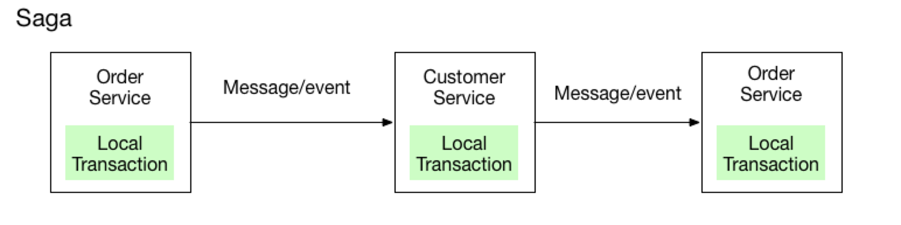

# Saga pattern

Если вы реализуете подход database per service, то рано или поздно можете столкнуться с проблемой распределенных 
транзакций. Например: при покупке товара нужно проверить, что пользователь не выходит за кредитный лимит. В таком случае
необходимо выполнить действия в двух БД двух разных сервисов. Обычно для решения распределенных транзакций используют
2PC (двухфазный коммит) или паттерн SAGA. 

Суть паттерна в том, чтобы каждый сервис делал свою локальную транзакцию. Таким образом сервис 1 выполнит необходимую 
транзакцию в своей базе, после вызовет сервис 2 и тот в свою очередь выполнит транзакцию в своей базе. Если в этой 
цепочке какой-то из сервисов не смог выполнить транзакцию по некой причине, то он инициирует цепочку компенсирующих 
транзакций во всех предыдущих сервисах. Суть компенсирующей транзакции, как понятно из названия, отменить действия
первоначальной транзакции. 

Существует два типа организации координации между сервисами: хореография и оркестрация. Принцип хореографии строится на 
том, что сервисы общаются друг с другом, образуя цепочку вызовов. Оркестрация вводит элемент координатор, через который
происходит общение между сервисами. Координатор следит за выполнением цепочки. Хореография является более простым 
подходом, так как не нужно вводить новый подход. Однако с увеличением числа сервисов в цепочке и с усложнением самой 
цепочки использовать хореографию может быть нецелесообразно (достаточно представить хореографию из 7+ сервисов). 
Оркестратор так же является центром, который всегда следит/знает/ответственен за распределенную транзакцию в целом. 
Даже если на каком-то этапе что-то пошло не так, у нас всегда есть центральный элемент, который может перезапустить 
проблемную часть цепочки. Тем не менее оркестратор является потенциальной точкой отказа системы.

Взаимодействие между сервисами в саге может быть как посредством HTTP запросов, так и посредством очередей сообщений. 
Очереди позволяют добиться большей масштабируемости и отзывчивости благодаря асинхронности процесса. Так же очереди 
уменьшают связность и по своей природе улучшают отказоустойчивость (благодаря ретраям). Но за это приходится платить 
повышенной сложностью взаимодействия и поддержки. HTTP же в свою очередь проще и синхронен (в некоторых случаях это 
может быть плюсом). Но имеют большую связность, меньшую масштабируемость и требуют дополнительную работу по 
отказоустойчивости. Мне кажется краеугольный камень в выборе метода взаимодействия - асинхронность. Если система 
толерантна к этому или даже требует это, то стоит выбирать очереди сообщений. 

Сага сама по себе влечет следующие проблемы: разработчикам приходится реализовывать компенсирующие транзакции (не 
всегда тривиальная работа) и отсутствие изоляции между транзакциями в разных БД: между разными этапами одной саги 
слабая синхронизация и теоретически кто-то может вклиниться в процесс выполнения транзакций. 