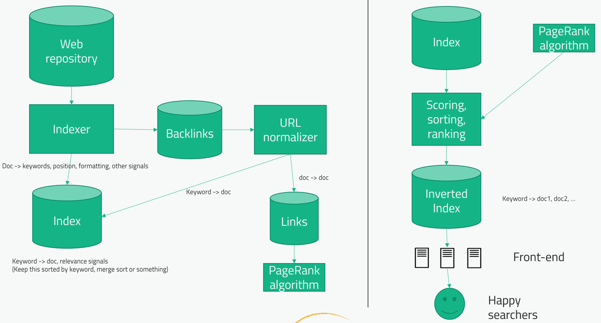

# Поисковой движок

## Вопросы
1) Мы говорим про поисковик по всему интернету, типа гугл? - Да
2) Можем ли мы предположить, что у нас уже есть готовый web crawler и БД с результатом его работы? - Да 
3) У гугла много нюансов в поиске, можем ли сфокусироваться только на выдаче релевантного ответа по поисковой строке? - Да

## High level design
Идея алгоритма: обратный индекс (как в эластике). Мы будем хранить связь ключевое слово -> список страниц.
Список страниц должен быть отсортирован по какому-то признаку (кол-во ссылок на страницу, 
количество упоминаний ключевого слова в тексте и тд). Важно, что все эти признаки уже расскусили, поэтому поисковые 
движки постоянно придумывают новые способы сортировки списка страниц.

Алгоритм:
1) Данные из БД после web crawler пропускаются через Indexer, чтобы из каждого документа получить ключевые слова, их 
позицию, частоту встречи и т.д. Внутри indexer много алгоритмов для обработки пунктуации, ошибок в словах, синонимов и тд
2) После indexer данные попадают в БД Index. По сути это большая key-value БД, где ключ - ключевое слово, 
значение - документ и вес для сортировки.
3) Backlinks подсчитывает количество ссылок на этот документ, чтобы тоже использовать это как вес
4) Так же необходимо хранить ссылки между страницами (в БД Links), чтобы после использовать это для ранжирования 
(PageRank алгоритм)
5) Затем из index и PageRank при помощи элемента Scoring, Sorting, Ranking составляется итоговый обратный индекс для
поиска. 

