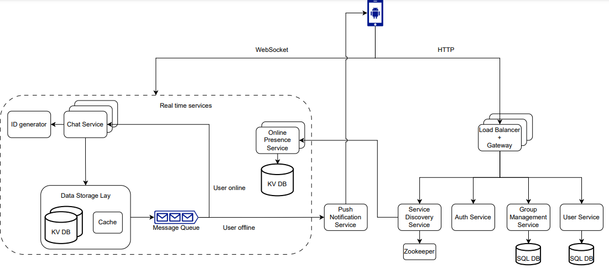
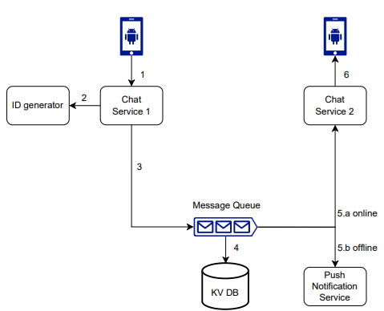
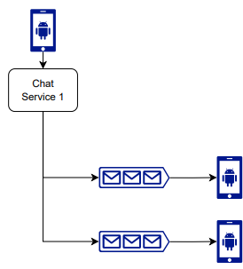

# Архитектура Телеграмма

## Основные фичи разрабатываемого Телеграмма:
1) Отправлять, принимать и читать сообщения
2) Сообщения могут содержать текст и вложения
3) Должны поддерживаться групповые чаты
4) Должны поддерживаться уведомления

## Особенности разрабатываемого Телеграмма
1) 10млрд сообщений каждый день
2) Ожидаем высокую доступность сервиса, конечной согласованности хватит (AP система)
3) Задержка низкая 

## Считаем цифры
1) 100к сообщений в секунду
2) 500к запросов в секунду
3) Типичный сервер выдерживает 10к запросов в секунду, значит нам понадобится 50 серверов
4) Типичное сообщение занимает примерно 100 байтов (50 символов юникода)
5) Примерно 1ТБ данных в день

## Обновления к схеме
1) У хранения сообщений нет простого однозначного ответа. Можно использовать cassandra, дискорд хранил в ней сообщения
и столкнулся с проблемами только при триллионах сообщений. После они перешли на совместимую с cassandra ScyllaDB. Кажется
если ввести cold storage, то можно всегда жить на cassandra. Другой вариант, хранения сообщений в MongoDB (не нашел 
примеров использования). Третий - пойти по стопам WhatsApp и хранить только бекапы всех сообщений (собирать бекап 
каждую ночь, например).

## Схема


Флоу сообщения 1-on-1:  
  
1. Пользователь А отправляет сообщение пользователю B при помощи Chat Service 1
2. Chat Service 1 получает ID сообщения из ID generator
3. Chat Service 1 отправляет сообщение в очередь
4. Сообщение сохраняется в KV БД
5. Если пользователь В онлайн, то сообщение отправляется в очередь пользователя В, откуда сообщение читает Chat Service 2 (к которому подключен пользователь В)
6. Если пользователь оффлайн, то отправляется push уведомление

Флоу групповых сообщений:  


## В каком виде хранятся данные
```json
{
  "message" : {
    "message_id": "bigint",
    "message_from": "bigint",
    "message_to": "bigint",
    "content": "text",
    "created_at": "timestamp"
  }
}
```

```json
{
  "group_message" : {
    "channel_id": "bigint",
    "message_id": "bigint",
    "message_from": "bigint",
    "content": "text",
    "created_at": "timestamp"
  }
}
```
