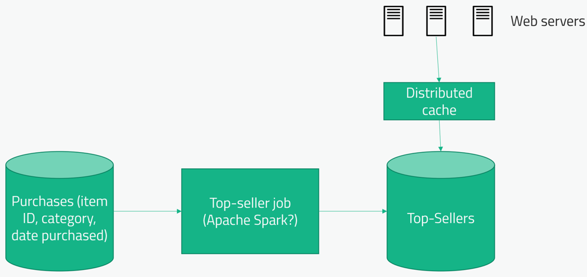

# Самые продаваемые товары

## Вопросы
1) Самые продаваемые товары нужны по всем разделам или по каким-то определенным? - И по всем разделам (топ всего сайта)
и по отдельным категориям
2) Насколько часто нужно обновлять топ? - Раз в день
3) За какой промежуток времени необходимо считать топ продаж? - Как вариант, смотреть все продажи, но чем дальше они 
от сегодня, тем меньший вес они получают.
4) Какой масштаб нашего сайта? - Большой, тысячи операций в секунду

## High level design
Для определения веса продажи отлично подойдет обратная логарифмическая формула e^(-a*t). Где a - настраиваемый параметр 
(как быстро продажа становится неактуальной и меньше весит) и t - время прошедшее с покупки.

Purchases DB - скорее всего в компании есть какая-то основная OLTP БД. Не хочется подключаться к ней напрямую, это 
лишняя и довольно серьезная нагрузка. Лучше реплицировать данные в какую-нибудь другую OLAP БД (например ClickHouse) и 
читать данные для аналитики уже оттуда.

Top seller job - некая ассинхронная и масштабируемая джоба, которая будем считать необходимые нам данные. Отлично 
подходит Apache Spark. Можно еще использовать MapReduce или встроенные возможности OLAP, но Apache Spark более гибкий и 
подходит лучше.

Top sellers DB - данных много не будет, так что подойдет любая БД которую можно отреплицировать (для чтения).