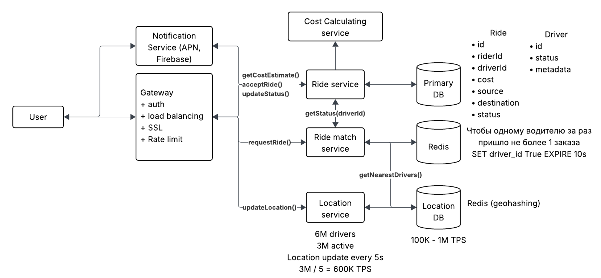

# Uber

## Вопросы
1) Необходимо прояснить функциональные требования, 2 главные фичи убера - поиск машин по запросу, проложение маршрута
для таксиста - Да
2) Необходимо ли рассчитывать стоимость поездки? - Да 
3) Водитель может принять или отклонить заказ? - Да
4) Будем прорабатывать несколько типов машин? Эконом/комфорт/бизнес? - Нет
5) Будем ли прорабатывать рейтинги водителей и пассажиров? - Нет

## Требования к системе
1) Пользователь вводит адрес откуда и куда, система выдает стоимость, пользователь может заказать поездку
2) Водитель может принять/отклонить заказ
3) Система строит водителю оптимальный маршрут до заказа, а после до места назначения

## Нефункциональные требования
1) Хорошая масштабируемость, водителей может стать много
2) Способность обслужить пиковые нагрузки
3) Быстрый поиск машины (либо выдача ошибки)
4) CP система поиска машины, мы не хотим чтоб пассажир остался без машины или одному пассажиру приехало 2 машины 
5) AP система вне поиска

## API
1) Создание поездки, получение стоимости:  
POST /ride/estimation (source, destination) -> Ride information (cost, time, schedule)
2) Подтверждение заказа поездки:  
POST /ride/{rideId} -> 200
3) Обновление локации машины:  
PUT /driver/location (lat, long) -> 200
4) Принятие/отказ от заказа водителем:  
POST /driver/decision/{rideId} (true/false) -> 200
5) Обновление статуса заказа/поездки:
PUT /ride/{rideId} (status) -> 200

## High level design
