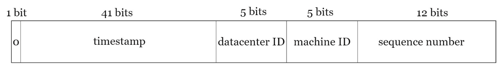

# Архитектура Unique ID Generator

## Требования
1) ID должен быть уникален
2) ID должен содержать только цифры 
3) ID должен умещаться в 64 бита 
4) ID должны возрастать по мере течения времени
5) Возможность генерировать 10к/сек ID в распределенной системе

## Подходы
### Multi-Master репликация  
В стандартных для БД средствах генерации ID можно настраивать шаг. Таким образом если мастера 2, то один может 
генерировать четные ID, а другой нечетные.

Плюсы:
- Легкость реализации

Минусы:
- Тяжело масштабировать
- Общая последовательность ID не возрастает с течением времени (1 сервер может генерировать ID больше и чаще)

### UUID
UUID - 128 битная число-буквенная последовательность, например `09c93e62-50b4-468d-bf8a-c07e1040bfb2`. У UUID маленький 
шанс коллизии, если генерировать 100млрд UUID в секунду на протяжении 100 лет, то шанс генерации единственной коллизии 
достигает 50% (инфа из википедии).

Плюсы:
- Легкость реализации и генерации. Нет нужды координации, поэтому генерация UUID может быть на стороне сервиса
- Легкость масштабирования, поскольку не нужна координация

Минусы:
- ID занимает 128 бит (наше требование 64 бита)
- ID не возрастают со временем
- ID состоит не только из цифр

### Ticket Server
Идея Ticket Server в централизации места, где будет генерироваться ID. Это может быть реализовано с помощью 
единственного сервера базы данных и использования его встроенных способов генерации ID.

Плюсы:
- ID состоит только из цифр
- Легко реализовать, работает для маленьких-средних нагрузок

Минусы:
- Добавляется единая точка отказа. Если развернуть несколько серверов, то снова появляется проблема с синхронизацией и 
возвращаемся к первому способу

### Twitter snowflake
Данный подход разделяет ID на сегменты:  

- Sign bit: 1 бит. Всегда равен 0, зарезервирован для будущих фичей. 
- Timestamp: 41 бит. Миллисекунды начиная с какого-то момента. В твиттере отсчет с 4 ноября 2010 года 01:42:54 UTC. 
Максимальное значение - 69 лет, по прошествии этого времени надо придумать новый способ генерации и мигрировать старые ID.
- Datacenter ID: 5 бит, то есть суммарно 2 ^ 5 = 32 датацентров.
- Machine ID: 5 бит, что дает нам 2 ^ 5 = 32 машин в датацентре.
- Sequence number: 12 бит. Увеличивается для каждого ID сгенерированного на сервере за 1 миллисекунду. Сбрасывается в 0 
каждую миллисекунду.

Плюсы:
- Удовлетворяет всем нашим требованиям
- Работает для больших нагрузок

Минусы:
- Ограничен по использованию