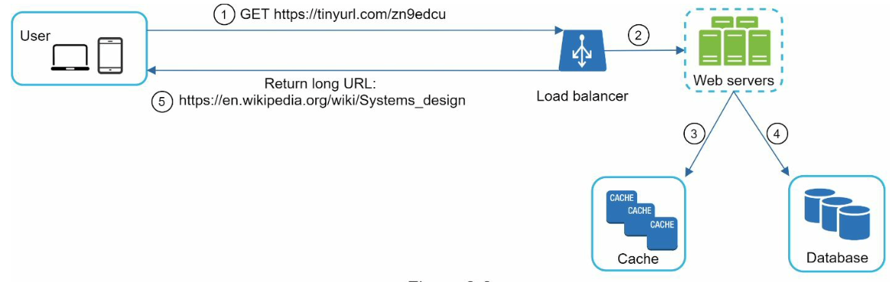
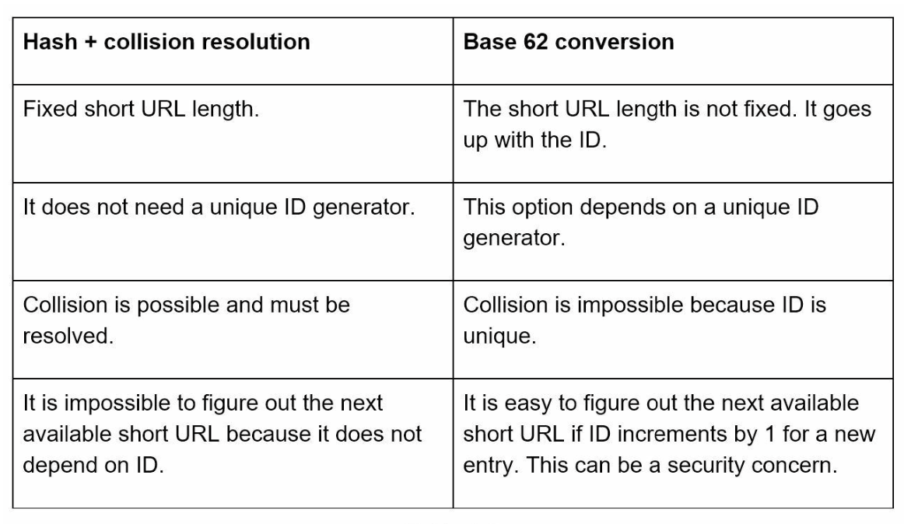
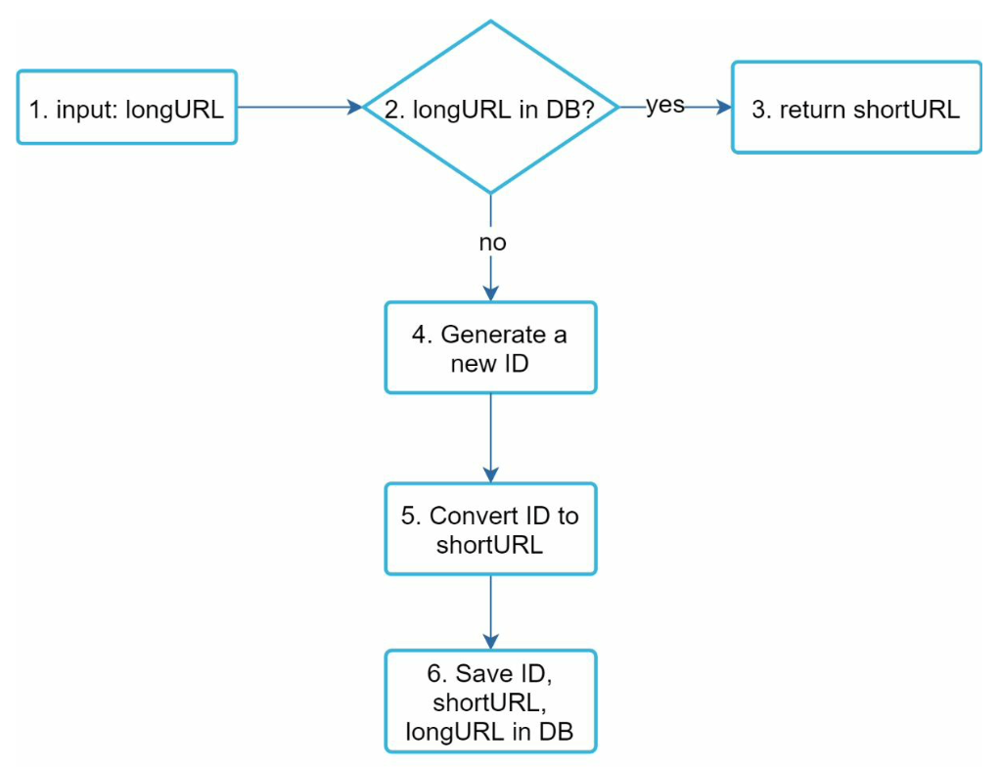

# Url Shortener

## Требования
1) Сокращение длинных url и выдача short url
2) short url состоят из букв и цифр
3) short url не может быть изменен или удален (упрощение)
4) Высокая доступность, масштабируемость

## Цифры
1) 100млн URL генерируется в день (1160 RPS)
2) Допустим соотношение чтение/запись - 10/1, тогда RPS чтения 11600
3) За 10 лет использования сервис сгенерирует 100млн * 365 * 10 = 365млрд записей
4) Средняя длина url - 100 символов, тогда хранение данных за 10 лет потребует 365млрд * 100 * 10 = 37TB

## High level design 
API endpoints:
1) URL Shortening: POST api/v1/data/shortening body:{longUrl: "..."}
2) URL redirecting: GET api/v1/{shortUrl} return 301 status and long url in header

Хранение данных в реляционной БД. Для получения короткого URL будем хешировать изначальный URL. Для получения длинного 
url по короткому используем индексацию.

## Deep dive
Общая архитектура сервиса:  
  

Модель данных в БД:
```json
{
  "id": "long, PK",
  "short_url": "string, indexed",
  "long_url": "string, indexed"
}
```

Длина хеша должна быть минимум 7 символов, так как 62 (кол-во допустимых символов) ^ 7 ~= 3.5трлн.  

Для хеширования в нашем случае есть 2 стратегии:
1) Hash + collision resolution - мы генерируем хеш при помощи любой хеш функции, как-то выбираем необходимую часть 
хеша (можно взять первые или последние 7 символов). Если такой хеш уже есть в базе, то добавляем к long url 
какую-нибудь строку и хешируем это еще раз. Данный способ чуть дороже следующего, поскольку придется лишний раз ходить
в базу для проверки коллизий.
2) Base 62 conversion - для входного long url генерируем ID (рядом есть папка с темой генератора ID). Этот ID переводим
в систему счисления по основанию 62. Полученная строка является "хешом" long url.

Сравнение двух подходов:  


Выберем второй подход хеширования и рассмотрим шаг создания short url и получения long url:
### URL shortening deep dive
1) К нам приходит long url
2) Есть ли в базе такой long url?
3) Если да - возвращаем его short url 
4) Если нет - генерируем новый ID 
5) По полученному ID генерируем short url
6) Сохраняем все это в базу



### URL redirecting deep dive
  

1) Пользователь кликает по short url
2) Load balancer отправляет запрос на сервер
3) Если short url в хеше, читаем хеш и отправляем long url пользователю
4) Если в хеше данных нет - обращаемся в базу данных