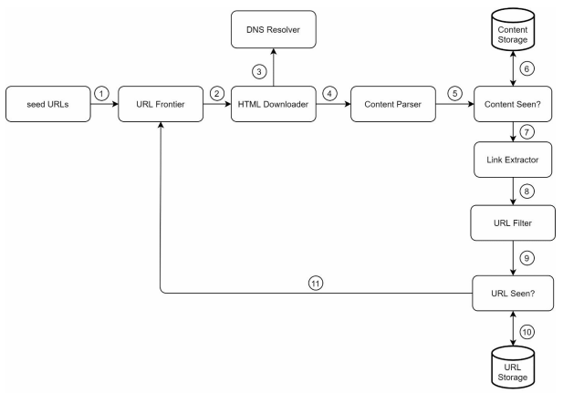
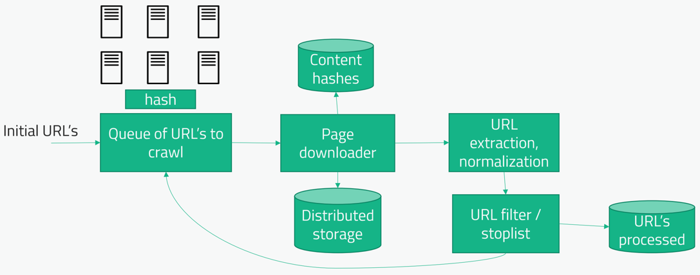
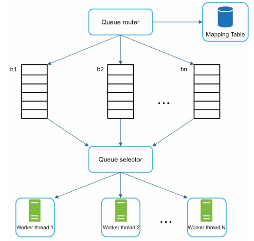
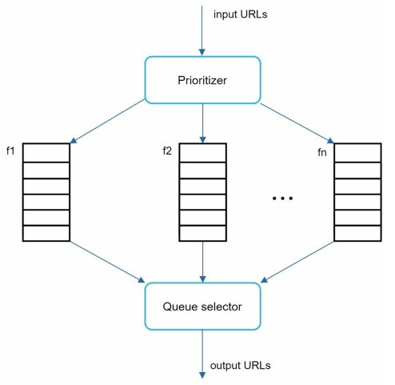

# Архитектура Web Crawler
Web Crawler - инструмент для отслеживания содержимого в интернете. Данный инструмент переходит по ссылкам и считывает
его содержимое, вычленяет оттуда ссылки и рекурсивно делает то же самое. Используется в поисковых движках, веб архивах, 
дата майнинге и мониторинге.

## Вопросы
1) Web crawler работает на некоторых сайтах или по всему вебу? - По всему вебу - Миллиарды сайтов
2) Как часто проходит crawler? - Данные должны обновляться каждую неделю
3) И мы должны проверять страницы, посещенные раньше, на проверку обновлений? - Да
4) Должны ли мы прихранивать копию пройденных страниц? В том числе картинки и динамический контент? - HTML точно надо, 
картинки и динамеческий контент будет хорошо, если останется время
5) Какую цель мы вообще преследуем: поисковый движок / дата майнинг / веб архив? - Поисковой движок

## Требования
1) Масштабируемость
2) Надежность 
3) Вежливость (politeness) - web crawler не должен дудосить или нагружать сайты
4) Расширяемость - возможность безболезненно добавить расширения, например индексация PDF файлов

## Цифры
1 миллиард посещенных страниц в месяц. Посещенные веб страницы должны храниться в течение 5 лет.
1) QPS: 1_000_000_000 / 30 (days) / 24 (hours) / 3600 (seconds) ~= 400 pages per seconds
2) Максимальный QPS = 2 * QPS = 800 pages per seconds
3) Предположим, что средняя веб страница весит 500кб. Тогда в месяц нам нужно 1млрд * 500кб = 500ТБ хранилища.
4) Для 5ти лет необходимо: 500ТБ * 12 (months) * 5 (years) = 30ПБ хранилища.

## High level design
Строго говоря, это задача обхода графа в ширину.
Если необходимо встроить задержку между обращениями к одному сайту (чтоб не дудосить), то можно направлять все запросы 
по одному сайту к одному и тому же потоку в одной и той же тачке. И в одном потоке сверять, если следующий запрос в тот 
же сайт, то делать задержку в секунду (например).

Флоу движения данных выглядит так:

Сначала рассмотрим каждый компонент. Важно понимать, что компоненты - логическое разделение задачи. Итоговые сервисы 
могут объединять в себе несколько компонентов.
- **Seed URLs**  

Для работы Web Crawler необходима стартовый URL, откуда он сможет продолжать переходить по ссылкам. Выбор таких URL 
нетривиальная задача. Один из подходов - использовать популярные сайты клиентов исходя из их страны проживания

- **URL Frontier**

Данный компонент решает проблемы politeness, приоритета и своевременности обработки URL страниц. Поговорим про этот 
компонент позже.

- **HTML Downloader**

Компонент для скачивания HTML страниц.

- **DNS Resolver**

При скачивании HTML страниц нужно знать их IP. Обращаться к удаленному DNS дорого, поэтому часто используют локально
развернутый DNS сервер, который кеширует данные и обновляет их раз в какое-то время.

- **Content Parser**

После того как страница скачана ее нужно провалидировать. Например, это может быть битый html файл или он может 
содержать запрещенную к показу информацию. Так же внутри страницы может быть реклама, которую надо вырезать.

- **Content Seen?**

Необходимо определить, встречалась ли полученная информация до этого. Мы не хотим хранить дубликаты информации. 
Посимвольное сравнение с содержимым базы слишком дорого, поэтому обычно текст разбивают на фрагменты, хэшируют его и 
проверяют дубликаты по хешу.

- **Content Storage**

Система хранения для посещенных страниц. Как правило используют смешанный способ хранения: все данные хранятся на диске,
но самые популярные страницы помимо этого хранят в памяти (так как их часто запрашивают для чтения).

- **URL Extractor**

Вычленяет URL из содержимого страницы

- **URL Filter**

Исключает из дальнейше обработки битые URL, URL из черного списка и тд

- **URL Seen?**

Если страница уже была посещена, то какое-то время бессмысленно посещать ее снова.

- **URL Storage**

Хранение уже посещенных страниц.

Примерно та же схема, но попроще:

## Deep dive
Погрузимся в некоторые компоненты:
### URL Frontier
URL Frontier на самом деле хранилище URL для дальнейшей обработки. Хранилище, как правило, на основе очередей. Основные 
цели данного компонента: соблюдение politeness, приоритизация в обработке URL, соблюдение свежести URL.

- **Politeness**  

Web crawler должен ограничивать число запросов к серверу, чтобы не допустить случайного DOS. Необходимо искусственно
ограничить кол-во этих запросов. Для этого все URL разделяются по очередям, а к каждой очереди прикреплен worker, 
который читает эту очередь с определенной частотой.

  
Queue router - распределяет URL по хостам в определенные очереди.  
Mapping table - содержит информацию о том, какой хост попадает в какую очередь.  
Queue selector - соблюдает требование, что каждый worker читает из определенной очереди.  
Worker thread - поток, который скачивает HTML страницы по URL. 

- **Priority**

Информация о продукте может быть получена из форума или из официального сайта компании. Информация из официального 
источника должна иметь больший вес. Для приоритизации самого источника используются сторонние сервисы.

  
Prioritizer - инструмент для приоритизации источника.  
Queue f1 to fn - в зависимости от приоритета источника он попадает в одну из очередей.  
Queue selector - случайным образом выбирает очередь с уклоном в очереди с более высоким приоритетом.  

- **Freshness**  

Веб страницы постоянно добавляются, удаляются и изменяются. Необходим поддерживать информацию о них в актуальном 
состоянии. Время от времени необходимо пересматривать уже обработанные страницы.

### HTML Downloader
Для HTML Downloader важна оптимизация процесса, вот некоторые способы его оптимизации:
1) Кеширование DNS сервера - обращение к удаленному DNS серверу может занимать 10-200ms. Можно развернуть локальный DNS
сервер, который будет содержать кэш обращений к DNS и обновлять их время от времени.
2) Локальность - html downloader должен располагаться географически как можно ближе к источнику информации.
3) Короткий ожидаемый таймаут - следует понизить ожидаемый таймаут от сервера, в случае долгого ответа попробовать еще 
через некоторое время.