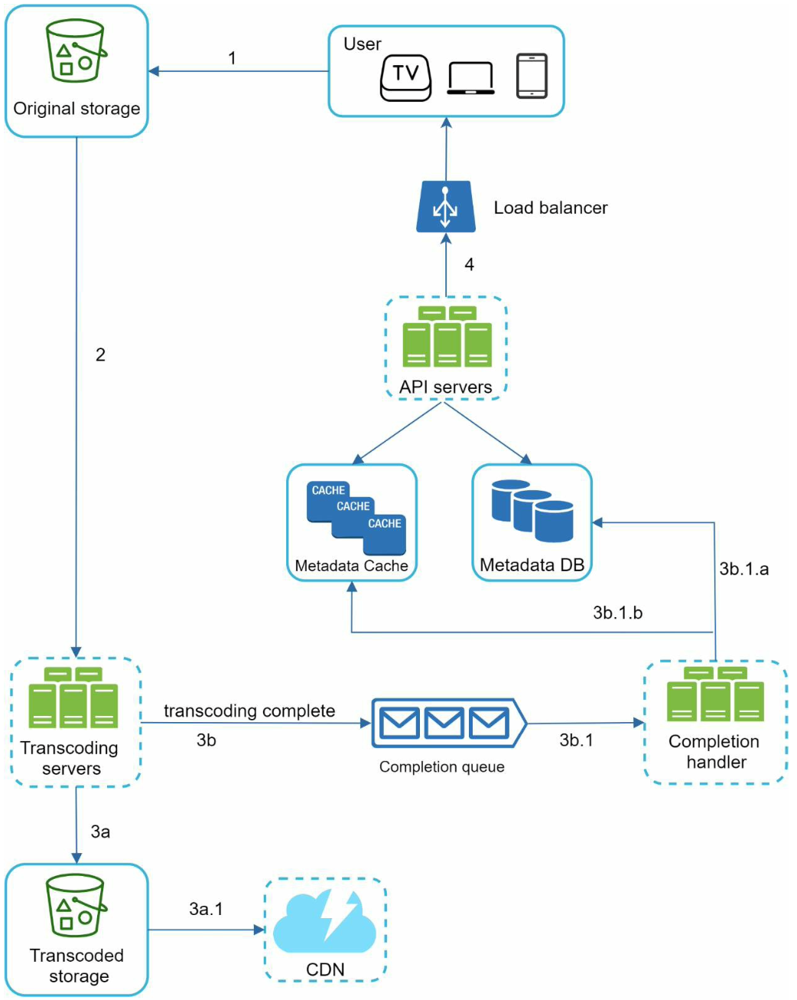
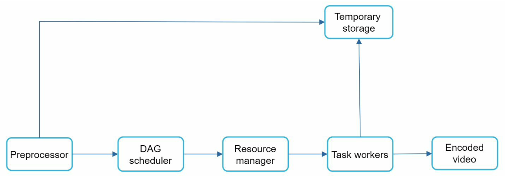

# Youtube

## Вопросы
1) В Youtube много функциональности, мы сейчас говорим исключительно и загрузке и проигрывании видео в 
больших масштабах? - Да

## Требования к системе 
1) Возможность загрузки и просмотра видео
2) Возможность менять качество видео
3) Как можно более низкая стоимость обслуживания инфраструктуры
4) Доступность, масштабируемость, надежность

## Цифры
1) 5млн активных пользователей в день
2) Каждый пользователь смотрит 5 видео в день
3) 10% всех пользователей добавляет 1 видео в день
4) Предположим, средний размер видео 300мб
5) В день необходимо 5млн * 10% * 300МБ = 150ТБ места в хранилище

## High level design
Видео для просмотра запрашиваются с CDN, но это потребует очень больших затрат на инфраструктуру. В deep dive мы 
подумаем, как максимально снизить стоимость.

### Video uploading flow
Непонятные компоненты системы:  
**Metadata DB/cache** - метадата видео хранится в отдельной таблице и кэше.  
**Original Storage** - BLOB БД для хранения оригинала видео.  
**Transcoding servers** - конвертирует видео в форматы удобные для хранения и стриминга.  
**Transcoded storage** - BLOB БД для хранения конвертированных видео.  
**Completion queue** - по итогам конвертации записывается сообщение в очередь.  
**Completion handler** - сообщение с итогами конвертации записываются в БД метадаты.  

Флоу загрузки видео:
1) Видео загружается в Original BLOB storage
2) Transcoding servers конвертируют видео в другие форматы
3) По окончанию конвертации запускаются 2 параллельных процесса: сохранение в transcoded BLOB storage и запись итогов 
конвертации в очередь (которые после окажутся в metadata storage)

## Deep dive
### Video transcoding
Процесс транскодинга необходим для конвертации видео в удобные для хранения и стриминга форматы. Так же на данном 
этапе видео разбивается на видео разных разрешений, проходит различные проверки, наклеиваются вотермарки и тд.

Внутри transcoding servers находятся следующие компоненты:  
  
**Preprocessor** - нарезает видео на части (которые обрабатываются независимо), генерирует таски (из yml файлов) для 
следующих шагов, кэширует данные (на случай сбоя можно еще раз послать те же самые данные из кэша).  
**DAG scheduler** - при поступлении части видео генерирует задачу на исполнение и отправляет в очередь. 
DAG (directed acylcic graph) задач применяется в Facebook. Задачи для DAG schedular создает 
препроцессор из подготовленных разработчиками yml файлами. Таким образом задачи можно динамически менять и добавлять 
новые. В данных задачах по сути и описана главная бизнес логика всего transcoding server. В этих задачах описывается
какие форматы видео нам нужны, какие проверки необходимо сделать, куда наклеить вотермарку и тд. 
**Resource manager** - следит за очередью задач из DAG scheduler и назначает эти задачи свободным (и подходящим)
task workers.  
**Task workers** - выполняют задачи DAG scheduler. Могут быть различных типов заточенные под определенную деятельность.  
**Temporary storage** - необходим для хранения метаданных видео, посколько к ним часто происходит обращения по ходу
выполнения задач.  

### System optimization
1) Можно загружать видео не целиком, а по 1-2с частям (Group of Pictures). 
2) Расположить сервера для загрузки видео территориально ближе к пользователю. 

### Safety optimization
1) Для загрузки видео выдается temporary pre-signed url. Многие BLOB БД предоставляют такие возможности.
2) Можно встроить систему защиты видео от скачивания/пиратства (DRM, AES). Встраивается на уровне transcoding server.

### Cost-saving optimization
1) Чтобы сократить издержки по оплате CDN серверов можно держать в них только популярные видео. Остальные видео 
грузятся напрямую с сервера.
2) Некоторые видео популярны (или даже доступны) только в определенных регионах. Не имеет смысла держать их на CDN 
других регионов.
3) Можно сделать свой CDN если есть выход на провайдеров.
