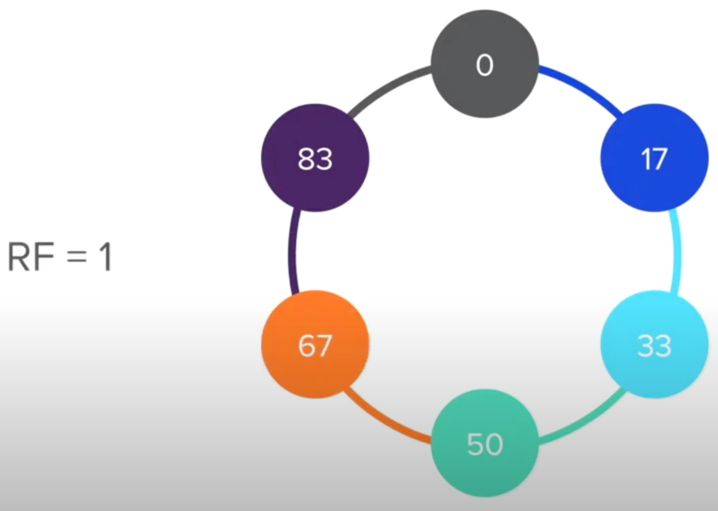
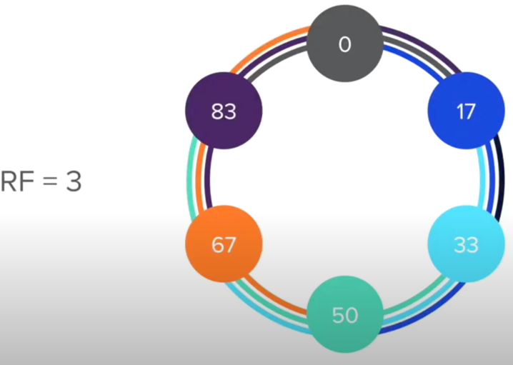
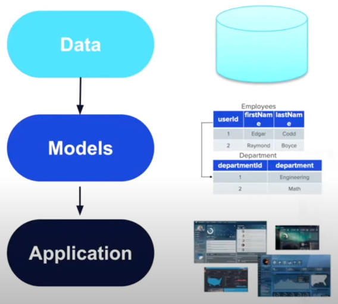
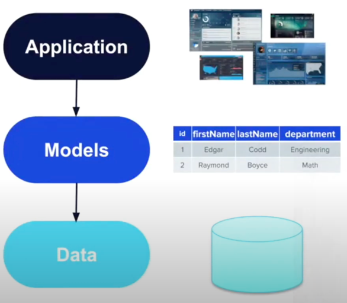

# Cassandra
## Общее
Cassandra - NoSQL распределенная шардированная и реплицированная база данных. Каждая отдельная нода cassandra дает 
емкость на примерно 1ТБ и 3к TPS (все сильно зависит от того, как вы умеете готовить cassandra). Используется leaderless 
схема реплицирования. Можно обращаться к любой ноде и она перенаправит запрос в правильную ноду, где хранятся данные. 
Но в целом, драйвер подключения достаточно умный и сразу отправляет запрос в правильную ноду. Масштабирование в 
cassandra приносит линейное увеличение пропускной способности (при условии правильной настройки и модели данных). 

Данные хранятся в cassandra денормализовано. Поэтому в cassandra можно получить данные только из одной таблицы
за запрос. Данные дублируются, нет join, зато мы получаем ускоренное чтение данных.

## Партиции и репликации

Устройство партиций и репликаций в cassandra схоже с кафкой: есть разбитые по серверам партиции, у каждой партиции есть
N реплик. Определение в ту или иную партицию происходит на основе partition key на основе partition ring.

Если replication factor > 1, то данные реплицируются на соседние ноды. 

## Partition и clustering key

Partition не должен быть слишком большим. Лучше иметь много маленьких partition. Если у вас один partition весит
пару ТБ, а другие пустые, то вы получаете hotspot. Даже добавление сотни новых серверов и partition не порешают проблему,
так как это не уменьшит существующий раздел.

Изменить partition key нельзя. Если вас что-то перестало устраивать, все что остается - создать новую таблицу и
мигрировать данные.

Primary key любой записи состоит из partition key и clustering column. Partition key обязателен (на его основе 
выбирается партиция для хранения), clustering key по желанию, с его помощью можно разбавить partition key (сделать 
запись более уникальной, чтобы все записи с одним partition key не перезатирали друг друга) или проводить выборку и 
сортировку данных.

## Плюсы и минусы
Плюсы:  
- Большая масштабируемость на запись (отлично подходит для time series, IoT, logging, analytics)
- Отличная горизонтальная масштабируемость (leaderless репликация, отсутствие master-slave ботлнеков)
- Большая доступность и защита от катастроф (данные реплицированы, может пережить смерть ноды, нет единой точки отказа)
- Настраиваемся консистентность (благодаря политикам на запись)

Минусы: 
- Сложное моделирование данных (краеугольный камень, без правильного моделирования данных от cassandra один вред)
- В интернете пишут, что операции на чтение медленнее, чем на запись
- Доступ к данным только по partition и clustering key, запросы по data column строго говоря невозможны. Полноценные 
search & analytics запросы невозможны
- Нет ACID транзакций

## CAP теорема
Консистентность в cassandra настраиваемая. По умолчанию cassandra AP система, но донастроив ее можно сделать CP 
систему. Настраивается это при помощи параметров read/write consistency level (CL).

CL устанавливается на каждый выполняемый запрос, дефолтное значение quorum. По сути этот параметр отвечает за то, 
сколько нод с данными мы должны опросить, чтобы отправить ответ. При CL = ONE, мы дождемся ответа только от одной ноды.
При quorum от половины +1. При CL = all мы будем ждать подтверждение от всех нод. 

Для обеспечения высокой согласованности достаточно read/write CL = quorum, тогда кол-во опрошенных на запись и на 
чтение будет больше суммарного количества нод (условие немедленной консистентности).

## Data modeling
Для использования Cassandra критически важно правильно смоделировать данные, иначе Cassandra не будет приносить никакой 
пользы (или просто мешать). Для этого важно понимать нюансы моделирования. 

Реляционное моделирование начинается с самих данных. Их структура определяется свойствами бизнес процесса или 
реального мира. Затем на основе этих данных мы делаем модель (таблички и связи) в реляционной БД. Затем на основе модели
мы делаем приложение. Образно если у нас есть пользователи, корзина и товары, то и в приложении будет страница с 
пользователями, корзиной и товарами. 

Моделирование данных для cassandra имеет противоположный подход: моделирование таблиц происходит исходя из приложения и 
представления данных, которые там необходимы. Все из-за того, что данные можно получить только по partition_id. То есть
в идеале придумать такое моделирование данных, чтобы необходимые данные можно было получить одним запросом. Поэтому query 
к бд тут рулят и понимание будущих query критически необходимо. Порой под каждый отдельный запрос делают отдельную 
таблицу (например отдельно таблица для поиска комментариев по видео и отдельная таблица для поиска комментариев по 
пользователю). 

Итоги:
1) Проектируем таблицы для удовлетворения предполагаемых запросов
2) Partition key используется для группировки данных (по нему определяется partition), чтобы их было возможно получить 
одним запросом
3) Clustering key может добавить уникальности в primary key (чтобы избежать коллизий), либо обеспечить дополнительную 
фильтрацию или сортировку
4) Дополнительные поля только хранят данные, запросы по ним не поддерживаются

